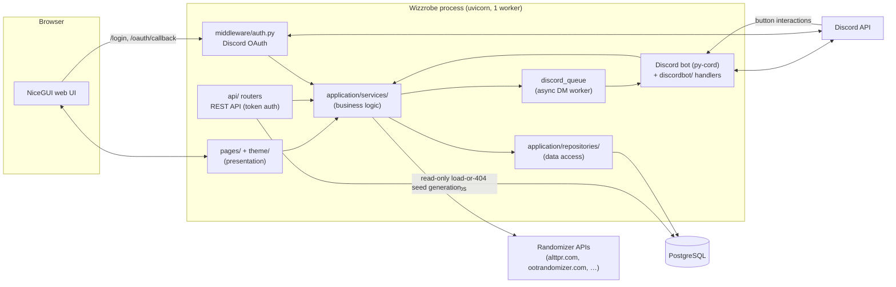

# Wizzrobe System Architecture

Wizzrobe is a web application for running tournament events: scheduling matches, enrolling players, coordinating commentators and trackers, assigning stream stages, generating randomizer seeds, and notifying everyone over Discord. It is a single Python process that serves a NiceGUI web UI, a small public REST API, and an in-process Discord bot, backed by PostgreSQL.

This document is the starting point for understanding the system. Each section links to a deeper reference doc; see the [documentation index](README.md) for the full catalog.

## Tech stack

Versions come from [`pyproject.toml`](../pyproject.toml) (Poetry); only major/minor shown here.

| Layer | Technology |
|---|---|
| Language | Python ≥3.12 |
| Web framework | FastAPI ≥0.136 |
| UI framework | NiceGUI ≥3.12 |
| ASGI server | Uvicorn (via `start.sh`) |
| ORM | Tortoise ORM ≥0.24 (asyncpg driver) |
| Migrations | Aerich ≥0.8 |
| Database | PostgreSQL (16-alpine in docker-compose) |
| Discord bot | py-cord / discord.py ≥2.6 |
| Discord OAuth | zenora |
| Seed generation | pyz3r (ALTTPR) + HTTP APIs for other randomizers |
| Testing | pytest ≥9, pytest-asyncio (`asyncio_mode = "auto"`), aiosqlite (in-memory test DB) |
| Packaging / runtime | Poetry, Docker + docker-compose |

## Process model and startup

Everything runs in **one Uvicorn worker** (`start.sh prod` passes `--workers 1`). This is a hard requirement, not an oversight: the process hosts the Discord bot connection, the in-memory Discord send queue, and NiceGUI's per-client websocket state. A second worker would start a second bot session and split UI state across processes.

[`main.py`](../main.py) builds the FastAPI app and wires everything together:

1. **Lifespan startup**
   1. `init_db()` — runs Aerich `upgrade()` (pending migrations are applied automatically on boot), then `Tortoise.init()` with the config from [`migrations/tortoise_config.py`](../migrations/tortoise_config.py).
   2. `init_discord_bot()` — starts the py-cord bot as an asyncio task using `DISCORD_TOKEN`. Skipped entirely under `MOCK_DISCORD`; logs a warning and continues if the token is unset (Discord features simply won't work).
   3. `discord_queue.start()` — starts the background worker that serializes outbound Discord DMs (see [reference/discord-integration.md](reference/discord-integration.md)).
2. **Lifespan shutdown** — reverse order: `discord_queue.stop()` → `close_discord_bot()` → `Tortoise.close_connections()`.

The FastAPI app is created with `docs_url="/api/docs"` and `redoc_url="/api/redoc"`, and the REST routers from the [`api/`](../api/) package are mounted at the `/api` prefix (see [reference/rest-api.md](reference/rest-api.md)).

[`frontend.py`](../frontend.py) then attaches the UI:

- `validate_security_config()` refuses to start with an insecure configuration (missing `STORAGE_SECRET`; missing DB credentials in production). Separately, `is_mock_discord()` raises at startup if `MOCK_DISCORD` is enabled while `ENVIRONMENT=production`.
- The `static/` directory is mounted at `/static`; in development (`ENVIRONMENT=development`, the default) a `NoCacheStaticFiles` wrapper adds `no-cache` headers so CSS/JS edits show up on refresh.
- Three middlewares are registered at import time (Starlette runs the last-added outermost, so the effective order is session → `TransportPrefixMiddleware` → `TenantMiddleware` → `AuthMiddleware`): `AuthMiddleware` (Discord OAuth session enforcement), `TenantMiddleware` (resolves the tenant from `/t/<slug>` or a custom `Host` and rewrites the ASGI scope — see [features/multitenancy.md](features/multitenancy.md)), and `TransportPrefixMiddleware` (un-prefixes NiceGUI/asset transport paths). The resolved `PLATFORM_HOST` is logged at startup.
- The OAuth routes and the page modules (`auth`, `challonge_oauth`, `twitch_oauth`, `racetime_oauth`, `admin`, `home`, `volunteer`, `equipment`, `platform`, `qualifiers`) are registered, and `ui.run_with(fastapi_app, storage_secret=...)` mounts NiceGUI onto the FastAPI app at the root path.

`main.py` is not run directly — `start.sh dev|prod` loads `.env` and launches Uvicorn (dev mode adds `--reload`).

## Three-layer pattern

The codebase follows a strict three-layer separation; the rules and rationale live in [refactoring-guide.md](refactoring-guide.md) and the conventions section of [`CLAUDE.md`](../CLAUDE.md).

```
Presentation  (pages/, theme/)          NiceGUI components, user interaction, ui.notify
      ↓ calls
Service       (application/services/)   business rules, validation, audit logs, Discord sends
      ↓ calls
Repository    (application/repositories/)  pure ORM data access
      ↓ uses
Models        (models/)                 Tortoise ORM models + enums
```

Key rules: the UI never writes through the ORM directly; services raise `ValueError` for user-facing errors (the UI catches and `ui.notify`s them); services write audit logs via `AuditService` and never import NiceGUI; repositories contain no business logic.

**Entry surfaces (`api/`, `discordbot/`) obey the presentation rule.** The REST routers and the Discord interaction handlers are additional presentation layers alongside the web UI: they call services and may do read-only *load-or-404* model lookups (the sanctioned shape is `Tournament.get_or_none(...)` in [`api/routers/tournament_actions.py`](../api/routers/tournament_actions.py)), but they must **not** import `application.repositories` or reach through a service's internal `.repository`. Reads route through a service method instead (`get_user_from_discord_id`, `UserService.get_user_by_id`, `MatchService.get_by_id`, `MatchService.get_player_names`, …). `.claude/scripts/enforce_architecture.py` classifies `api/` and `discordbot/` as presentation and enforces this on every edit.

## Component diagram



Notes on the arrows:

- The REST API (the [`api/`](../api/) package) is a full read/write API authenticated by personal access tokens (`Authorization: Bearer …`, see [reference/rest-api.md](reference/rest-api.md)). Routers call **into the service layer** like any other presentation layer and may do read-only *load-or-404* model lookups, but never import `application.repositories` (see the entry-surface rule above); the original public `GET /api/matches` read path queries the ORM (models) directly.
- Discord button interactions (crew signup, match acknowledgment, unwatch) arrive at the bot and call back **into the service layer** — the bot is a second presentation layer alongside the web UI, bound by the same repository-import ban. See [reference/discord-integration.md](reference/discord-integration.md).
- Outbound DMs are never sent inline from request handlers; services enqueue them onto `discord_queue` so UI interactions don't block on Discord.

## Authentication in one paragraph

Users log in with Discord OAuth: `/login` redirects to Discord with a CSRF `state` token, `/oauth/callback` exchanges the code (via zenora), upserts the `User` row, and stores `discord_id` in NiceGUI's signed session storage. `AuthMiddleware` redirects unauthenticated requests to protected routes, and the `protected_page` decorator enforces login plus optional role (and feature-flag) requirements per page. Authorization is role-based through `AuthService`: eleven `Role` members — the seven per-tenant community roles (STAFF, PROCTOR, STREAM_MANAGER, TRIFORCE_SUBMITTER, VOLUNTEER_COORDINATOR, EQUIPMENT_MANAGER, VOLUNTEER), the three per-tenant online-tournament admin roles (PRESET_MANAGER, SYNC_ADMIN, QUALIFIER_ADMIN), and the one global SUPER_ADMIN — plus per-tournament admin/crew-coordinator membership. Roles are **per-tenant** (evaluated within the current tenant); SUPER_ADMIN is global and bypasses the per-tenant gate. Full mechanics: [reference/authentication.md](reference/authentication.md); role semantics: [features/role-based-auth.md](features/role-based-auth.md); tenant resolution: [features/multitenancy.md](features/multitenancy.md). For local development without a Discord app, `MOCK_DISCORD=true` swaps in a user-picker login page and stubs all Discord calls ([features/mock-discord.md](features/mock-discord.md)).

## Directory map

Every top-level entry in the repository, with the doc that covers it:

| Path | What it is | Reference |
|---|---|---|
| `main.py` | App entry point: lifespan, DB init, bot init, router mounting | this doc |
| `frontend.py` | NiceGUI ↔ FastAPI integration, static files, page registration | [reference/frontend.md](reference/frontend.md) |
| `api/` | Public REST API (routers, Pydantic schemas, token auth, rate limiting) | [reference/rest-api.md](reference/rest-api.md) |
| `models/` | All Tortoise ORM models (54) and enums (17), split into per-domain submodules | [reference/data-model.md](reference/data-model.md) |
| `application/services/` | Business-logic layer (69 modules, incl. `tournament_strategies/`) | [reference/services.md](reference/services.md) |
| `application/repositories/` | Data-access layer (43 repositories) | [reference/data-model.md](reference/data-model.md) |
| `application/tenant_context.py`, `application/feature_flags.py` | Request-time tenant context + the feature-flag registry | [features/multitenancy.md](features/multitenancy.md), [features/feature-flags.md](features/feature-flags.md) |
| `application/utils/` | 30 helpers: timezone, environment validation, CSV export, Challonge/Twitch/racetime/SpeedGaming clients, QR codes, web push, Sentry, host/URL/session helpers, mock flags | [reference/services.md](reference/services.md), [timezone-handling.md](timezone-handling.md) |
| `middleware/` | `auth.py` (`protected_page` + `AuthMiddleware`), `tenant.py` (`TenantMiddleware` + `TransportPrefixMiddleware`), `error_handlers.py`, `security_headers.py` | [reference/authentication.md](reference/authentication.md), [features/multitenancy.md](features/multitenancy.md) |
| `discordbot/` | Discord interaction handlers (buttons for signup/ack/watch, crew & volunteer acknowledgment) | [reference/discord-integration.md](reference/discord-integration.md) |
| `racetimebot/` | Racetime bot runtime (peer of `discordbot/`): lifespan-managed connection per active `RacetimeBot` category, first-class health tracking, tenant-routed room-event handlers; gated by `RACETIME_BOT_ENABLED`, mockable via `MOCK_RACETIME` | [reference/services.md](reference/services.md#racetimebot--the-racetime-bot-runtime-pr-4) |
| `pages/` | NiceGUI pages (12 modules): home, admin (role-gated tabs), volunteer, equipment, `platform.py` (super-admin), `qualifiers.py`, and the OAuth login pages (`auth.py` Discord + dev mock, `challonge_oauth.py`, `twitch_oauth.py`, `racetime_oauth.py`) | [reference/frontend.md](reference/frontend.md), [reference/authentication.md](reference/authentication.md) |
| `theme/` | `base.py` layout shell, `dialog/` (dialogs), `tables/` (table views), `realtime.py` | [reference/frontend.md](reference/frontend.md) |
| `static/` | CSS (and other static assets) served at `/static` | [reference/frontend.md](reference/frontend.md) |
| `presets/` | Built-in randomizer preset files (alttpr/, dk64r/, ootr/, smmap/) | [reference/seed-generation.md](reference/seed-generation.md) |
| `migrations/` | Tortoise connection config + Aerich migration files | [reference/data-model.md](reference/data-model.md), [deployment.md](deployment.md) |
| `scripts/` | `seed_dev.py` — idempotent local dev fixtures | [development.md](development.md) |
| `tests/` | pytest suite (API, utils, and `tests/services/`) | [development.md](development.md) |
| `docs/` | This documentation | [README.md](README.md) |
| `start.sh` | Dev/prod Uvicorn launcher, loads `.env` | [deployment.md](deployment.md) |
| `Dockerfile`, `docker-compose.yml` | Container build and postgres+app stack | [deployment.md](deployment.md) |
| `.github/workflows/` | CI (`test.yml`) and GHCR image publishing (`publish.yml`) | [development.md](development.md), [deployment.md](deployment.md) |
| `pyproject.toml`, `poetry.lock` | Poetry dependencies, pytest and Aerich config | [development.md](development.md) |
| `.env.example` | Annotated template for all environment variables | [deployment.md](deployment.md) |
| `CLAUDE.md`, `AGENTS.md` | Conventions and AI-assistant development guides | — |
| `README.md` | Quick-start readme | — |

## Key design decisions

- **UTC in the database, US/Eastern in the UI.** All datetimes are stored UTC; every user-facing render goes through `application/utils/timezone.py`. See [timezone-handling.md](timezone-handling.md).
- **Role-based access, no permission bits on `User`.** Roles live in the `UserRole` junction table and are **per-tenant** (nullable `tenant` FK; the one global `SUPER_ADMIN` uses `tenant=NULL`); tournament-scoped authority comes from `Tournament.admins` / `Tournament.crew_coordinators` M2M membership. See [features/role-based-auth.md](features/role-based-auth.md).
- **Logically multitenant, no auto-scoping manager.** One process and DB serve many communities; a `tenant` FK on ~33 models is scoped explicitly through `application/repositories/_tenant.py`, and `require_tenant_id()` raising is the safety net. Users are global; almost everything a community owns is tenant-scoped. See [features/multitenancy.md](features/multitenancy.md).
- **The bot and the web UI are peers.** Both call the same service layer, so a crew signup from a Discord button and one from the web page follow identical business rules and audit logging.
- **Migrations apply on boot.** `init_db()` runs `aerich upgrade` every start; deploys are "pull new image, restart". The flip side: rollbacks need care, since an old image won't un-apply a new migration ([deployment.md](deployment.md)).
- **Mockable Discord boundary.** Every Discord touchpoint (OAuth, DMs, bot) sits behind `MOCK_DISCORD` so the full app is developable with no Discord credentials ([features/mock-discord.md](features/mock-discord.md)).
- **Single squashed initial migration.** The schema history was consolidated into one init migration (`migrations/models/0_20260608213149_init.py`); new schema changes add migrations on top.
