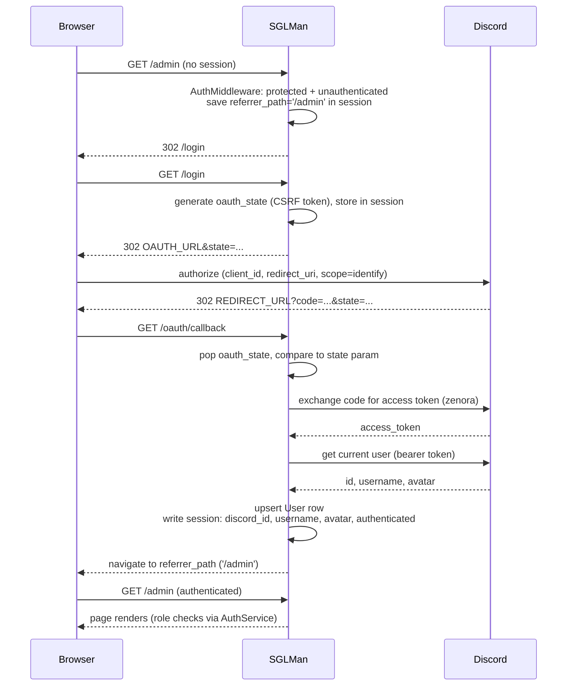

# Authentication & Authorization Reference

_Mechanics of Discord OAuth login, session storage, route protection, and the `AuthService` authorization API. Part of the [documentation index](../README.md)._

This document covers **how** authentication and authorization work. For **who may do what** (the role/permission matrix), see [features/role-based-auth.md](../features/role-based-auth.md). For the mock-login developer workflow, see [features/mock-discord.md](../features/mock-discord.md).

Sources: [`middleware/auth.py`](../../middleware/auth.py), [`middleware/mock_auth.py`](../../middleware/mock_auth.py), [`application/services/auth_service.py`](../../application/services/auth_service.py), [`application/utils/environment.py`](../../application/utils/environment.py), [`application/utils/mock_discord.py`](../../application/utils/mock_discord.py), [`frontend.py`](../../frontend.py).

## Overview

SGLMan authenticates users with Discord OAuth (`identify` scope only) and keeps their identity in NiceGUI's signed per-browser session store (`app.storage.user`). [`middleware/auth.py`](../../middleware/auth.py) owns the whole flow: it registers the `/login`, `/logout`, and `/oauth/callback` routes, provides the `protected_page` decorator that marks pages as login-required, and installs `AuthMiddleware`, which redirects unauthenticated requests to `/login`. Authorization is a separate, stateless layer: [`AuthService`](../../application/services/auth_service.py) answers role and capability questions against the database on every check — nothing about roles is cached in the session. When `MOCK_DISCORD=true`, the three auth routes are replaced by a local user-picker ([`middleware/mock_auth.py`](../../middleware/mock_auth.py)) and no Discord credentials are needed.



## OAuth flow mechanics

### Routes

`middleware/auth.py:create()` registers three NiceGUI pages (called from [`frontend.py`](../../frontend.py) `init()`). Under `MOCK_DISCORD` it instead delegates to `mock_auth.create()`, which registers the same three paths (see [Mock authentication](#mock-authentication-dev)).

| Route | Behavior |
|---|---|
| `/login` | If already authenticated, redirects to `/`. Otherwise generates a CSRF `state` token, stores it in the session, and 302-redirects to `OAUTH_URL` with `state` appended. |
| `/logout` | `app.storage.user.clear()` — wipes the entire session — then redirects to `/`. |
| `/oauth/callback` | Validates `state`, exchanges the `code` for an access token, fetches the Discord user, upserts the `User` row, writes the session, then navigates to the saved `referrer_path` (default `/`). |

### CSRF state

`/login` binds each login attempt to a one-time token:

- Generated with `secrets.token_urlsafe(32)` and stored at `app.storage.user['oauth_state']`.
- Appended to the authorize URL as `state=...` (URL-encoded; joined with `&` or `?` depending on whether `OAUTH_URL` already contains a query string).
- On the callback, the stored value is **popped** (single use) before any validation and compared to the returned `state` query parameter. A missing or mismatched state notifies "Login session expired or invalid" and navigates back to `/login`.

### Callback processing

`/oauth/callback` is an async NiceGUI page. It waits for `client.connected()`, then reads the full URL via `ui.run_javascript('window.location.href')` and parses the query string from it (rather than from the server-side request). It handles, in order: an `error` parameter (user cancelled/denied → warning notify, back to `/login`), the state check, and a missing `code` — each failure path notifies and navigates to `/login`. Any unexpected exception is logged and produces a negative notify plus a `/login` redirect.

The token exchange uses zenora: a module-level `APIClient(DISCORD_TOKEN, client_secret=DISCORD_CLIENT_SECRET)` (created at import time; `None` in mock mode) calls `oauth.get_access_token(code, REDIRECT_URL)`, and a second `APIClient(access_token, bearer=True)` fetches the current Discord user.

### What is persisted where

Session keys in `app.storage.user`:

| Key | Written by | Purpose |
|---|---|---|
| `authenticated` | callback / mock login | `bool` flag that `AuthMiddleware` checks |
| `discord_id` | callback / mock login | Identity key; resolved to a `User` row by `get_user_from_discord_id(discord_id)` |
| `username` | callback / mock login | Display convenience |
| `avatar` | callback (`avatar_url`; `None` in mock mode) | Display convenience |
| `oauth_state` | `/login` | One-time CSRF token; popped by the callback |
| `referrer_path` | `AuthMiddleware` | Original destination; popped after the post-login redirect |

`User` row writes on every successful login (`User.get_or_create(discord_id=...)`):

- **New user** — created with `discord_id` and `username`.
- **Existing user** — `username` is overwritten and saved; all other fields (including `display_name`) are untouched.

The Discord `access_token` is **not persisted**: the callback uses it only in-process to fetch the current Discord user (via a short-lived bearer `APIClient`), and it is never written to the `User` row or the session. Roles are never written at login by the callback itself — `DiscordRoleMappingService().sync_user_roles(user)` may map guild roles onto `UserRole` rows, but role checks otherwise come solely from `UserRole` rows and tournament memberships (see [features/role-based-auth.md](../features/role-based-auth.md)).

The post-login redirect target is `app.storage.user.get('referrer_path', '/')`; if it is one of `/login`, `/logout`, or `/oauth/callback` it falls back to `/`.

### OAuth URL derivation

All values are read from the environment **once, at import of `middleware/auth.py`**. See [`.env.example`](../../.env.example) for the annotated template and [deployment.md](../deployment.md) for the full variable table.

| Variable | Required | Default / derivation |
|---|---|---|
| `DISCORD_CLIENT_ID` | yes (real OAuth) | Embedded in the derived `OAUTH_URL` |
| `DISCORD_CLIENT_SECRET` | yes (real OAuth) | zenora client secret for the code exchange |
| `DISCORD_TOKEN` | yes (real OAuth) | Bot token for the module-level zenora client |
| `BASE_URL` | no | `http://localhost:8000` (trailing `/` stripped) |
| `REDIRECT_URL` | no | `{BASE_URL}/oauth/callback` |
| `OAUTH_URL` | no | `https://discord.com/api/oauth2/authorize?client_id={DISCORD_CLIENT_ID}&redirect_uri={REDIRECT_URL, URL-encoded}&response_type=code&scope=identify` |

`REDIRECT_URL` and `OAUTH_URL` env vars are overrides for non-standard setups; normally only `BASE_URL` and the Discord credentials are set. The `state` parameter is appended per request, not baked into `OAUTH_URL`.

## Route protection

Protection has two layers: `AuthMiddleware` enforces **login** for registered protected paths, and the `protected_page` wrapper optionally enforces **roles** at render time.

### `protected_page` decorator

```python
def protected_page(
    path: str,
    *,
    roles: Optional[Iterable[Role]] = None,
    allow_tournament_membership: bool = False,
    **page_kwargs,
)
```

Semantics:

- Adds `path` to the module-level `protected_routes` registry (consumed by `AuthMiddleware`), then registers the function with `ui.page(path, **page_kwargs)`.
- **No `roles` and `allow_tournament_membership=False`** — the function is registered as-is. Login is enforced only by the middleware; there is no render-time check.
- **`roles` set** — at render time the user is resolved via `get_user_from_discord_id(app.storage.user.get('discord_id'))` and must hold **at least one** of the listed global roles (`AuthService.get_roles` intersection).
- **`allow_tournament_membership=True`** — if the role gate did not pass (or no `roles` were given), `AuthService.can_view_admin(user)` is consulted, so Tournament Admins and Crew Coordinators of any tournament also pass. Intended for pages like the admin dashboard shell whose subset of features is available to per-tournament admins.
- **Denied** — the wrapper renders the themed 403 page via `render_error_page(status_code=403, headline='Forbidden', ...)` ([`theme/error_page.py`](../../theme/error_page.py)) and returns. This is a normal 200 page render, not a redirect. See [Error pages](frontend.md#error-pages-middlewareerror_handlerspy).

Current usages: `@protected_page('/admin')` ([`pages/admin.py`](../../pages/admin.py)) and `@protected_page('/equipment/{asset_id}')` ([`pages/equipment.py`](../../pages/equipment.py)) — both login-only, with authorization handled inside the page body — plus `@protected_page('/volunteer', roles=[Role.VOLUNTEER, Role.PROCTOR, Role.STAFF])` ([`pages/volunteer.py`](../../pages/volunteer.py)), which uses the render-time role gate. Triforce text editing is no longer a standalone protected route: it lives as a Triforce Texts tab on the home page and inside the admin dashboard. Page registration order is described in [frontend.md](frontend.md).

Note that on a login-only protected page, a user whose session is valid but whose `User` row no longer exists reaches the page body with no render-time gate — the page must handle that itself (as `pages/admin.py` does, below).

### `AuthMiddleware`

Registered in [`frontend.py`](../../frontend.py) with `app.add_middleware(AuthMiddleware)` at module import time (on the NiceGUI `app`). Its `dispatch` runs on every request:

1. If `app.storage.user.get('authenticated', False)` is truthy, pass through.
2. Otherwise, if the path does not start with `/_nicegui` (NiceGUI internals are exempt) **and** `_matches_protected_route(path)` is true: save the path as `app.storage.user['referrer_path']` and return `RedirectResponse('/login')`.
3. All other unauthenticated traffic (home page, `/api/*`, static files) passes through.

The original destination is preserved server-side in the session (`referrer_path`), not as a query parameter; the OAuth callback (and mock login) consume it after a successful login.

`_matches_protected_route` matches each entry in `protected_routes`:

- Plain paths match by **exact string equality** (no prefix matching — `/admin/foo` would not match `/admin`).
- Paths containing `{param}` placeholders are compiled to anchored regexes, each placeholder replaced with `[^/]+`, so dynamic NiceGUI routes like `/equipment/{asset_id}` match concrete request paths like `/equipment/3`.

## Session storage & security

`app.storage.user` is NiceGUI's per-browser session store, signed with `STORAGE_SECRET` — [`frontend.py`](../../frontend.py) passes `storage_secret=(os.environ.get('STORAGE_SECRET') or '').strip()` to `ui.run_with()`. The entire authorization model trusts the `discord_id` in this signed store, which is why startup refuses to proceed without the secret.

`validate_security_config()` ([`application/utils/environment.py`](../../application/utils/environment.py)) is called first thing in `frontend.init()` (see [architecture.md](../architecture.md) for the full startup sequence) and raises `RuntimeError` (aborting startup before any request is served) when:

| Check | Environment | Notes |
|---|---|---|
| `STORAGE_SECRET` non-empty (after strip) | always | Presence check; the error message and [`.env.example`](../../.env.example) direct operators to a strong random value (e.g. `secrets.token_urlsafe(32)`) |
| `STORAGE_SECRET` length **≥ 32** (after strip) | production only | Enforced in addition to the presence check; a shorter secret aborts startup with a `RuntimeError` |
| `DB_USERNAME` non-empty | production only | |
| `DB_PASSWORD` non-empty | production only | |

"Production" means `ENVIRONMENT=production` (`get_environment()` lowercases and strips; default is `development`).

The `MOCK_DISCORD` production refusal is **not** part of `validate_security_config()` — it lives in `is_mock_discord()` ([`application/utils/mock_discord.py`](../../application/utils/mock_discord.py)), which raises `RuntimeError` whenever `MOCK_DISCORD` is truthy (`1`/`true`/`yes`, case-insensitive) while `ENVIRONMENT=production`. Because `middleware/auth.py` calls `is_mock_discord()` at import time, this also aborts startup. Rationale: mock mode turns `/login` into an unauthenticated impersonate-anyone page (see below), which is a complete authentication bypass.

`/logout` clears the whole session; there is no server-side session table to invalidate. The Discord access token is never persisted — neither in the session nor on the `User` row — so there is nothing token-shaped to revoke at logout.

## Authorization API (`AuthService`)

[`AuthService`](../../application/services/auth_service.py) is a stateless collection of async static methods. Every check accepts `Optional[User]` and treats `None` as "no access" — callers never need a guard. The intended pattern: resolve the user **once** at page entry with `get_user_from_discord_id(app.storage.user.get('discord_id'))`, then pass the model into the helpers. All checks query the database live; nothing is cached.

For the role semantics behind these checks (what staff/proctor/stream_manager mean, TA/CC membership), see [features/role-based-auth.md](../features/role-based-auth.md). For the rest of the service layer, see [services.md](services.md).

| Method | True when / behavior |
|---|---|
| `get_roles(user)` | Returns `set[Role]` of global roles (empty set for `None`) |
| `has_role(user, role)` | User holds the given global role (`UserRole` row exists) |
| `is_staff(user)` | Shorthand for `has_role(user, Role.STAFF)` |
| `is_proctor(user)` | Shorthand for `has_role(user, Role.PROCTOR)` |
| `is_stream_manager(user)` | Shorthand for `has_role(user, Role.STREAM_MANAGER)` |
| `is_tournament_admin(user, tournament_id)` | User is in that tournament's `admins` M2M |
| `is_crew_coordinator_of(user, tournament_id)` | User is in that tournament's `crew_coordinators` M2M |
| `can_view_admin(user)` | An admin global role (`STAFF`, `STREAM_MANAGER`, `EQUIPMENT_MANAGER`, `VOLUNTEER_COORDINATOR`), **or** TA/CC of at least one tournament. Excludes `PROCTOR`/`VOLUNTEER` |
| `can_edit_tournament(user, tournament)` | Staff, or TA of that tournament |
| `can_crud_match(user, match)` | Staff, or TA of the match's tournament |
| `can_transition_match(user, match)` | Staff, proctor, or TA of the match's tournament — covers seat/start/finish/confirm, seed rolls, station assignment |
| `can_approve_crew(user, match)` | Staff, TA, or CC of the match's tournament |
| `can_manage_stream_rooms(user)` | Staff or stream manager — CRUD on `StreamRoom` records themselves |
| `can_assign_match_stream(user, match)` | `can_manage_stream_rooms`, or TA of the match's tournament — sets a match's `stream_room` / `is_stream_candidate` |
| `can_grant_roles(user)` | Staff only — grant/revoke `UserRole` rows and tournament `admins`/`crew_coordinators` |
| `ensure(allowed, message='Permission denied')` | Raises `PermissionError(message)` when `allowed` is falsy — for service-layer guard clauses |

The module also exports a helper (re-exported from [`application/services`](../../application/services/__init__.py)):

```python
async def get_user_from_discord_id(discord_id: str | None) -> Optional[User]
```

Takes the `discord_id` read from `app.storage.user` and returns `User.get_or_none(discord_id=...)` — `None` when `discord_id` is absent (not logged in) **or** when the user row has been deleted since login.

### Worked example: per-tournament gating in `pages/admin.py`

[`pages/admin.py`](../../pages/admin.py) uses login-only protection (`@protected_page('/admin')`, no `roles=`) and does its own authorization inside the page body, because tab visibility depends on a mix of global roles and per-tournament membership:

```python
@protected_page('/admin')
async def admin_dashboard_page(...):
    user = await User.get_or_none(discord_id=app.storage.user.get('discord_id'))
    ...
    roles = await AuthService.get_roles(user)
    is_staff = Role.STAFF in roles
    is_stream_manager = Role.STREAM_MANAGER in roles
    is_volunteer_coordinator = Role.VOLUNTEER_COORDINATOR in roles
    is_equipment_manager = Role.EQUIPMENT_MANAGER in roles
    is_ta_any = await user.admin_tournaments.all().exists()
    is_cc_any = await user.crew_coordinated_tournaments.all().exists()

    if not (is_staff or is_stream_manager or is_equipment_manager or is_ta_any or is_cc_any):
        ...render denial page; return          # same condition as AuthService.can_view_admin

    if is_staff or is_ta_any or is_cc_any:
        tabs.append(...)  # Schedule
    if is_staff:
        tabs.append(...)  # Users
    if is_staff or is_ta_any:
        tabs.append(...)  # Tournaments, Triforce Texts
    if is_staff or is_equipment_manager:
        tabs.append(...)  # Equipment
```

Proctors are **not** admitted to `/admin`; their race/schedule workflow lives on the [`/volunteer`](../../pages/volunteer.py) page instead. A Tournament Admin with no global role gets the Schedule/Tournaments/Reports tabs but never Users; deeper actions inside the tabs re-check against the specific tournament with `is_tournament_admin` / `is_crew_coordinator_of`.

## Mock authentication (dev)

When `is_mock_discord()` returns true, `middleware/auth.py:create()` skips the OAuth routes entirely and calls [`middleware/mock_auth.py`](../../middleware/mock_auth.py) `create()`, which registers replacements at the same paths:

| Route | Mock behavior |
|---|---|
| `/login` | Full user-picker page (no Discord redirect): a filterable table of all existing users — username, display name, discord_id, and a roles summary including `TA(n)`/`CC(n)` membership counts — each with a "Log in as" button, plus a "Create new user" card (username, optional display name, random pre-filled numeric discord_id, multi-select of all `Role` values) that creates the `User` and `UserRole` rows and logs straight in. Already-authenticated visitors are sent to `/`. |
| `/logout` | Identical to the real route: clears the session, redirects to `/`. |
| `/oauth/callback` | Stub: unconditionally redirects to `/`. |

`_login_as(user)` populates `app.storage.user` with exactly the same keys as the real callback (`username`, `avatar=None`, `authenticated=True`, `discord_id`) and honors `referrer_path` with the same `/login`-`/logout`-`/oauth/callback` exclusion — so `AuthMiddleware`, `protected_page`, and all `AuthService` checks behave identically in mock mode. No `access_token` is involved, and the zenora client is never constructed.

Users created through the picker are real database rows and persist across restarts. The mode is refused at startup in production (see [Session storage & security](#session-storage--security)). For the enable/use workflow and the `DiscordService` stubbing that accompanies it, see [features/mock-discord.md](../features/mock-discord.md).
