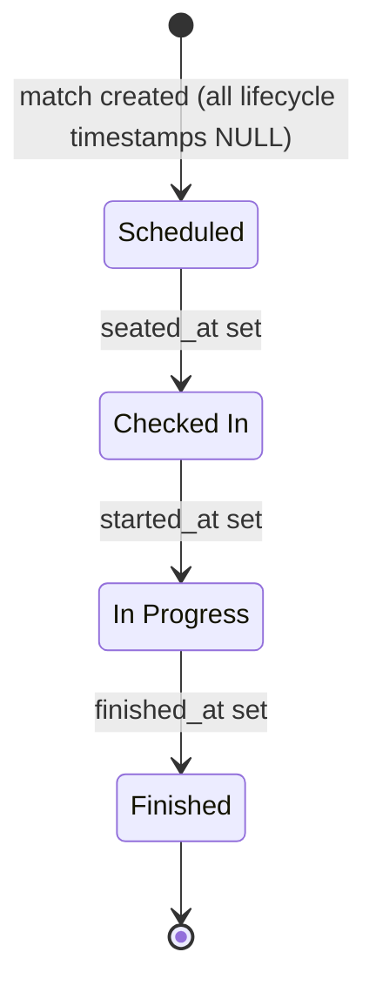

# Data Model & Persistence Reference

*Method-level reference for the [`models/`](../../models/) package (all 52 models and its 16 enums), the repository layer in [`application/repositories/`](../../application/repositories/), and the migration setup in [`migrations/`](../../migrations/). Part of the [documentation index](../README.md). The service layer that sits on top of these repositories is documented in [services.md](services.md).*

> **Package layout.** Models were split out of the former single `models.py` into per-domain submodules under `models/` (`tenant`, `user`, `tournament`, `match`, `equipment`, `feedback`, `volunteer`, `audit`, `system`, `webhook`, `challonge`, `racetime`, `speedgaming`, `discord_events`, `async_qualifier`), with the shared enums in `models/enums.py`. Every model and enum is re-exported from `models/__init__.py`, so `from models import X` and Tortoise's single `"models"` app registration are unchanged. Cross-model foreign keys use string references (`'models.User'`), so the submodules carry no import-order dependencies.*

## Overview

Persistence is [Tortoise ORM](https://tortoise.github.io/) 0.24 on PostgreSQL via the `asyncpg` backend. A single `default` connection is built from environment variables in [`migrations/tortoise_config.py`](../../migrations/tortoise_config.py) (see [Migrations](#migrations)). For the database's place in the overall system see [architecture.md](../architecture.md); for the Docker topology and operations see [deployment.md](../deployment.md).

Conventions shared by all models:

- **Surrogate primary key** — every model has `id = fields.IntField(pk=True)` (`SERIAL` in PostgreSQL). The per-model field tables below omit `id`.
- **Timestamps** — every model has `created_at` (`auto_now_add=True`, except `EquipmentLoan`, which uses `checked_out_at`); all except `AuditLog`, `TelemetryEvent`, `UserRole`, `ApiToken`, and `EquipmentLoan` also have `updated_at` (`auto_now=True`). The field tables omit these unless a model deviates. All datetime columns are `TIMESTAMPTZ` and store UTC; display is US/Eastern — see [timezone-handling.md](../timezone-handling.md).
- **Table names** — Tortoise defaults to the lowercased class name (`matchplayers`, `generatedseeds`, …). Most multi-word models also pin that same lowercased name explicitly via `Meta.table` (`matchplayers`, `tournamentplayers`, `commentator`, `tracker`, `matchacknowledgment`, `tournamentnotificationpreference`, `matchwatcher`, `auditlog`, `telemetryevent`, `userrole`, `triforcetext`, `apitoken`, `feedback`, `equipment`, `equipmentloan`, `volunteerprofile`, `volunteerposition`, `volunteershift`, `volunteerassignment`, `volunteerqualification`, `volunteeravailability`, `playeravailability`, `challongeconnection`, `challongeparticipant`, `challongematch`, `challongeapiusage`, `webpushsubscription`). The two many-to-many through tables keep their declared CamelCase names (`"TournamentAdmins"`, `"TournamentCrewCoordinators"`).
- **Delete behavior** — Tortoise's default `ON DELETE CASCADE` applies to genuine parent/child FKs (deleting a match removes its players, acknowledgments, and crew). Detachment and attribution FKs declare `on_delete=fields.SET_NULL` so the record survives the referenced row's deletion: `Match.stream_room` / `Match.generated_seed`, `AuditLog.user`, `TelemetryEvent.user`, `UserRole.granted_by`, `Commentator.approved_by`, `Tracker.approved_by`, `TriforceText.user` / `TriforceText.approved_by`, `Equipment.owner_user`, `EquipmentLoan.checked_in_by`, `VolunteerAssignment.assigned_by` / `checked_in_by`, `ChallongeConnection.connected_by`, `ChallongeParticipant.user`, `ChallongeMatch.participant1` / `participant2` / `winner_participant` / `match`. Equipment lending history uses `on_delete=fields.RESTRICT` (`EquipmentLoan.borrower` / `checked_out_by`) so a user with loan history cannot be hard-deleted — retire them via `User.is_active` instead. Natural-key uniqueness is enforced by DB constraints on the junctions (`MatchPlayers`, `TournamentPlayers`, `Commentator`, `Tracker` on their `(match|tournament, user)` pair) and on `User.challonge_user_id` and `User.twitch_user_id`.

Coding conventions for the layers above (async everywhere, no ORM writes from the UI, audit-log action naming) are canonical in [CLAUDE.md](../../CLAUDE.md) and [refactoring-guide.md](../refactoring-guide.md) — not restated here.

## Multitenancy

The database is **logically multitenant**: one shared database and shared
tables, with a `tenant_id` discriminator column on tenant-scoped rows and a
request-time tenant context resolved from the URL (see
[multitenancy-plan.md](../multitenancy-plan.md) and
[`application/tenant_context.py`](../../application/tenant_context.py)). The
unifying rule: **identity, the tenancy machinery, and singleton runtime
resources are global; everything a tournament community owns or produces is
tenant-scoped.**

- **`Tenant`** (`tenant`) — one row per hosted community. Columns: `name`,
  `slug` (unique, URL-safe — path routing key `/t/<slug>`), `domain` (unique,
  nullable — reserved for host-based addressing, not yet resolved),
  `discord_guild_id` (nullable, **non-unique** — bot routing key; a guild may be
  shared by several tenants and the bot fans out over all of them), `is_active`,
  `config` (JSON).
- **`TenantMembership`** (`tenantmembership`) — `(user, tenant)`, `unique_together`.
  Ties a global `User` to the tenants they belong to; queried across tenants, so
  it is never auto-scoped.
- **Global (no `tenant` FK):** `User`, `WebPushSubscription`, `Tenant`,
  `TenantMembership`, `RacetimeBot` (shared, platform-managed per category).
  `User.discord_id` / `challonge_user_id` / `twitch_user_id` / `racetime_user_id`
  uniques stay global — identity links are to the person; `RacetimeBot.category`
  is globally unique.
- **Nullable `tenant` (stamped from context, NULL = platform-level row):**
  `AuditLog`, `TelemetryEvent` (`SET NULL` on tenant delete), and `UserRole`
  (`CASCADE`; NULL only for the global `SUPER_ADMIN` role).
- **Tenant-scoped (`tenant` FK, NOT NULL, `CASCADE`):** every other model —
  `Tournament`, `Match`, `MatchPlayers`, `MatchAcknowledgment`,
  `TournamentPlayers`, `TournamentNotificationPreference`, `StreamRoom`,
  `Commentator`, `Tracker`, `MatchWatcher`, `GeneratedSeeds`, `Preset`,
  `SystemConfiguration`, `Webhook`, `WebhookDelivery`, `DiscordRoleMapping`,
  `TriforceText`, `ApiToken`, `Feedback`, `Equipment`, `EquipmentLoan`,
  `VolunteerProfile`, `VolunteerPosition`, `VolunteerShift`,
  `VolunteerAssignment`, `VolunteerQualification`, `VolunteerAvailability`,
  `PlayerAvailability`, `ChallongeConnection`, `ChallongeParticipant`,
  `ChallongeMatch`, `ChallongeApiUsage`, `RacetimeBotTenant`, `RaceRoomProfile`,
  `RacetimeRoom`.
- **Per-tenant uniqueness** — formerly-global uniques became composite with
  `tenant`: `StreamRoom.name`, `VolunteerPosition.name`,
  `SystemConfiguration.name` → `(tenant, name)`; `Equipment.asset_number` →
  `(tenant, asset_number)`; `ChallongeApiUsage.period` → `(tenant, period)`;
  `DiscordRoleMapping` → `(tenant, discord_role_id, app_role)`; `UserRole` →
  `(user, role, tenant)`; `RaceRoomProfile.name` → `(tenant, name)`. The
  `RacetimeBotTenant` grant is unique on `(bot, tenant)`; `RacetimeRoom.slug`
  stays **globally** unique (it is the tenant-routing key for inbound events).
- **`VolunteerProfile`** changed from a global `OneToOneField(user)` to a
  tenant-scoped `ForeignKeyField(user)` with `unique_together(tenant, user)` —
  opt-in is per tenant. `User.volunteer_profile` (single) became
  `User.volunteer_profiles` (per-tenant).

The `tenant`-adding migration is additive (nullable FK → default-tenant backfill
→ `SET NOT NULL`); see [Migrations](#migrations).

## Entity-relationship diagram

Legend: `||--o{` required FK (child → exactly one parent), `|o--o{` nullable FK (child → zero or one parent), `}o--o{` many-to-many. Relationship labels are the FK/M2M field names as declared in the `models/` package.

```mermaid
erDiagram
    User ||--o{ UserRole : "user"
    User |o--o{ UserRole : "granted_by"
    User ||--o{ AuditLog : "user"
    User |o--o{ TelemetryEvent : "user"
    User ||--o{ WebPushSubscription : "user"

    Tournament }o--o{ User : "admins (TournamentAdmins)"
    Tournament }o--o{ User : "crew_coordinators (TournamentCrewCoordinators)"
    Tournament ||--o{ TournamentPlayers : "tournament"
    User ||--o{ TournamentPlayers : "user"
    Tournament ||--o{ TournamentNotificationPreference : "tournament"
    User ||--o{ TournamentNotificationPreference : "user"
    Tournament ||--o{ TriforceText : "tournament"
    User |o--o{ TriforceText : "user"
    User |o--o{ TriforceText : "approved_by"

    Tournament ||--o{ Match : "tournament"
    StreamRoom |o--o{ Match : "stream_room"
    GeneratedSeeds |o--o{ Match : "generated_seed"
    Match ||--o{ MatchPlayers : "match"
    User ||--o{ MatchPlayers : "user"
    Match ||--o{ MatchAcknowledgment : "match"
    User ||--o{ MatchAcknowledgment : "user"
    Match ||--o{ MatchWatcher : "match"
    User ||--o{ MatchWatcher : "user"

    Match ||--o{ Commentator : "match"
    User ||--o{ Commentator : "user"
    User |o--o{ Commentator : "approved_by"
    Match ||--o{ Tracker : "match"
    User ||--o{ Tracker : "user"
    User |o--o{ Tracker : "approved_by"

    User ||--o{ ApiToken : "user"
    User ||--o{ Feedback : "user"
    User |o--o{ Equipment : "owner_user"
    Equipment ||--o{ EquipmentLoan : "equipment"
    User ||--o{ EquipmentLoan : "borrower"
    User ||--o{ EquipmentLoan : "checked_out_by"
    User |o--o{ EquipmentLoan : "checked_in_by"

    User ||--|| VolunteerProfile : "user"
    VolunteerPosition ||--o{ VolunteerShift : "position"
    VolunteerShift ||--o{ VolunteerAssignment : "shift"
    User ||--o{ VolunteerAssignment : "user"
    User |o--o{ VolunteerAssignment : "assigned_by"
    User ||--o{ VolunteerQualification : "user"
    VolunteerPosition ||--o{ VolunteerQualification : "position"
    User ||--o{ VolunteerAvailability : "user"
    User ||--o{ PlayerAvailability : "user"

    User |o--o{ ChallongeConnection : "connected_by"
    Tournament ||--o{ ChallongeParticipant : "tournament"
    User |o--o{ ChallongeParticipant : "user"
    Tournament ||--o{ ChallongeMatch : "tournament"
    ChallongeParticipant |o--o{ ChallongeMatch : "participant1 / participant2 / winner"
    Match |o--o{ ChallongeMatch : "match"

    SystemConfiguration {
        string name "unique key"
    }
    ChallongeApiUsage {
        string period "unique YYYY-MM"
    }
```



`SystemConfiguration` and `ChallongeApiUsage` have no foreign-key relationships. The two M2M lines are realized as the through tables `TournamentAdmins` and `TournamentCrewCoordinators`, declared inline on `Tournament` (`through=`) rather than as model classes.

## Enums

These enums are `str`-valued and stored via `CharEnumField`.

### `Role`

Used by `UserRole.role` and `DiscordRoleMapping.app_role` (`max_length=32`). Authorization checks are made through `AuthService` — see [role-based-auth.md](../features/role-based-auth.md).

| Value | Meaning |
|---|---|
| `STAFF` = `'staff'` | Full staff access |
| `PROCTOR` = `'proctor'` | Match proctoring |
| `STREAM_MANAGER` = `'stream_manager'` | Stream/stage management |
| `TRIFORCE_SUBMITTER` = `'triforce_submitter'` | May submit triforce-screen texts |
| `VOLUNTEER_COORDINATOR` = `'volunteer_coordinator'` | Manages volunteer positions, shifts, and assignments |
| `EQUIPMENT_MANAGER` = `'equipment_manager'` | Manages lending equipment and checkouts |
| `VOLUNTEER` = `'volunteer'` | Opted-in onsite volunteer |
| `PRESET_MANAGER` = `'preset_manager'` | Manages seed-rolling presets (online-tournament surface) |
| `SYNC_ADMIN` = `'sync_admin'` | Manages upstream sync config: SpeedGaming links, Discord events, racetime bot/room config |
| `QUALIFIER_ADMIN` = `'qualifier_admin'` | Administers async qualifiers (also grantable per-qualifier via its `admins` M2M) |
| `SUPER_ADMIN` = `'super_admin'` | Global platform role (manages tenants on `/platform`). Its `UserRole` rows carry `tenant=NULL` and stay visible inside any tenant request; the only role that may be tenant-less. |

### `RoleSource`

Used by `UserRole.source` (`max_length=16`, default `MANUAL`). Distinguishes roles a Staff member granted by hand from roles derived automatically from Discord, so the login-time sync only ever revokes the roles it created — see [discord-role-sync.md](../features/discord-role-sync.md).

| Value | Meaning |
|---|---|
| `MANUAL` = `'manual'` | Granted by a Staff member (or pre-existing); never auto-revoked |
| `DISCORD` = `'discord'` | Granted by the Discord role sync; revoked when the mapped Discord role is lost |

### `MatchNotificationLevel`

Used by `TournamentNotificationPreference.match_notifications` (`max_length=30`, default `NONE`). Consumed by `TournamentNotificationRepository.get_match_notification_subscribers` / `get_stream_candidate_subscribers` — see [tournament-notifications.md](../features/tournament-notifications.md).

| Value | Meaning |
|---|---|
| `NONE` = `'none'` | No match notifications |
| `STREAMED` = `'streamed'` | Notify only for matches with a stream room assigned |
| `STREAMED_AND_CANDIDATES` = `'streamed_and_candidates'` | As `STREAMED`, plus stream-candidate alerts |
| `ALL` = `'all'` | Notify for every match in the tournament |

### `VolunteerAvailabilityStatus`

Used by both `VolunteerAvailability.status` and `PlayerAvailability.status` (`max_length=20`, default `AVAILABLE`). Drives the availability picker and the effective-availability overlap calculations in the volunteer/player availability services.

| Value | Meaning |
|---|---|
| `AVAILABLE` = `'available'` | Free during the window |
| `UNAVAILABLE` = `'unavailable'` | Explicitly blocked out during the window |
| `PREFERRED` = `'preferred'` | Available and would prefer to be scheduled then |

### `FeedbackCategory`

Used by `Feedback.category` (`max_length=20`, default `OTHER`).

| Value | Meaning |
|---|---|
| `BUG` = `'bug'` | Something is broken |
| `SUGGESTION` = `'suggestion'` | Feature/UX idea |
| `PRAISE` = `'praise'` | Positive feedback |
| `OTHER` = `'other'` | Uncategorized |

### `FeedbackStatus`

Used by `Feedback.status` (`max_length=20`, default `NEW`).

| Value | Meaning |
|---|---|
| `NEW` = `'new'` | Not yet triaged |
| `REVIEWED` = `'reviewed'` | A staff member has reviewed it |

### `EquipmentStatus`

Used by `Equipment.status` (`max_length=20`, default `AVAILABLE`). Kept in sync with open `EquipmentLoan` rows by `EquipmentService` (the single writer).

| Value | Meaning |
|---|---|
| `AVAILABLE` = `'available'` | On hand, can be checked out |
| `CHECKED_OUT` = `'checked_out'` | Currently on loan (an open `EquipmentLoan` exists) |
| `RETIRED` = `'retired'` | No longer in service |

### `StationFormat`

Stored in `SystemConfiguration` under key `station_format`. Controls the validation pattern applied to station assignment strings in the dialog and in `MatchService.assign_stations`. Default is `FREE` to preserve existing behaviour.

| Value | Meaning |
|---|---|
| `FREE` = `'free'` | No validation; any string up to 50 characters |
| `NUMERIC` = `'numeric'` | Integers only (e.g. `1`, `2`, `3`) |
| `STRUCTURED` = `'structured'` | One letter followed by 1–2 digits (e.g. `A1`, `B12`) |
| `ALPHANUMERIC` = `'alphanumeric'` | Letters, numbers, hyphens, and spaces up to 20 characters |

### `ChallongeMatchState`

Used by `ChallongeMatch.state` (`max_length=20`, default `PENDING`). Mirrors the subset of Challonge match states relevant to scheduling.

| Value | Meaning |
|---|---|
| `PENDING` = `'pending'` | Participants not yet fully determined |
| `OPEN` = `'open'` | Both participants known and ready to play |
| `COMPLETE` = `'complete'` | Result recorded on Challonge |

### `BotStatus`

Used by `RacetimeBot.status` (`max_length=20`, default `UNKNOWN`). Health of a
racetime bot's websocket connection; the values are *written* by the PR 4
runtime and read by the platform health surface.

| Value | Meaning |
|---|---|
| `UNKNOWN` = `'unknown'` | No live connection has reported yet |
| `CONNECTED` = `'connected'` | Websocket up |
| `DISCONNECTED` = `'disconnected'` | Websocket down |
| `ERROR` = `'error'` | Connection error |

### `RaceRoomStatus`

Used by `RacetimeRoom.status` (`max_length=20`, default `OPEN`). Cached racetime
room lifecycle state, written by PR 4/6.

| Value | Meaning |
|---|---|
| `OPEN` = `'open'` | Room open, race not started |
| `IN_PROGRESS` = `'in_progress'` | Race running |
| `FINISHED` = `'finished'` | Race complete |
| `CANCELLED` = `'cancelled'` | Room cancelled |

### `SyncStatus`

Used by `SpeedGamingEpisode.sync_status` (`max_length=20`, default `PENDING`).
Reconciliation state of a synced SG episode (PR 7). `(str, Enum)` — render `.value`.

| Value | Meaning |
|---|---|
| `PENDING` = `'pending'` | Discovered upstream, not yet materialized |
| `SYNCED` = `'synced'` | Materialized/refreshed into a `Match` |
| `SKIPPED` = `'skipped'` | A lifecycle guard held the refresh back |
| `CANCELLED` = `'cancelled'` | Upstream episode gone; the `Match` soft-detached |
| `ERROR` = `'error'` | Transform/load failed (see `sync_error`) |

### `AsyncQualifierRunStatus` / `AsyncQualifierReviewStatus`

Async-qualifier run + review state (PR 9). Both `(str, Enum)` — render `.value`.
Web-first collapses reveal and start, so a run is created `IN_PROGRESS` at draw;
`PENDING` is reserved for a run pre-created before a synchronous start (live-race
path, PR 10).

| `AsyncQualifierRunStatus` | | `AsyncQualifierReviewStatus` | |
|---|---|---|---|
| `PENDING` = `'pending'` | reserved (live races) | `PENDING` = `'pending'` | awaiting review |
| `IN_PROGRESS` = `'in_progress'` | drawn, timing | `APPROVED` = `'approved'` | counts + scored |
| `FINISHED` = `'finished'` | submitted | `REJECTED` = `'rejected'` | excluded |
| `FORFEIT` = `'forfeit'` | irreversible, scores 0 | | |
| `DISQUALIFIED` = `'disqualified'` | staff DQ | | |

### `AsyncQualifierLiveRaceStatus`

Lifecycle of a synchronous racetime qualifier race (PR 10). `(str, Enum)` —
render `.value`: `SCHEDULED` = `'scheduled'` (before a room opens) → `PENDING` =
`'pending'` (room open, not started) → `IN_PROGRESS` = `'in_progress'` → `FINISHED`
= `'finished'` (results captured into runs).

## Model reference

### Identity

#### `User`

Discord-authenticated account. Created/updated during OAuth login; access control hangs off `UserRole`, not fields here.

| Field | Type | Null / default | Notes |
|---|---|---|---|
| `discord_id` | `BigIntField` | not null, `unique=True` | Discord snowflake |
| `username` | `CharField(150)` | not null | Discord username |
| `display_name` | `CharField(150)` | null | Preferred display name |
| `pronouns` | `CharField(50)` | null | |
| `is_active` | `BooleanField` | default `True` | |
| `is_system` | `BooleanField` | default `False` | Marks the single reserved automation actor (sentinel `discord_id` = `SYSTEM_USER_DISCORD_ID` = `0`). Workers/bots pass this row as `actor`; resolve it via `UserService.get_system_user()`. `AuthService.is_system()` treats it as authorized for automation actions |
| `dm_notifications` | `BooleanField` | default `True` | Master opt-out for Discord DMs |
| `challonge_user_id` | `CharField(64)` | null, `unique=True` | Verified Challonge identity, captured via one-time OAuth (scope `me`). Unique so bracket sync resolves to exactly one user (Postgres allows multiple NULLs) |
| `challonge_username` | `CharField(255)` | null | Cached Challonge username |
| `challonge_linked_at` | `DatetimeField` | null | When the Challonge identity was linked |
| `twitch_user_id` | `CharField(64)` | null, `unique=True` | Verified Twitch identity, captured via one-time OAuth. Unique so a Twitch id resolves to exactly one user (Postgres allows multiple NULLs) |
| `twitch_username` | `CharField(255)` | null | Cached Twitch login/display name |
| `twitch_linked_at` | `DatetimeField` | null | When the Twitch identity was linked |
| `racetime_user_id` | `CharField(64)` | null, `unique=True` | Verified racetime.gg identity, captured via one-time OAuth (read scope). Unique so a racetime id resolves to exactly one user (Postgres allows multiple NULLs) |
| `racetime_username` | `CharField(255)` | null | Cached racetime.gg name |
| `racetime_linked_at` | `DatetimeField` | null | When the racetime identity was linked |

The Challonge identity is **identity only** — the player's Challonge access token is never retained (writes use the shared service-account `ChallongeConnection`). The Twitch and racetime.gg identities are likewise **identity only** — the user's access token is used once during linking and discarded. There is no `access_token` field; the Discord OAuth token is not persisted on `User`.

Relationships: declared reverse/M2M accessors for `admin_tournaments` and `crew_coordinated_tournaments` (M2M from `Tournament`), `match_players`, `match_acknowledgments`, `tournament_players`, `tournament_notifications`, `commentaries`, `approved_commentaries`, `trackers`, `approved_trackers`, `watched_matches`, `roles`, `granted_roles`, `audit_logs`, `triforce_texts`, `triforce_texts_moderated`, `api_tokens`, `feedback_submissions`, `owned_equipment`, `equipment_loans`, `equipment_checkouts_performed`, `equipment_checkins_performed`, `volunteer_profile` (one-to-one), `volunteer_assignments`, `volunteer_assignments_made`, `volunteer_qualifications`, `volunteer_availability`, `challonge_participations`. Accessors that exist only implicitly via the children's `related_name` (no class-level annotation): `player_availability`, `challonge_connections`.

Properties: `preferred_name` returns `display_name` if it is truthy, otherwise `username`.

#### `UserRole`

Junction table mapping users to global `Role` values; records who granted the role and whether it was granted manually or synced from Discord. No `updated_at` field.

| Field | Type | Null / default | Notes |
|---|---|---|---|
| `user` | FK → `User` | not null, `CASCADE` | `related_name='roles'` |
| `role` | `CharEnumField(Role)` | not null | `max_length=32` |
| `granted_by` | FK → `User` | null, `SET_NULL` | `related_name='granted_roles'`; null for Discord-synced rows; survives granter deletion |
| `source` | `CharEnumField(RoleSource)` | not null, default `MANUAL` | `max_length=16`; manual grants are never auto-revoked by the Discord sync |

Constraints: `unique_together ('user', 'role')`; `Meta.table = 'userrole'`.

#### `DiscordRoleMapping`

Maps a Discord guild role to an application `Role`. Consulted at login by the Discord role sync; managed by Staff on the admin **Discord Roles** tab — see [discord-role-sync.md](../features/discord-role-sync.md).

| Field | Type | Null / default | Notes |
|---|---|---|---|
| `guild_id` | `BigIntField` | not null | Discord guild snowflake |
| `discord_role_id` | `BigIntField` | not null | Discord role snowflake |
| `discord_role_name` | `CharField(100)` | not null | Cached label for the admin table |
| `app_role` | `CharEnumField(Role)` | not null | `max_length=32` |

Constraints: `unique_together ('guild_id', 'discord_role_id', 'app_role')`; `Meta.table = 'discordrolemapping'`. A Discord role may map to several app roles and vice-versa.

#### `ApiToken`

Personal access token granting REST API access as its owning user. Only the SHA-256 hash is stored; the plaintext is shown once at creation. A token acts with the owner's full permissions unless `read_only` is set, in which case it may only call read endpoints — see [rest-api.md](rest-api.md) and [`ApiTokenService`](services.md). No `updated_at` field.

| Field | Type | Null / default | Notes |
|---|---|---|---|
| `user` | FK → `User` | not null | `related_name='api_tokens'` |
| `name` | `CharField(100)` | not null | User-supplied label |
| `token_hash` | `CharField(64)` | not null, `unique=True`, `index=True` | SHA-256 of the plaintext token |
| `token_prefix` | `CharField(24)` | not null | Non-secret prefix shown in the UI to identify the token |
| `read_only` | `BooleanField` | default `False` | Restricts the token to read endpoints |
| `last_used_at` | `DatetimeField` | null | Stamped on each authenticated request |
| `expires_at` | `DatetimeField` | null | Optional expiry; null = never |
| `revoked_at` | `DatetimeField` | null | Set when revoked; non-null tokens are rejected |

Constraints: `Meta.table = 'apitoken'`.

#### `Feedback`

In-app feedback submission from a logged-in attendee. Captures the page the user was on (`page_url`, including any `?tab=`) so staff have context to act on it. Reviewed on the admin **Feedback** tab.

| Field | Type | Null / default | Notes |
|---|---|---|---|
| `user` | FK → `User` | not null, `CASCADE` | `related_name='feedback_submissions'` |
| `category` | `CharEnumField(FeedbackCategory)` | default `OTHER` | `max_length=20` |
| `message` | `TextField` | not null | Free-text feedback |
| `page_url` | `CharField(512)` | not null | Path + query the user was on |
| `status` | `CharEnumField(FeedbackStatus)` | default `NEW` | `max_length=20` |

Constraints: `Meta.table = 'feedback'`.

### Tournament

#### `Tournament`

Tournament metadata and configuration; the root aggregate for matches, enrollment, teams, announcements, and triforce texts.

| Field | Type | Null / default | Notes |
|---|---|---|---|
| `name` | `CharField(255)` | not null | |
| `description` | `TextField` | null | |
| `seed_generator` | `CharField(255)` | null | Legacy randomizer name for seed generation; the `preset` FK wins when set ([seed-generation.md](seed-generation.md)) |
| `is_active` | `BooleanField` | default `True` | |
| `players_per_match` | `IntField` | default `2` | |
| `team_size` | `IntField` | default `1` | |
| `bracket_url` | `CharField(255)` | null | |
| `rules_url` | `CharField(255)` | null | |
| `tournament_format` | `CharField(255)` | null | |
| `triforce_access_message` | `TextField` | null | Custom message shown to players on the triforce-texts tab |
| `average_match_duration` | `IntField` | null | Minutes |
| `max_match_duration` | `IntField` | null | Minutes |
| `challonge_tournament_id` | `CharField(64)` | null | Linked Challonge tournament id (enables bracket sync) |
| `challonge_tournament_url` | `CharField(255)` | null | Challonge bracket URL |
| `challonge_last_synced_at` | `DatetimeField` | null | Last successful Challonge sync (UTC) |
| `config` | `JSONField` | null | Hybrid-config JSON half (messaging templates, scoring params, strategy choices). Written only through `TournamentService`, which validates it with `validate_tournament_config` (unknown keys raise `ValueError`); typed knobs stay their own columns. See [online-tournaments](../online-tournaments/README.md) |
| `preset` | FK → `Preset` | null, `SET_NULL` | Seed-rolling preset; resolves the randomizer + settings for seed generation and overrides `seed_generator` when set. `related_name='tournaments'` |
| `racetime_bot` | FK → `RacetimeBot` | null, `SET_NULL` | Selected racetime bot/category; validated against the tenant's authorization grants (`RacetimeBotTenant`). `related_name='tournaments'` |
| `race_room_profile` | FK → `RaceRoomProfile` | null, `SET_NULL` | Reusable room settings applied when a room is opened. `related_name='tournaments'` |
| `racetime_auto_create_rooms` | `BooleanField` | default `False` | Opt-in: auto-open a race room per scheduled match |
| `room_open_minutes_before` | `IntField` | default `30` | Lead time before `scheduled_at` to open the room |
| `require_racetime_link` | `BooleanField` | default `False` | Require players to have a linked racetime identity |
| `racetime_default_goal` | `CharField(255)` | null | Default racetime goal for opened rooms |
| `admins` | M2M → `User` | — | `through='TournamentAdmins'`, `related_name='admin_tournaments'` |
| `crew_coordinators` | M2M → `User` | — | `through='TournamentCrewCoordinators'`, `related_name='crew_coordinated_tournaments'` |
| `staff_administered` | `BooleanField` | default `False` | Staff-run vs. community tournament |

Relationships: declared reverse accessors `players`, `matches`, `teams`, `announcements`, `notification_preferences`, `triforce_texts`, `challonge_participants`, `challonge_matches`. Both M2M through tables carry a unique index on `(tournament_id, user_id)`.

Computed: `is_racetime_enabled` (property) → `racetime_bot_id is not None`. This is the canonical "configured for racetime.gg" test — a racetime tournament runs online, so the schedule UI hides on-site-only controls (check-in/seating, station assignment) and `MatchScheduleService.seat_match` / `MatchService.assign_stations` reject those actions for it.

#### `TournamentPlayers`

Tournament enrollment row (user ⇆ tournament).

| Field | Type | Null / default | Notes |
|---|---|---|---|
| `tournament` | FK → `Tournament` | not null | `related_name='players'` |
| `user` | FK → `User` | not null | `related_name='tournament_players'` |

Constraint: `unique_together ('tournament', 'user')` (added in migration 14); the `TournamentRepository.is_player_enrolled*` service checks remain for friendly error messages.

#### `TournamentNotificationPreference`

Per-user, per-tournament match notification level. See [tournament-notifications.md](../features/tournament-notifications.md).

| Field | Type | Null / default | Notes |
|---|---|---|---|
| `user` | FK → `User` | not null | `related_name='tournament_notifications'` |
| `tournament` | FK → `Tournament` | not null | `related_name='notification_preferences'` |
| `match_notifications` | `CharEnumField(MatchNotificationLevel)` | default `NONE` | `max_length=30` |

Constraints: `unique_together ('user', 'tournament')`; `Meta.table = 'tournamentnotificationpreference'`.

### Match

#### `Match`

Core scheduling unit. Lifecycle is derived from nullable timestamps rather than a status column — see [Match lifecycle](#match-lifecycle).

| Field | Type | Null / default | Notes |
|---|---|---|---|
| `tournament` | FK → `Tournament` | not null, `CASCADE` | `related_name='matches'` |
| `stream_room` | FK → `StreamRoom` | null, `SET_NULL` | `related_name='matches'`; deleting a room detaches its matches |
| `scheduled_at` | `DatetimeField` | null, indexed | Planned start (UTC) |
| `seated_at` | `DatetimeField` | null | Source comment: *now known as "Checked In"* |
| `started_at` | `DatetimeField` | null | |
| `finished_at` | `DatetimeField` | null, indexed | |
| `confirmed_at` | `DatetimeField` | null | Post-finish results confirmation |
| `comment` | `TextField` | null | |
| `is_stream_candidate` | `BooleanField` | default `False` | |
| `title` | `CharField(255)` | null | |
| `generated_seed` | FK → `GeneratedSeeds` | null, `SET_NULL` | `related_name='matches'` |

Relationships: declared reverse accessors `acknowledgments` and `challonge_match` (the linked Challonge bracket match, if scheduled from one); reverse accessors `players`, `commentators`, `trackers`, `watchers` exist via the children's `related_name`s without class-level declarations.

Properties (each a `bool` except the last):

- `is_seated` — `seated_at is not None`
- `is_finished` — `finished_at is not None`
- `is_confirmed` — `confirmed_at is not None`
- `is_started` — `started_at is not None`
- `current_state` — first match wins, checked in this order: `is_finished` → `'Finished'`, `is_started` → `'In Progress'`, `is_seated` → `'Checked In'`, else `'Scheduled'`

#### `MatchPlayers`

Players assigned to a match, with result and station assignment.

| Field | Type | Null / default | Notes |
|---|---|---|---|
| `match` | FK → `Match` | not null, `CASCADE` | `related_name='players'` |
| `user` | FK → `User` | not null, `CASCADE` | `related_name='match_players'` |
| `finish_rank` | `IntField` | null | Final placement (1 = winner) |
| `finish_time` | `IntField` | null | Elapsed finish time in whole seconds, captured from a racetime room result (PR 6, migration 25); null for non-finishers and non-racetime matches |
| `assigned_station` | `CharField(50)` | null | Physical/stream station label |

Constraint: `unique_together (('match', 'user'),)` (added in migration 14).

#### `MatchAcknowledgment`

Tracks whether each player has acknowledged a match (manually or automatically). See [match-acknowledgment.md](../features/match-acknowledgment.md).

| Field | Type | Null / default | Notes |
|---|---|---|---|
| `match` | FK → `Match` | not null, `CASCADE` | `related_name='acknowledgments'` |
| `user` | FK → `User` | not null, `CASCADE` | `related_name='match_acknowledgments'` |
| `acknowledged_at` | `DatetimeField` | null | Null = row exists but not acknowledged |
| `auto_acknowledged` | `BooleanField` | default `False` | True when acknowledged by the system |

Constraints: `unique_together (('match', 'user'),)`; `Meta.table = 'matchacknowledgment'`.

#### `MatchWatcher`

Users watching a match for state-change Discord DMs (observers, not participants). See [match-watcher.md](../features/match-watcher.md).

| Field | Type | Null / default | Notes |
|---|---|---|---|
| `user` | FK → `User` | not null, `CASCADE` | `related_name='watched_matches'` |
| `match` | FK → `Match` | not null, `CASCADE` | `related_name='watchers'` |

Constraints: `unique_together ('user', 'match')`; `Meta.table = 'matchwatcher'`.

#### `GeneratedSeeds`

Randomizer seed generated for a match; referenced by `Match.generated_seed`. Created directly by `MatchScheduleService.generate_seed` (no repository).

| Field | Type | Null / default | Notes |
|---|---|---|---|
| `seed_url` | `CharField(255)` | not null | Link to the generated seed |
| `seed_info` | `TextField` | null | Generator metadata |

#### `Preset`

Tenant-authored seed-rolling preset: a named `randomizer` + `settings` blob that seed generation resolves instead of a hard-coded `presets/*` file. CRUD via `PresetService` (gated by `AuthService.can_manage_presets`); the built-in files import as starting rows. Referenced by `Tournament.preset`. See [seed-generation.md](seed-generation.md).

| Field | Type | Null / default | Notes |
|---|---|---|---|
| `name` | `CharField(255)` | not null | Unique per `(tenant, randomizer)` |
| `randomizer` | `CharField(32)` | not null | One of `SeedGenerationService.AVAILABLE_RANDOMIZERS` |
| `settings` | `JSONField` | not null | Raw settings payload handed to the randomizer backend |
| `description` | `TextField` | null | |

Constraint: `unique (tenant, randomizer, name)`. Reverse accessor `tournaments`.

### Crew

#### `Commentator`

Commentary signup for a match, with approval workflow and crew acknowledgment. See [crew-management.md](../features/crew-management.md).

| Field | Type | Null / default | Notes |
|---|---|---|---|
| `user` | FK → `User` | not null, `CASCADE` | `related_name='commentaries'` |
| `match` | FK → `Match` | not null, `CASCADE` | `related_name='commentators'` |
| `approved` | `BooleanField` | default `False` | |
| `approved_by` | FK → `User` | null, `SET_NULL` | `related_name='approved_commentaries'`; survives approver deletion |
| `acknowledged_at` | `DatetimeField` | null | Crew member confirmed the assignment |

Constraint: `unique_together (('match', 'user'),)` (added in migration 14).

#### `Tracker`

Item/map tracker operator signup for a match. Structurally identical to `Commentator`.

| Field | Type | Null / default | Notes |
|---|---|---|---|
| `user` | FK → `User` | not null, `CASCADE` | `related_name='trackers'` |
| `match` | FK → `Match` | not null, `CASCADE` | `related_name='trackers'` |
| `approved` | `BooleanField` | default `False` | |
| `approved_by` | FK → `User` | null, `SET_NULL` | `related_name='approved_trackers'`; survives approver deletion |
| `acknowledged_at` | `DatetimeField` | null | |

Constraint: `unique_together (('match', 'user'),)` (added in migration 14).

### Infrastructure

#### `StreamRoom`

Named stream stage ("Stage 1", "Stage 2", …) that matches can be assigned to.

| Field | Type | Null / default | Notes |
|---|---|---|---|
| `name` | `CharField(255)` | not null, `unique=True` | |
| `stream_url` | `CharField(255)` | null | |
| `is_active` | `BooleanField` | default `True` | |

#### `SystemConfiguration`

Key-value application settings. Accessed directly by `SystemConfigService` (typed get/set; no repository) — see [services.md](services.md).

| Field | Type | Null / default | Notes |
|---|---|---|---|
| `name` | `CharField(255)` | not null, `unique=True` | Setting key |
| `value` | `TextField` | not null | Raw string value |

#### `Webhook`

Staff-managed outbound webhook. When a published event matches `event_types`, the app POSTs a signed JSON body to `url`. Managed via `WebhookService`; the delivery path subscribes to the [event bus](../features/event-system.md). See [webhooks.md](../features/webhooks.md).

| Field | Type | Null / default | Notes |
|---|---|---|---|
| `name` | `CharField(255)` | not null | Human-readable label |
| `url` | `CharField(1024)` | not null | HTTPS endpoint (SSRF-validated in production) |
| `secret` | `CharField(128)` | not null | HMAC-SHA256 signing key; plaintext (must be reproducible to sign), never returned by list/GET or logged |
| `event_types` | `JSONField` | default `[]` | List of `EventType` values; `['*']` = all events |
| `is_active` | `BooleanField` | default `True` | Disabled webhooks are skipped at delivery |

#### `WebhookDelivery`

Per-attempt delivery log for observability. See [webhooks.md](../features/webhooks.md).

| Field | Type | Null / default | Notes |
|---|---|---|---|
| `webhook` | FK → `Webhook` | not null, `CASCADE` | `related_name='deliveries'`; indexed |
| `event_type` | `CharField(100)` | not null | The delivered event name |
| `payload` | `TextField` | not null | Exact JSON body sent |
| `response_status` | `IntField` | null | HTTP status of the final attempt |
| `attempt_count` | `IntField` | default `0` | Number of attempts made (bounded retries) |
| `success` | `BooleanField` | default `False` | True on a 2xx response |
| `error` | `TextField` | null | Last error (non-2xx / transport) when unsuccessful |
| `created_at` | `DatetimeField` | `auto_now_add`, indexed | |
| `delivered_at` | `DatetimeField` | null | Set on success |

#### `WebPushSubscription`

One browser/device push subscription for a user; every Discord DM is mirrored
to the owner's subscriptions as a native device notification. See
[web-push.md](../features/web-push.md).

| Field | Type | Null / default | Notes |
|---|---|---|---|
| `user` | FK → `User` | not null, `CASCADE` | `related_name='web_push_subscriptions'`; indexed |
| `endpoint` | `CharField(1024)` | not null, `unique=True` | Push-service URL identifying the device subscription |
| `p256dh` | `CharField(128)` | not null | Client public key; messages are encrypted against it (RFC 8291) |
| `auth` | `CharField(64)` | not null | Client auth secret (RFC 8291) |
| `user_agent` | `CharField(255)` | null | Captured at subscribe time to label the device in settings |
| `last_used_at` | `DatetimeField` | null | Set on each successful delivery |

#### `AuditLog`

Append-only record of admin actions. No `updated_at` field — rows are never modified. Action naming conventions are defined in [CLAUDE.md](../../CLAUDE.md); the feature is described in [audit-logging.md](../features/audit-logging.md).

| Field | Type | Null / default | Notes |
|---|---|---|---|
| `user` | FK → `User` | null, `SET_NULL` | Actor; `related_name='audit_logs'`. Nullable + `SET_NULL` so the trail survives user deletion; `AuditService.write_log` also snapshots the actor's `username`/`discord_id` into `details`. |
| `action` | `CharField(255)` | not null | Namespaced `verb.object` string |
| `details` | `TextField` | null | JSON-encoded dict (includes `actor_username` / `actor_discord_id`) |
| `created_at` | `DatetimeField` | `auto_now_add`, indexed | |

Indexes: `created_at` and `user` (added in migration 14) for the audit-log listing hot path.

#### `TelemetryEvent`

Append-only engagement telemetry — *how* people use the tool, as opposed to the deliberate admin **actions** `AuditLog` records. Written from three capture points (the event-bus mirror, page-view tracking in `protected_page`, and explicit interaction calls); read only by the Staff-gated engagement report. See [telemetry.md](../features/telemetry.md). Added in migration 18.

| Field | Type | Null / default | Notes |
|---|---|---|---|
| `user` | FK → `User` | null, `SET_NULL` | Actor; `related_name='telemetry_events'`. Nullable + `SET_NULL` so the trail survives user deletion; the service also snapshots the actor's `username` into `details`. Resolved even for deactivated accounts (attribution, not authorization). |
| `category` | `CharField(32)` | not null, indexed | Coarse bucket: `page`, `interaction`, or `domain` |
| `event_type` | `CharField(100)` | not null, indexed | Namespaced `object.verb` name — the `EventType` string for domain rows, else e.g. `page.view` / `report.viewed` |
| `path` | `CharField(512)` | null | Route the event happened on (page views + interactions); null for domain events |
| `session_id` | `CharField(64)` | null, indexed | Per-browser correlation id (NiceGUI `app.storage.browser` id) for session reconstruction; null for bus events |
| `details` | `TextField` | null | JSON-encoded dict (page params / event payload, plus `actor_username`) |
| `created_at` | `DatetimeField` | `auto_now_add`, indexed | |

Indexes: `created_at`, `category`, `event_type`, `session_id`, and `user` — the report's aggregation and filter dimensions. No `updated_at` (append-only, like `AuditLog`). Capture honors the `TELEMETRY_ENABLED` kill-switch.

#### `TriforceText`

Player-submitted ALTTP end-game triforce screen line, moderated per entry. See [triforce-texts.md](../features/triforce-texts.md).

| Field | Type | Null / default | Notes |
|---|---|---|---|
| `tournament` | FK → `Tournament` | not null, `CASCADE` | `related_name='triforce_texts'` |
| `user` | FK → `User` | null, `SET_NULL` | Submitter; survives user deletion as `NULL` |
| `text` | `CharField(200)` | not null | The submitted line |
| `author` | `CharField(200)` | null | Display attribution |
| `approved` | `BooleanField` | **null** | Tri-state: `NULL` pending, `True` approved, `False` rejected |
| `approved_by` | FK → `User` | null, `SET_NULL` | Moderator; `related_name='triforce_texts_moderated'` |
| `approved_at` | `DatetimeField` | null | When moderated |

Constraints: `Meta.table = 'triforcetext'`.

### Equipment

Lending-equipment subsystem: assets and their checkout history. Managed by `EquipmentService` (the single writer that keeps `Equipment.status` in sync with open loans); gated by the `EQUIPMENT_MANAGER` role (or Staff).

#### `Equipment`

A physical asset available for lending at live events. Each asset gets an auto-assigned, unique `asset_number`; its detail page carries a scannable QR code that encodes the asset URL (see [`qrcode_util`](services.md)).

| Field | Type | Null / default | Notes |
|---|---|---|---|
| `asset_number` | `IntField` | not null, `unique=True` | Auto-assigned, human-facing asset number |
| `name` | `CharField(255)` | not null | |
| `description` | `TextField` | null | |
| `private_notes` | `TextField` | null | Staff-only notes |
| `owner_user` | FK → `User` | null, `SET_NULL` | `related_name='owned_equipment'`; null = owned by SpeedGaming Live |
| `status` | `CharEnumField(EquipmentStatus)` | default `AVAILABLE` | `max_length=20`; service-maintained |

Relationships: reverse accessor `loans`. Property: `owner_label` returns the owner's `preferred_name`, or `'SpeedGaming Live'` when `owner_user` is null. Constraints: `Meta.table = 'equipment'`.

#### `EquipmentLoan`

A single checkout of an `Equipment` asset. The open loan (`checked_in_at` is null) identifies the current holder; closed loans form the asset's full lending history.

| Field | Type | Null / default | Notes |
|---|---|---|---|
| `equipment` | FK → `Equipment` | not null, `CASCADE` | `related_name='loans'` |
| `borrower` | FK → `User` | not null, `RESTRICT` | `related_name='equipment_loans'`; who holds the asset. `RESTRICT` blocks hard-deleting a user with loan history |
| `checked_out_by` | FK → `User` | not null, `RESTRICT` | `related_name='equipment_checkouts_performed'` |
| `checked_out_at` | `DatetimeField` | `auto_now_add` | Checkout time |
| `checked_in_at` | `DatetimeField` | null | Null while the loan is open |
| `checked_in_by` | FK → `User` | null, `SET_NULL` | `related_name='equipment_checkins_performed'` |

Constraints: `Meta.table = 'equipmentloan'`. No `updated_at` field.

### Volunteering

Onsite-volunteer subsystem: opt-in profiles, coordinator-defined positions and shifts, assignments, qualifications, and availability. Coordinated via the `VolunteerScheduleService` / `VolunteerAutoscheduleService` family; gated by `VOLUNTEER_COORDINATOR` (or Staff) for management, with self-service opt-in/availability for any logged-in user. See [services.md](services.md).

#### `VolunteerProfile`

Per-user opt-in record for onsite volunteering. Any logged-in user can have a profile; only users with `opted_in_at` set are assignable / appear in the coordinator's pool. One-to-one with `User`.

| Field | Type | Null / default | Notes |
|---|---|---|---|
| `user` | O2O → `User` | not null, `CASCADE` | `related_name='volunteer_profile'` |
| `opted_in_at` | `DatetimeField` | null | Null = not currently opted in |
| `note` | `TextField` | null | Free-text note (e.g. arrival/departure) |

Constraints: `Meta.table = 'volunteerprofile'`.

#### `VolunteerPosition`

A coordinator-defined volunteer job (e.g. Check-in Desk, Race Proctor).

| Field | Type | Null / default | Notes |
|---|---|---|---|
| `name` | `CharField(255)` | not null, `unique=True` | |
| `description` | `TextField` | null | |
| `color` | `CharField(32)` | null | UI color for the schedule grid |
| `display_order` | `IntField` | default `0` | Sort order |
| `is_active` | `BooleanField` | default `True` | |
| `shift_length_minutes` | `IntField` | null | With `stagger_minutes`, enables staggered rolling shifts |
| `stagger_minutes` | `IntField` | null | Offset between overlapping rolling shifts |

Relationships: reverse accessors `shifts`, `qualifications`. Property: `is_staggered` is true when both `shift_length_minutes` and `stagger_minutes` are set (the generator then produces overlapping rolling shifts offset by `stagger_minutes` so handoffs happen one at a time, instead of fixed shared blocks). Constraints: `Meta.table = 'volunteerposition'`.

#### `VolunteerShift`

A fillable slot-set for a position over a time window (UTC).

| Field | Type | Null / default | Notes |
|---|---|---|---|
| `position` | FK → `VolunteerPosition` | not null, `CASCADE` | `related_name='shifts'` |
| `starts_at` | `DatetimeField` | not null, `index=True` | Window start (UTC) |
| `ends_at` | `DatetimeField` | not null | Window end (UTC) |
| `label` | `CharField(100)` | null | Optional label |
| `slots_needed` | `IntField` | default `1` | Volunteers wanted for this shift |
| `notes` | `TextField` | null | |

Relationships: reverse accessor `assignments`. Constraints: `Meta.table = 'volunteershift'`.

#### `VolunteerAssignment`

A volunteer placed into a shift, mirroring the crew signup/acknowledge flow.

| Field | Type | Null / default | Notes |
|---|---|---|---|
| `shift` | FK → `VolunteerShift` | not null, `CASCADE` | `related_name='assignments'` |
| `user` | FK → `User` | not null, `CASCADE` | `related_name='volunteer_assignments'` |
| `assigned_by` | FK → `User` | null, `SET_NULL` | `related_name='volunteer_assignments_made'`; null for auto-generated drafts |
| `auto_generated` | `BooleanField` | default `False` | True when produced by the auto-scheduler |
| `acknowledged_at` | `DatetimeField` | null | Volunteer confirmed the assignment |
| `reminder_sent_at` | `DatetimeField` | null | Last reminder DM time (see [`volunteer_reminder`](services.md)) |

Constraints: `unique_together (('shift', 'user'),)`; `Meta.table = 'volunteerassignment'`.

#### `VolunteerQualification`

Capability matrix: which positions a user can fill. Consulted by the auto-scheduler.

| Field | Type | Null / default | Notes |
|---|---|---|---|
| `user` | FK → `User` | not null, `CASCADE` | `related_name='volunteer_qualifications'` |
| `position` | FK → `VolunteerPosition` | not null, `CASCADE` | `related_name='qualifications'` |

Constraints: `unique_together (('user', 'position'),)`; `Meta.table = 'volunteerqualification'`.

### Availability

Self-declared availability windows. Volunteer and player availability share the `VolunteerAvailabilityStatus` enum and an identical shape; they differ only in audience and which service reads them.

#### `VolunteerAvailability`

A window an opted-in volunteer self-declares (UTC). Read by the coordinator picker and the auto-scheduler.

| Field | Type | Null / default | Notes |
|---|---|---|---|
| `user` | FK → `User` | not null, `CASCADE` | `related_name='volunteer_availability'` |
| `starts_at` | `DatetimeField` | not null, `index=True` | Window start (UTC) |
| `ends_at` | `DatetimeField` | not null | Window end (UTC) |
| `status` | `CharEnumField(VolunteerAvailabilityStatus)` | default `AVAILABLE` | `max_length=20` |
| `note` | `TextField` | null | |

Constraints: `Meta.table = 'volunteeravailability'`.

#### `PlayerAvailability`

A window a player self-declares they can play (UTC). Unlike volunteer availability there is no opt-in/role gate. Used for match-time suggestions (see [`MatchSuggestionService`](services.md)).

| Field | Type | Null / default | Notes |
|---|---|---|---|
| `user` | FK → `User` | not null, `CASCADE` | `related_name='player_availability'` |
| `starts_at` | `DatetimeField` | not null, `index=True` | Window start (UTC) |
| `ends_at` | `DatetimeField` | not null | Window end (UTC) |
| `status` | `CharEnumField(VolunteerAvailabilityStatus)` | default `AVAILABLE` | `max_length=20` |
| `note` | `TextField` | null | |

Constraints: `Meta.table = 'playeravailability'`.

### Challonge integration

Mirrors a linked Challonge bracket into sglman so matchups can be scheduled through the normal match flow. Writes to Challonge use a single shared service-account OAuth connection; per-player linking is identity-only. Coordinated by `ChallongeService` and the [`challonge_client`](services.md); managed on the admin **Challonge** tab.

#### `ChallongeConnection`

Single shared SGL service-account OAuth connection to Challonge. Only one connection is meaningful at a time; the most recently saved row is authoritative. Tokens are privileged secrets — surfaced only to Staff and never logged.

| Field | Type | Null / default | Notes |
|---|---|---|---|
| `access_token` | `CharField(512)` | not null | OAuth access token (secret) |
| `refresh_token` | `CharField(512)` | null | OAuth refresh token (secret) |
| `token_expires_at` | `DatetimeField` | null | Access-token expiry |
| `scopes` | `CharField(255)` | null | Granted scopes |
| `challonge_username` | `CharField(255)` | null | Connected account username |
| `connected_by` | FK → `User` | null, `SET_NULL` | `related_name='challonge_connections'` |

Constraints: `Meta.table = 'challongeconnection'`.

#### `ChallongeParticipant`

A Challonge participant in a linked tournament, mirrored into sglman. `user` is resolved by matching `challonge_user_id` to a player who has linked their Challonge identity; it stays null for participants we can't map.

| Field | Type | Null / default | Notes |
|---|---|---|---|
| `tournament` | FK → `Tournament` | not null, `CASCADE` | `related_name='challonge_participants'` |
| `challonge_participant_id` | `CharField(64)` | not null | Challonge's participant id |
| `name` | `CharField(255)` | null | Display name on Challonge |
| `challonge_user_id` | `CharField(64)` | null | Challonge account id, used to map to a `User` |
| `user` | FK → `User` | null, `SET_NULL` | `related_name='challonge_participations'` |

Constraints: `unique_together (('tournament', 'challonge_participant_id'),)`; `Meta.table = 'challongeparticipant'`.

#### `ChallongeMatch`

A Challonge bracket match mirrored into sglman. `match` links to the scheduled sglman `Match` once a player schedules it; null while the matchup is unscheduled.

| Field | Type | Null / default | Notes |
|---|---|---|---|
| `tournament` | FK → `Tournament` | not null, `CASCADE` | `related_name='challonge_matches'` |
| `challonge_match_id` | `CharField(64)` | not null | Challonge's match id |
| `round` | `IntField` | null | Bracket round |
| `state` | `CharEnumField(ChallongeMatchState)` | default `PENDING` | `max_length=20` |
| `participant1` | FK → `ChallongeParticipant` | null, `SET_NULL` | `related_name='matches_as_p1'` |
| `participant2` | FK → `ChallongeParticipant` | null, `SET_NULL` | `related_name='matches_as_p2'` |
| `winner_participant` | FK → `ChallongeParticipant` | null, `SET_NULL` | `related_name='matches_as_winner'` |
| `match` | FK → `Match` | null, `SET_NULL` | `related_name='challonge_match'`; the scheduled sglman match |

Constraints: `unique_together (('tournament', 'challonge_match_id'),)`; `Meta.table = 'challongematch'`.

#### `ChallongeApiUsage`

Per-calendar-month tally of real outbound Challonge API requests. One row per `YYYY-MM` period, incremented at the client's single HTTP choke point so consumption can be shown against the monthly quota.

| Field | Type | Null / default | Notes |
|---|---|---|---|
| `period` | `CharField(7)` | not null, `unique=True` | `YYYY-MM` (UTC) |
| `request_count` | `IntField` | default `0` | Requests made this period |

Constraints: `Meta.table = 'challongeapiusage'`. No relationships.

### Racetime automation (PR 3)

The data + admin half of the racetime room automation. The live websocket
connection, health-field *writes*, and room creation land in PR 4/6.

#### `RacetimeBot`

A shared, platform-managed racetime.gg bot for one game category. **Global** (no
`tenant` FK) like the Discord token / VAPID keys: one bot per category holding
that category's OAuth credentials. SUPER_ADMIN authorizes tenants via
`RacetimeBotTenant`. The `client_secret` is a privileged secret — never returned
to a tenant-facing surface or logged (`RacetimeBotService.serialize` omits it).

| Field | Type | Null / default | Notes |
|---|---|---|---|
| `category` | `CharField(64)` | not null, `unique=True` | Racetime game category (one bot per category) |
| `client_id` | `CharField(255)` | not null | Category OAuth client id |
| `client_secret` | `CharField(255)` | not null | Category OAuth secret; write-only, never surfaced/logged |
| `name` | `CharField(255)` | not null | Display name |
| `description` | `TextField` | null | |
| `is_active` | `BooleanField` | default `True` | Inactive bots are not selectable |
| `handler_class` | `CharField(255)` | null | Dotted path to the PR 4 handler |
| `status` | `CharEnumField(BotStatus)` | default `UNKNOWN` | Health; written by PR 4 |
| `status_message` | `TextField` | null | Last health detail |
| `last_connected_at` | `DatetimeField` | null | Written by PR 4 |
| `last_checked_at` | `DatetimeField` | null | Written by PR 4 |

Relationships: `tenant_grants` (→ `RacetimeBotTenant`), `rooms` (→ `RacetimeRoom`), `tournaments` (→ `Tournament`). `Meta.table = 'racetimebot'`.

#### `RacetimeBotTenant`

The SUPER_ADMIN authorization grant — a many-to-many join between a global
`RacetimeBot` and a `Tenant`. Created on `/platform` with explicit ids (no
ambient tenant scope). A tenant may hold several categories; a category serves
many tenants.

| Field | Type | Null / default | Notes |
|---|---|---|---|
| `bot` | FK → `RacetimeBot` | not null, `CASCADE` | `related_name='tenant_grants'` |
| `tenant` | FK → `Tenant` | not null, `CASCADE` | `related_name='racetime_bot_grants'` |
| `is_active` | `BooleanField` | default `True` | Suspend a grant without deleting it |

Constraints: `unique_together (('bot', 'tenant'),)`; `Meta.table = 'racetimebottenant'`.

#### `RaceRoomProfile`

Tenant-scoped reusable racetime room settings a tournament points at (the
racetime `startrace` parameters). Managed by SYNC_ADMIN via `RaceRoomProfileService`.

| Field | Type | Null / default | Notes |
|---|---|---|---|
| `tenant` | FK → `Tenant` | not null, `CASCADE` | `related_name='race_room_profiles'` |
| `name` | `CharField(255)` | not null | |
| `goal` | `CharField(255)` | null | Racetime goal |
| `invitational` / `unlisted` | `BooleanField` | default `False` | Room visibility |
| `auto_start` | `BooleanField` | default `True` | Auto-start the race |
| `allow_comments` / `allow_midrace_chat` / `allow_non_entrant_chat` | `BooleanField` | default `True` | Chat rules |
| `chat_message_delay` | `IntField` | default `0` | Seconds |
| `start_delay` | `IntField` | default `15` | Seconds before an auto-started race begins |
| `time_limit` | `IntField` | default `24` | Hours before the room auto-closes |
| `streaming_required` | `BooleanField` | default `False` | |

Constraints: `unique_together (('tenant', 'name'),)`; `Meta.table = 'raceroomprofile'`. Relationship: `tournaments` (→ `Tournament`).

#### `RacetimeRoom`

A racetime.gg race room record — its own model, not a slug on `Match`. `slug` is
**globally unique + indexed**: inbound racetime events carry only the slug (no
tenant), so the reverse lookup is deliberately *unscoped* for tenant routing
(`RacetimeRoomRepository.get_by_slug`, mirroring the `ApiToken`→tenant pattern).
Room creation and status writes land in PR 4/6.

| Field | Type | Null / default | Notes |
|---|---|---|---|
| `tenant` | FK → `Tenant` | not null, `CASCADE` | `related_name='racetime_rooms'` |
| `bot` | FK → `RacetimeBot` | null, `SET_NULL` | Removing a bot keeps room history. `related_name='rooms'` |
| `slug` | `CharField(255)` | not null, `unique=True`, `index=True` | Global room slug — unscoped routing key |
| `category` | `CharField(64)` | not null | |
| `room_name` | `CharField(255)` | null | |
| `status` | `CharEnumField(RaceRoomStatus)` | default `OPEN` | Cached room state; written by PR 4/6 |
| `match` | O2O → `Match` | null, `SET_NULL` | `related_name='racetime_room'` |
| `opened_at` | `DatetimeField` | null | |

Constraints: `Meta.table = 'racetimeroom'`; `Meta.indexes = (('match',),)`.

### SpeedGaming ETL (PR 7)

One-way sync of SpeedGaming schedule episodes into `Match` rows. Two tenant-scoped
staging models plus the placeholder-user pattern on the global `User`.

**`User` placeholder fields.** `discord_id` becomes **nullable + unique** (Postgres
allows many NULLs) with a DB `CHECK (discord_id IS NOT NULL OR is_placeholder)`, so
only a placeholder may lack a discord id. `is_placeholder` (`BooleanField`, default
`False`) flags an unresolved SG player kept as a first-class `User`; `speedgaming_id`
(`CharField(64)`, null, unique) is the SG-side id used to re-find the same
placeholder across syncs and to **upgrade it in place** once a `discord_id` appears.

**`Match.speedgaming_episode`** — O2O → `SpeedGamingEpisode` (null, `SET_NULL`). The
single canonical **source marker**: non-null = this match was materialized by the
ETL, which makes its ETL-owned fields (`scheduled_at`, players, `tournament`)
read-only in SGLMan (guard in `MatchService.update_match`). SET_NULL soft-detaches
the match if its episode is purged.

#### `SpeedGamingEventLink`

Tenant-scoped config: which SG event slug feeds which tournament, plus observability.

| Field | Type | Null / default | Notes |
|---|---|---|---|
| `tenant` | FK → `Tenant` | not null, `CASCADE` | `related_name='sg_event_links'` |
| `tournament` | FK → `Tournament` | not null, `CASCADE` | `related_name='sg_event_links'` |
| `event_slug` | `CharField(128)` | not null | SG event slug to poll |
| `content_type` | `CharField(64)` | null | Optional SG content-type filter |
| `active` | `BooleanField` | default `True` | Worker only polls active links |
| `sync_interval_minutes` | `IntField` | default `15` | Poll cadence |
| `lookahead_hours` | `IntField` | default `72` | Forward window per poll |
| `last_synced_at` / `last_status` / `last_error` | observability | null | Surfaced in the admin SpeedGaming tab |

Constraints: `Meta.table = 'speedgamingeventlink'`; unique `(tenant, tournament, event_slug)`; indexes on `tenant`, `tournament`. Reverse: `episodes`.

#### `SpeedGamingEpisode`

Tenant-scoped staging record. Unique `(tenant, sg_episode_id)`. Holds the raw payload
snapshot + a `content_hash` (cheap unchanged-since-last check). The materialized
`Match` is reached via the reverse of `Match.speedgaming_episode` (no second column).

| Field | Type | Null / default | Notes |
|---|---|---|---|
| `tenant` | FK → `Tenant` | not null, `CASCADE` | `related_name='sg_episodes'` |
| `event_link` | FK → `SpeedGamingEventLink` | null, `SET_NULL` | `related_name='episodes'` |
| `sg_episode_id` | `CharField(64)` | not null | SG-side episode id |
| `title` / `scheduled_at` | | null | Normalized from the payload |
| `payload` | `JSONField` | null | Raw upstream snapshot |
| `content_hash` | `CharField(64)` | null | SHA-256 of the payload |
| `sync_status` | `CharEnumField(SyncStatus)` | default `PENDING` | `pending`/`synced`/`skipped`/`cancelled`/`error` |
| `synced_at` / `sync_error` | | null | Per-episode outcome |

Constraints: `Meta.table = 'speedgamingepisode'`; unique `(tenant, sg_episode_id)`; indexes on `tenant`, `event_link`.

### Discord Events mirror (PR 8)

Mirrors the SGLMan schedule into each tenant guild's **Discord Scheduled Events**.
`Tournament` gains per-tournament opt-in columns: **`discord_events_enabled`**
(`BOOL`, default `False`), **`discord_event_duration_minutes`** (`INT`, default
60), and nullable **`discord_event_title_template`** / **`discord_event_description_template`**
(`{tournament}` / `{match}` / `{players}` placeholders; a built-in default renders
when unset). The reconciler runs against the **verified** `Tenant.discord_guild_id`.

#### `DiscordEventSource` (enum)

`(str, Enum)` — what SGLMan schedule row a mirrored Discord event came from. Today
only **`MATCH`** (`'match'`); the link is polymorphic so qualifier windows / live
races join later without a schema change.

#### `DiscordScheduledEvent`

Tenant-scoped reconciliation link between a schedule row and a Discord Scheduled
Event. `content_hash` drives update-vs-noop; the working set is **only this
tenant's own rows**, so a shared guild (several tenants, non-unique
`discord_guild_id`) never has a sibling's event cancelled.

| Field | Type | Null / default | Notes |
|---|---|---|---|
| `tenant` | FK → `Tenant` | not null, `CASCADE` | `related_name='discord_scheduled_events'` |
| `guild_id` | `BigIntField` | not null | Snapshot of `Tenant.discord_guild_id` at creation |
| `discord_event_id` | `BigIntField` | not null, **unique** | The Discord Scheduled Event id (one link per event) |
| `source_type` | `CharEnumField(DiscordEventSource)` | not null | Today always `MATCH` |
| `source_id` | `IntField` | not null | The `Match` id (polymorphic key) |
| `title` / `scheduled_at` | | title not null; `scheduled_at` null | Snapshot rendered onto the event |
| `content_hash` | `CharField(64)` | null | SHA-256 of name/description/start/end/location |
| `synced_at` | | null | Last reconcile that touched the event |

Constraints: `Meta.table = 'discordscheduledevent'`; `discord_event_id` unique; unique `(tenant, source_type, source_id)` (idempotency); indexes on `tenant`, `guild_id`.

### Async Qualifiers (PR 9)

A **peer aggregate of `Tournament`** — created/administered like a tournament
(per-qualifier `admins` M2M, `is_active`) but a distinct state machine entirely
outside the Match/schedule system: window opens → draw → run → review → scored
leaderboard → close. All five models are tenant-scoped (`CASCADE`, scoped repos,
leak test). Config is **hybrid**: typed window/count columns + a validated-JSON
`config` blob (`par_sample_size`, `draw_imbalance_threshold`, `messaging_templates`).
PR 10 adds `AsyncQualifierLiveRace` and the `AsyncQualifierRun.live_race` FK.

#### `AsyncQualifier`

| Field | Type | Null / default | Notes |
|---|---|---|---|
| `tenant` | FK → `Tenant` | not null, `CASCADE` | `related_name='async_qualifiers'` |
| `name` | `CharField(255)` | not null | |
| `description` / `event_name` | `TextField` / `CharField(255)` | null | `event_name` is informational only (no FK to the event it feeds) |
| `opens_at` / `closes_at` | `DatetimeField` | null | Typed window columns (UTC) |
| `runs_per_pool` | `IntField` | default 1 | Leaderboard slots per pool |
| `allowed_reattempts` | `IntField` | default 0 | Reattempt budget per player |
| `config` | `JSONField` | null | Validated by `validate_async_qualifier_config` |
| `is_active` | `BooleanField` | default `True` | Closing it (or passing `closes_at`) lifts the info lockdown |
| `admins` | M2M → `User` | through `AsyncQualifierAdmins` | The reviewer set (self-review blocked) |

#### `AsyncQualifierPool`

Named permalink pool; optional `preset` FK (`SET_NULL`). Unique `(qualifier, name)`;
indexes on `tenant`, `qualifier`.

#### `AsyncQualifierPermalink`

One seed `url` in a pool (`CASCADE`), `notes`, `live_race` flag, and a maintained
`par_time` (whole seconds, mean of the N fastest approved runs) + `par_updated_at`.
Indexes on `tenant`, `pool`.

#### `AsyncQualifierRun`

A player's attempt. FKs → `qualifier` (`CASCADE`), `user`, `permalink` (`SET_NULL`
so purging a permalink keeps run history), and nullable `reviewed_by` /
`review_claimed_by` (`SET_NULL`). Carries `status` / `review_status` enums, timing
(`started_at`, `finished_at`, `elapsed_seconds`), `runner_vod_url`, the one-attempt
backstop (`reattempted` + `reattempt_reason`), `score` (0–105, null until scored),
and review attribution/claim-lock timestamps. Indexes: `tenant`, `(qualifier,
review_status)` (reviewer queue), `user` ("my runs"), `permalink` (par recompute).
The nullable `live_race` FK (`SET_NULL`, PR 10) marks a run captured from a
synchronous racetime race.

#### `AsyncQualifierReviewNote`

A reviewer's note (`author` FK) on a run (`CASCADE`). Indexes on `tenant`, `run`.

#### `AsyncQualifierLiveRace` (PR 10)

A synchronous racetime race whose entrants' results are captured into
`AsyncQualifierRun`s. FKs → `pool` (`CASCADE`) and nullable `permalink` /
`episode` (→ `SpeedGamingEpisode`, `SET_NULL`); `match_title`; a globally-unique
nullable `racetime_slug` that mirrors the `RacetimeRoom.slug` (so the shared
inbound-event handler routes the room's events to the qualifier capture path when
`RacetimeRoom.match_id` is null); and an `AsyncQualifierLiveRaceStatus` enum
(`scheduled` → `pending` → `in_progress` → `finished`). Indexes on `tenant`,
`pool`. Live-race runs **skip reviewer sign-off** (written `APPROVED`) — the
racetime result is self-attributing — and are par-scored like any other approved
run; recording is refused while any entrant is still racing.

## Match lifecycle

`Match.current_state` is derived from three nullable timestamps; there is no status column. The model comment on `seated_at` notes the naming history: the field is called *seated* but the state it produces is now labeled **"Checked In"**.



Because the state is recomputed from whichever timestamps are set, the precedence order in `current_state` (`finished_at` > `started_at` > `seated_at`) is what matters — a match with `started_at` set but `seated_at` still null reads "In Progress", and clearing a timestamp moves the match back to the previous state.

Two further timestamps sit outside this state machine:

- **`scheduled_at`** — the planned start time (UTC), set at creation via `MatchRepository.create` and used for ordering and schedule display. It does not affect `current_state`; a match is "Scheduled" until `seated_at` is set regardless of whether `scheduled_at` has passed.
- **`confirmed_at`** — results confirmation *after* the match finishes. `MatchScheduleService.confirm_match` rejects confirmation unless `finished_at` is set, then stamps `confirmed_at`. It is surfaced via the `is_confirmed` property and shown as a distinct "Confirmed" state in some service-layer displays, but `current_state` itself never returns it.

## Repository layer

Repositories ([`application/repositories/`](../../application/repositories/)) are the only layer that should issue ORM queries: pure data access with no business logic, audit logging, or notifications. Most are classes of `@staticmethod`s used without instantiation; `TournamentNotificationRepository` is the exception — it uses instance methods and is instantiated by its callers. The layering rules and worked examples live in [refactoring-guide.md](../refactoring-guide.md).

The original set is documented method-by-method below. The newer subsystems (equipment, volunteering, availability, Challonge, API tokens, feedback) added their own repositories following the same static-method CRUD/query pattern — see [Newer subsystem repositories](#newer-subsystem-repositories) for the per-repository summary and the source for full signatures.

Some read-only and legacy paths still query models directly rather than going through a repository — for example, the `GET /api/matches` endpoint builds a `Match.all()` query with filters and `prefetch_related` inline. Models with no repository (`SystemConfiguration`, `GeneratedSeeds`) are accessed directly from services.

### `AuditRepository`

Serves `AuditLog` ([`audit_repository.py`](../../application/repositories/audit_repository.py)).

| Method | Description |
|---|---|
| `async list(*, start=None, end=None, user_id=None, action_contains=None, limit=100, offset=0) -> List[AuditLog]` | Filtered, paginated list (date range, actor, case-insensitive action substring), newest first, `user` prefetched |
| `async count(*, start=None, end=None, user_id=None, action_contains=None) -> int` | Row count for the same filters (pagination totals) |

### `TelemetryRepository`

Serves `TelemetryEvent` ([`telemetry_repository.py`](../../application/repositories/telemetry_repository.py)). Writes plus DB-side aggregations for the engagement report (no full-table scans into memory).

| Method | Description |
|---|---|
| `async create(*, category, event_type, user_id=None, path=None, session_id=None, details=None) -> TelemetryEvent` | Insert one telemetry row |
| `async list(*, start, end, category, event_type, user_id, session_id, path_contains, limit=100, offset=0) -> List[TelemetryEvent]` | Filtered, paginated list, newest first, `user` prefetched |
| `async count(*, <same filters>) -> int` | Row count for the same filters |
| `async count_distinct_users(*, start, end) -> int` / `count_distinct_sessions(...)` | Distinct reach for the KPI strip |
| `async top_paths(*, start, end, category=None, limit=15) -> List[dict]` | Busiest paths with view + distinct-user counts (`GROUP BY path`) |
| `async top_event_types(*, start, end, limit=20) -> List[dict]` | Most frequent `(category, event_type)` pairs |
| `async top_users(*, start, end, limit=15) -> List[dict]` | Busiest identified users with event + distinct-session counts |

### `CommentatorRepository`

Serves `Commentator` ([`commentator_repository.py`](../../application/repositories/commentator_repository.py)).

| Method | Description |
|---|---|
| `async get_by_id(commentator_id: int) -> Optional[Commentator]` | Lookup by primary key |
| `async get_by_match(match: Match) -> List[Commentator]` | All commentators for a match, `user` prefetched |
| `async get_by_match_and_user(match: Match, user: User) -> Optional[Commentator]` | Single signup row for a match/user pair |
| `async create(match: Match, user: User, approved: bool = False) -> Commentator` | Insert a signup |
| `async update(commentator: Commentator, **fields) -> Commentator` | Apply arbitrary field updates and save |
| `async delete(commentator: Commentator) -> None` | Delete the row |
| `async approve(commentator: Commentator) -> Commentator` | Sets `approved=True` (via `update`) |
| `async acknowledge(commentator: Commentator) -> Commentator` | Sets `acknowledged_at=datetime.now()` |
| `async clear_acknowledgment(commentator: Commentator) -> Commentator` | Resets `acknowledged_at` to `None` |

### `MatchAcknowledgmentRepository`

Serves `MatchAcknowledgment` ([`match_acknowledgment_repository.py`](../../application/repositories/match_acknowledgment_repository.py)).

| Method | Description |
|---|---|
| `async list_for_match(match: Match) -> List[MatchAcknowledgment]` | All acknowledgment rows for a match, `user` prefetched |
| `async list_for_matches(match_ids: List[int]) -> Dict[int, List[MatchAcknowledgment]]` | One query for many matches, grouped by match id; every requested id gets a (possibly empty) list |
| `async get(match: Match, user: User) -> Optional[MatchAcknowledgment]` | Single row for a match/user pair |
| `async upsert(match: Match, user: User, *, acknowledged: bool, auto: bool) -> MatchAcknowledgment` | `update_or_create`; sets `acknowledged_at` to now (or `None`), `auto_acknowledged` only when acknowledging |
| `async delete_for_match(match: Match) -> int` | Bulk-delete all rows for a match; returns count |
| `async delete_for_user(match: Match, user: User) -> None` | Delete one user's row for a match |

### `MatchRepository`

Serves `Match` and `MatchPlayers` ([`match_repository.py`](../../application/repositories/match_repository.py)).

| Method | Description |
|---|---|
| `async get_by_id(match_id: int, prefetch_relations: bool = True) -> Optional[Match]` | Lookup by id; optionally prefetches `tournament`, `players(+user)`, `stream_room`, `generated_seed`, `commentators(+user)`, `trackers(+user)` |
| `async get_all(*, tournament_ids=None, stream_room_ids=None, only_upcoming=False, user_discord_id=None, prefetch_relations=True) -> List[Match]` | Filtered list ordered by `scheduled_at`; `only_upcoming` means `finished_at IS NULL`; `user_discord_id` restricts to matches the user plays in; same prefetch set as `get_by_id` |
| `async create(tournament_id: int, scheduled_at: datetime, comment=None, stream_room_id=None, is_stream_candidate=False) -> Match` | Insert a match |
| `async update(match: Match, **fields) -> Match` | `setattr` each field and save |
| `async delete(match: Match) -> None` | Delete the match |
| `async add_player(match: Match, user: User) -> MatchPlayers` | Insert a `MatchPlayers` row |
| `async remove_player(match: Match, user: User) -> None` | Delete the first matching `MatchPlayers` row, if any |
| `async get_players(match: Match \| int) -> List[MatchPlayers]` | Player rows for a match (accepts a `Match` or its id), `user` prefetched |

### `MatchWatcherRepository`

Serves `MatchWatcher` ([`match_watcher_repository.py`](../../application/repositories/match_watcher_repository.py)).

| Method | Description |
|---|---|
| `async get_by_id(watcher_id: int) -> Optional[MatchWatcher]` | Lookup by primary key |
| `async get_by_match(match: Match) -> List[MatchWatcher]` | Watchers of a match, `user` prefetched |
| `async get_by_match_and_user(match: Match, user: User) -> Optional[MatchWatcher]` | Single watch row for a match/user pair |
| `async get_by_user(user: User) -> List[MatchWatcher]` | All watch rows for a user |
| `async get_match_ids_for_user(user: User) -> List[int]` | Watched match ids only (`values_list`) |
| `async is_watching(match_id: int, user_id: int) -> bool` | Existence check by ids |
| `async get_or_create(match: Match, user: User) -> Tuple[MatchWatcher, bool]` | Idempotent watch; bool is "created" |
| `async delete(watcher: MatchWatcher) -> None` | Delete a row |
| `async delete_by_match_and_user(match: Match, user: User) -> bool` | Delete by pair; `True` if a row was removed |

### `StreamRoomRepository`

Serves `StreamRoom` ([`stream_room_repository.py`](../../application/repositories/stream_room_repository.py)).

| Method | Description |
|---|---|
| `async get_by_id(stream_room_id: int) -> Optional[StreamRoom]` | Lookup by primary key |
| `async get_all() -> List[StreamRoom]` | All rooms ordered by name |
| `async get_all_as_dict() -> dict[int, str]` | id → name map for select options |
| `async create(name: str, stream_url=None, is_active=True) -> StreamRoom` | Insert a room |
| `async update(stream_room: StreamRoom, **fields) -> None` | `setattr` each field and save |
| `async delete(stream_room: StreamRoom) -> None` | Delete the room |

### `TournamentNotificationRepository`

Serves `TournamentNotificationPreference` ([`tournament_notification_repository.py`](../../application/repositories/tournament_notification_repository.py)). Instance methods, unlike the other repositories.

| Method | Description |
|---|---|
| `async get_by_user_and_tournament(user: User, tournament: Tournament) -> Optional[TournamentNotificationPreference]` | Single preference row |
| `async get_all_for_user(user: User) -> List[TournamentNotificationPreference]` | All of a user's preferences, `tournament` prefetched |
| `async upsert(user: User, tournament: Tournament, match_notifications: MatchNotificationLevel) -> TournamentNotificationPreference` | `get_or_create` then set the level and save |
| `async get_match_notification_subscribers(tournament_id: int, has_stream_room: bool) -> List[User]` | Users qualifying for a match-scheduled DM: `ALL` always; `STREAMED`/`STREAMED_AND_CANDIDATES` only when a stream room is assigned; drops users without `discord_id` or with `dm_notifications` off |
| `async get_stream_candidate_subscribers(tournament_id: int) -> List[User]` | `STREAMED_AND_CANDIDATES` opt-ins, same DM-ability filter |

### `TournamentRepository`

Serves `Tournament` and `TournamentPlayers` ([`tournament_repository.py`](../../application/repositories/tournament_repository.py)).

| Method | Description |
|---|---|
| `async get_by_id(tournament_id: int, prefetch_players: bool = False) -> Optional[Tournament]` | Lookup by id; optional `players(+user)` prefetch |
| `async get_by_ids(tournament_ids: List[int]) -> List[Tournament]` | Bulk lookup ordered by name |
| `async get_all(active_only=False, staff_only=False, prefetch_players=False) -> List[Tournament]` | All tournaments ordered by name; filters on `is_active` / `staff_administered` |
| `async get_all_as_dict(active_only=False, staff_only=False) -> dict[int, str]` | id → name map for select options |
| `async create(name, description=None, seed_generator=None, is_active=True, players_per_match=2, team_size=1, bracket_url=None, rules_url=None, tournament_format=None, average_match_duration=None, max_match_duration=None, staff_administered=False, config=None, preset_id=None) -> Tournament` | Insert a tournament (`config` is the validated hybrid-config blob; `preset_id` links a seed-rolling `Preset`) |
| `async update(tournament: Tournament, **fields) -> None` | `setattr` each field and save |
| `async delete(tournament: Tournament) -> None` | Delete the tournament |
| `async enroll_player(tournament: Tournament, user) -> TournamentPlayers` | Insert an enrollment row |
| `async unenroll_player(tournament: Tournament, user) -> None` | Bulk-delete matching enrollment rows |
| `async get_enrolled_players(tournament: Tournament) -> List` | Enrollment rows for a tournament, `user` prefetched |
| `async get_enrolled_players_by_user(user) -> List` | A user's enrollments, `tournament` prefetched |
| `async get_enrolled_players_by_tournament_id(tournament_id: int) -> List` | Enrollment rows by tournament id, `user` prefetched |
| `async is_player_enrolled(tournament: Tournament, user) -> bool` | Existence check |
| `async is_player_enrolled_by_id(tournament_id: int, user) -> bool` | Existence check by tournament id |
| `async enroll_player_by_id(tournament_id: int, user) -> TournamentPlayers` | Insert an enrollment row by tournament id |

### `TrackerRepository`

Serves `Tracker` ([`tracker_repository.py`](../../application/repositories/tracker_repository.py)). Method-for-method mirror of `CommentatorRepository`.

| Method | Description |
|---|---|
| `async get_by_id(tracker_id: int) -> Optional[Tracker]` | Lookup by primary key |
| `async get_by_match(match: Match) -> List[Tracker]` | All trackers for a match, `user` prefetched |
| `async get_by_match_and_user(match: Match, user: User) -> Optional[Tracker]` | Single signup row for a match/user pair |
| `async create(match: Match, user: User, approved: bool = False) -> Tracker` | Insert a signup |
| `async update(tracker: Tracker, **fields) -> Tracker` | Apply arbitrary field updates and save |
| `async delete(tracker: Tracker) -> None` | Delete the row |
| `async approve(tracker: Tracker) -> Tracker` | Sets `approved=True` |
| `async acknowledge(tracker: Tracker) -> Tracker` | Sets `acknowledged_at=datetime.now()` |
| `async clear_acknowledgment(tracker: Tracker) -> Tracker` | Resets `acknowledged_at` to `None` |

### `TriforceTextRepository`

Serves `TriforceText` ([`triforce_text_repository.py`](../../application/repositories/triforce_text_repository.py)). The module exposes `APPROVAL_STATUSES = ('pending', 'approved', 'rejected')`, the status vocabulary callers pass in; a private helper maps these onto the tri-state `approved` column (`pending` → `NULL`, `approved` → `TRUE`, `rejected` → `FALSE`) and raises `ValueError` for unknown statuses.

| Method | Description |
|---|---|
| `async get_by_id(text_id: int) -> Optional[TriforceText]` | Lookup by id; prefetches `tournament`, `user`, `approved_by` |
| `async list_by_tournament(tournament: Tournament, status: Optional[str] = None) -> List[TriforceText]` | Texts for a tournament filtered by status (`None` = all), newest first, `user`/`approved_by` prefetched |
| `async list_by_tournament_and_user(tournament: Tournament, user: User) -> List[TriforceText]` | A player's own submissions, newest first |
| `async list_approved(tournament: Tournament) -> List[TriforceText]` | All approved texts for a tournament |
| `async list_approved_user_buckets(tournament: Tournament) -> List[Optional[int]]` | Distinct submitter ids with ≥1 approved text; includes a `None` bucket for texts whose submitter was deleted (FK set null), keeping them in rotation for balanced selection |
| `async list_approved_by_user(tournament: Tournament, user_id: Optional[int]) -> List[TriforceText]` | Approved texts in one submitter bucket |
| `async create(tournament: Tournament, user: Optional[User], text: str, author: Optional[str]) -> TriforceText` | Insert with `approved=None` (pending) |
| `async update(triforce_text: TriforceText, **changes) -> TriforceText` | Apply arbitrary field updates and save |
| `async set_moderation(triforce_text: TriforceText, approved: bool, actor: User) -> TriforceText` | Sets `approved`, `approved_by=actor`, `approved_at=datetime.now()` |
| `async delete(triforce_text: TriforceText) -> None` | Delete the row |

### `UserRepository`

Serves `User` ([`user_repository.py`](../../application/repositories/user_repository.py)).

| Method | Description |
|---|---|
| `async get_by_id(user_id: int) -> Optional[User]` | Lookup by primary key |
| `async get_by_discord_id(discord_id: str) -> Optional[User]` | Lookup by Discord snowflake |
| `async get_all(role: Optional[Role] = None, has_discord: bool = False) -> List[User]` | All users ordered by username; `role` filters through the `userrole` join (distinct); `has_discord` excludes null `discord_id` |
| `async search_by_name(search_term: str, limit: int = 20) -> List[User]` | Case-insensitive name search; note it filters on `preferred_name`, which is a Python property rather than a database column |
| `async create(username: str, discord_id=None, display_name=None, pronouns=None, is_active=True, access_token=None) -> User` | Insert a user |
| `async update(user: User, **fields) -> None` | `setattr` each field and save |
| `async delete(user: User) -> None` | Delete the user |
| `async update_discord_info(user: User, username: str, discriminator=None, avatar=None) -> None` | Refresh Discord profile data; note `discriminator`/`avatar` are not fields on `User` |

### `UserRoleRepository`

Serves `UserRole` ([`user_role_repository.py`](../../application/repositories/user_role_repository.py)).

| Method | Description |
|---|---|
| `async add(user: User, role: Role, granted_by=None, source=RoleSource.MANUAL) -> UserRole` | Idempotent grant via `get_or_create`. A `MANUAL` grant on an existing Discord-sourced row upgrades its `source` to `MANUAL`, pinning it against future Discord revocation |
| `async remove(user: User, role: Role) -> int` | Revoke; returns number of rows deleted |
| `async list_for_user(user: User) -> List[UserRole]` | All role rows for a user |
| `async list_for_user_by_source(user: User, source: RoleSource) -> List[UserRole]` | Role rows for a user filtered by source (used by the Discord sync to find revocable rows) |
| `async list_users_with_role(role: Role) -> List[User]` | Users holding a role, resolved via prefetched rows |

### `DiscordRoleMappingRepository`

Serves `DiscordRoleMapping` ([`discord_role_mapping_repository.py`](../../application/repositories/discord_role_mapping_repository.py)).

| Method | Description |
|---|---|
| `async get_by_id(mapping_id: int) -> Optional[DiscordRoleMapping]` | Lookup by primary key |
| `async get_all() -> List[DiscordRoleMapping]` | All mappings, ordered by Discord role name then app role |
| `async list_for_guild(guild_id: int) -> List[DiscordRoleMapping]` | Mappings scoped to one guild |
| `async get_match(guild_id, discord_role_id, app_role) -> Optional[DiscordRoleMapping]` | Exact-tuple lookup used to reject duplicates |
| `async create(guild_id, discord_role_id, discord_role_name, app_role) -> DiscordRoleMapping` | Insert a mapping |
| `async delete(mapping: DiscordRoleMapping) -> None` | Delete a mapping |

### Tenancy repositories and the scoping helper

Every scoped repository reads the ambient tenant itself rather than taking a `tenant_id` parameter — the shared helper [`_tenant.py`](../../application/repositories/_tenant.py) is the single seam:

| Symbol | Description |
|---|---|
| `current_tenant_id() -> int` | Alias of `require_tenant_id()` ([`tenant_context.py`](../../application/tenant_context.py)); raises if no tenant is in scope. Repositories call it to **stamp** `tenant_id` on writes |
| `scoped(qs, tenant_id=None)` | `qs.filter(tenant_id=current_tenant_id())` — the standard read filter. Applied to `.all()`/`.filter(...)` querysets so a read never crosses tenants |

A read that forgets to `scoped(...)` (or a write that forgets to stamp) fails loudly at `require_tenant_id()` when no tenant is bound, rather than silently leaking — the safety net of the explicit-threading contract. Nullable-tenant models (`AuditLog`, `TelemetryEvent`, `UserRole`) filter to the current tenant on read (excluding NULL platform rows) and stamp the ambient tenant on write.

The two tenancy tables are served by cross-tenant repositories that are **never** `scoped` (they resolve which tenant a request belongs to, so they must see all tenants):

| Repository | Source | Serves | Key methods |
|---|---|---|---|
| `TenantRepository` | [`tenant_repository.py`](../../application/repositories/tenant_repository.py) | `Tenant` | `get_by_id`, `get_by_slug`, `get_by_domain`, `list_by_guild_id`, `list_all`, `slug_exists`, `domain_exists`, `create`, `update`, `delete` |
| `TenantMembershipRepository` | [`tenant_membership_repository.py`](../../application/repositories/tenant_membership_repository.py) | `TenantMembership` | `is_member`, `add`, `remove`, `list_for_user`, `list_for_tenant`, `tenant_ids_for_user` |

### Newer subsystem repositories

The equipment, volunteering, availability, Challonge, API-token, feedback, and webhook subsystems each added a repository in the same pattern as those above (the webhook pair uses instance methods, like `TournamentNotificationRepository`; the rest are static-method classes). They are exported from [`__init__.py`](../../application/repositories/__init__.py). Summaries below; consult the source for full signatures.

| Repository | Source | Serves | Key methods |
|---|---|---|---|
| `ApiTokenRepository` | [`api_token_repository.py`](../../application/repositories/api_token_repository.py) | `ApiToken` | `create`, `get_by_id`, `get_by_hash`, `list_for_user`, `touch_last_used`, `revoke` |
| `FeedbackRepository` | [`feedback_repository.py`](../../application/repositories/feedback_repository.py) | `Feedback` | `create`, `get_by_id`, `list_recent`, `set_status` |
| `EquipmentRepository` | [`equipment_repository.py`](../../application/repositories/equipment_repository.py) | `Equipment`, `EquipmentLoan` | `create`, `get_by_id`, `list_all`, `next_asset_number`, `bulk_create`, `update`, `delete`, `create_loan`, `get_open_loan`, `close_loan`, `list_open_loans_for_user`, `list_loans_for_equipment`, `open_loans_by_equipment_id` |
| `VolunteerProfileRepository` | [`volunteer_profile_repository.py`](../../application/repositories/volunteer_profile_repository.py) | `VolunteerProfile` | `get_for_user`, `get_or_create_for_user`, `save`, `list_opted_in`, `opted_in_user_ids` |
| `VolunteerPositionRepository` | [`volunteer_position_repository.py`](../../application/repositories/volunteer_position_repository.py) | `VolunteerPosition` | `get_by_id`, `list_all`, `list_active`, `create`, `update`, `delete` |
| `VolunteerShiftRepository` | [`volunteer_shift_repository.py`](../../application/repositories/volunteer_shift_repository.py) | `VolunteerShift` | `get_by_id`, `list_for_window`, `list_for_position_window`, `create`, `update`, `delete`, `delete_all` |
| `VolunteerAssignmentRepository` | [`volunteer_assignment_repository.py`](../../application/repositories/volunteer_assignment_repository.py) | `VolunteerAssignment` | `get_by_id`, `exists`, `create`, `delete`, `save`, `overlapping_for_user`, `list_for_user`, `list_for_window`, `delete_auto_for_window`, `due_for_reminder` |
| `VolunteerAvailabilityRepository` | [`volunteer_availability_repository.py`](../../application/repositories/volunteer_availability_repository.py) | `VolunteerAvailability` | `get_by_id`, `list_for_user`, `for_users_overlapping`, `create`, `delete`, `delete_for_user` |
| `VolunteerQualificationRepository` | [`volunteer_qualification_repository.py`](../../application/repositories/volunteer_qualification_repository.py) | `VolunteerQualification` | `qualified_position_ids`, `qualified_user_ids_for_position`, `set_for_user`, `list_all` |
| `PlayerAvailabilityRepository` | [`player_availability_repository.py`](../../application/repositories/player_availability_repository.py) | `PlayerAvailability` | `get_by_id`, `list_for_user`, `for_users_overlapping`, `create`, `delete`, `delete_for_user`, `has_any` |
| `ChallongeRepository` | [`challonge_repository.py`](../../application/repositories/challonge_repository.py) | `ChallongeConnection`, `ChallongeParticipant`, `ChallongeMatch`, `ChallongeApiUsage` | connection: `get_connection`, `save_connection`, `update_connection_tokens`, `clear_connection`; participants: `upsert_participant`, `get_participant`, `list_participants`, `participant_tournament_ids_for_user`; matches: `upsert_match`, `get_match`, `get_challonge_match_for_match`, `link_match`, `unscheduled_open_matches_for_user`; counts/sync: `count_participants`, `count_matches`, `set_last_synced_at`; usage metering: `increment_api_usage`, `get_monthly_usage` |
| `WebPushRepository` | [`web_push_repository.py`](../../application/repositories/web_push_repository.py) | `WebPushSubscription` | `get_by_endpoint`, `get_by_id`, `list_for_user`, `list_for_discord_id`, `upsert` (re-binds an existing endpoint), `delete`, `delete_by_endpoint`, `touch_last_used` (instance methods) |
| `WebhookRepository` | [`webhook_repository.py`](../../application/repositories/webhook_repository.py) | `Webhook` | `get_by_id`, `list_all`, `list_active`, `create`, `update`, `delete` (instance methods) |
| `WebhookDeliveryRepository` | [`webhook_delivery_repository.py`](../../application/repositories/webhook_delivery_repository.py) | `WebhookDelivery` | `create`, `list_for_webhook`, `prune_older_than` (instance methods) |
| `PresetRepository` | [`preset_repository.py`](../../application/repositories/preset_repository.py) | `Preset` | `get_by_id`, `get_by_natural_key`, `list_all`, `list_by_randomizer`, `create`, `update`, `delete` (instance methods) |

## Migrations

Migrations are managed by [Aerich](https://github.com/tortoise/aerich) 0.8.

**Configuration.** [`pyproject.toml`](../../pyproject.toml) points Aerich at the ORM config and migration directory:

```toml
[tool.aerich]
tortoise_orm = "migrations.tortoise_config.TORTOISE_ORM"
location = "./migrations"
src_folder = "./."
```

**Connection config.** [`migrations/tortoise_config.py`](../../migrations/tortoise_config.py) loads `.env` (via `python-dotenv`) and builds a `postgres://` DSN from `DB_USERNAME`, `DB_PASSWORD`, `DB_HOST`, `DB_PORT`, and `DB_NAME`, URL-quoting the password with `urllib.parse.quote_plus`. It raises `ValueError` at import time if `DB_HOST`, `DB_PORT`, or `DB_NAME` is missing, and — the production credential guard — also raises when `ENVIRONMENT` is `production` but `DB_USERNAME`/`DB_PASSWORD` are blank. The `models` app registers both `models` and `aerich.models` (Aerich's own version-tracking model). The full environment-variable table is in [deployment.md](../deployment.md).

**Automatic upgrade on startup.** `init_db()` in [`main.py`](../../main.py), called from the FastAPI lifespan, runs `aerich.Command(tortoise_config=TORTOISE_ORM, app='models', location='./migrations')`, then `command.init()` and `command.upgrade()` before `Tortoise.init(config=TORTOISE_ORM)` — so pending migrations are applied on every application start, with no manual step in deployment.

**Migration history.** The history was squashed into a single init migration, [`migrations/models/0_20260608213149_init.py`](../../migrations/models/0_20260608213149_init.py), with later migrations adding the equipment, volunteering, availability, Challonge, API-token, feedback, web-push, and Twitch-linking tables/columns. Together they create all model tables, the two M2M through tables (`"TournamentAdmins"`, `"TournamentCrewCoordinators"` with unique `(tournament_id, user_id)` indexes), and the `aerich` bookkeeping table. Its `downgrade()` returns empty SQL, so the init migration is not reversible.

**Foreign-key / reverse-lookup indexes (migration 19).** Tortoise does not index FK columns on Postgres, and a `unique_together` composite only serves lookups on its *leftmost* column — so single-column reverse-relation reads (e.g. `matchwatcher` by `match_id`, `tournamentplayers` by `user_id`) previously sequential-scanned. [`migrations/models/19_20260711000000_add_fk_hotpath_indexes.py`](../../migrations/models/19_20260711000000_add_fk_hotpath_indexes.py) adds single-column indexes on the hot FK/reverse-lookup columns of the growing tables (`match.tournament_id`/`stream_room_id`, `matchplayers.user_id`, `matchwatcher.match_id`, `tournamentplayers.user_id`, `tournamentnotificationpreference.tournament_id`, `equipmentloan.equipment_id`/`borrower_id`, `challongematch.match_id`/`participant1_id`/`participant2_id`, `challongeparticipant.user_id`, `volunteerassignment.user_id`, `volunteerqualification.position_id`, `volunteershift.position_id`, `volunteeravailability.user_id`, `playeravailability.user_id`, `userrole.role`, `feedback.created_at`) plus a composite `triforcetext(tournament_id, user_id)`. Each is mirrored by a `Meta.indexes` (or field-level `index=True`) declaration in the `models/` package so `generate_schemas()` builds the same schema in tests.

**Developer workflow.** After changing a model in the `models/` package:

```bash
poetry run aerich migrate   # generate a new migration from model changes
poetry run aerich upgrade   # apply it (or just restart the app)
```
