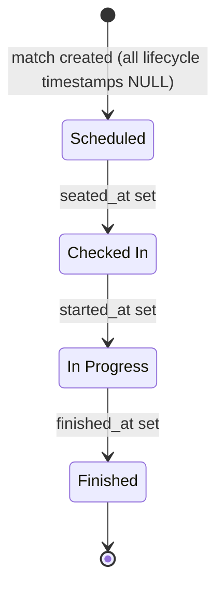

# Data Model & Persistence Reference

*Method-level reference for [`models.py`](../../models.py) (all 20 models and both enums), the repository layer in [`application/repositories/`](../../application/repositories/), and the migration setup in [`migrations/`](../../migrations/). Part of the [documentation index](../README.md). The service layer that sits on top of these repositories is documented in [services.md](services.md).*

## Overview

Persistence is [Tortoise ORM](https://tortoise.github.io/) 0.24 on PostgreSQL via the `asyncpg` backend. A single `default` connection is built from environment variables in [`migrations/tortoise_config.py`](../../migrations/tortoise_config.py) (see [Migrations](#migrations)). For the database's place in the overall system see [architecture.md](../architecture.md); for the MySQL→PostgreSQL history and Docker topology see [postgresql-migration.md](../features/postgresql-migration.md) and [deployment.md](../deployment.md).

Conventions shared by all models:

- **Surrogate primary key** — every model has `id = fields.IntField(pk=True)` (`SERIAL` in PostgreSQL). The per-model field tables below omit `id`.
- **Timestamps** — every model has `created_at` (`auto_now_add=True`); all except `AuditLog` and `UserRole` also have `updated_at` (`auto_now=True`). The field tables omit these two unless a model deviates. All datetime columns are `TIMESTAMPTZ` and store UTC; display is US/Eastern — see [timezone-handling.md](../timezone-handling.md).
- **Table names** — Tortoise defaults to the lowercased class name (`matchplayers`, `generatedseeds`, …). Five models also pin the same name explicitly via `Meta.table`: `matchacknowledgment`, `tournamentnotificationpreference`, `matchwatcher`, `userrole`, `triforcetext`. The two many-to-many through tables keep their declared CamelCase names (`"TournamentAdmins"`, `"TournamentCrewCoordinators"`).
- **Delete behavior** — Tortoise's default `ON DELETE CASCADE` applies to every foreign key except `TriforceText.user` and `TriforceText.approved_by`, which declare `on_delete=fields.SET_NULL` (verified in the [init migration](../../migrations/models/0_20260608213149_init.py)).

Coding conventions for the layers above (async everywhere, no ORM writes from the UI, audit-log action naming) are canonical in [CLAUDE.md](../../CLAUDE.md) and [refactoring-guide.md](../refactoring-guide.md) — not restated here.

## Entity-relationship diagram

Legend: `||--o{` required FK (child → exactly one parent), `|o--o{` nullable FK (child → zero or one parent), `}o--o{` many-to-many. Relationship labels are the FK/M2M field names as declared in `models.py`.

```mermaid
erDiagram
    User ||--o{ UserRole : "user"
    User |o--o{ UserRole : "granted_by"
    User ||--o{ AuditLog : "user"

    Tournament }o--o{ User : "admins (TournamentAdmins)"
    Tournament }o--o{ User : "crew_coordinators (TournamentCrewCoordinators)"
    Tournament ||--o{ TournamentPlayers : "tournament"
    User ||--o{ TournamentPlayers : "user"
    Tournament ||--o{ Team : "tournament"
    Team ||--o{ UserTeams : "team"
    User ||--o{ UserTeams : "user"
    Tournament ||--o{ TournamentNotificationPreference : "tournament"
    User ||--o{ TournamentNotificationPreference : "user"
    Tournament |o--o{ Announcement : "tournament"
    Tournament ||--o{ TriforceText : "tournament"
    User |o--o{ TriforceText : "user"
    User |o--o{ TriforceText : "approved_by"

    Tournament ||--o{ Match : "tournament"
    StreamRoom |o--o{ Match : "stream_room"
    GeneratedSeeds |o--o{ Match : "generated_seed"
    Match ||--o{ MatchPlayers : "match"
    User ||--o{ MatchPlayers : "user"
    Match ||--o{ MatchAcknowledgment : "match"
    User ||--o{ MatchAcknowledgment : "user"
    Match ||--o{ MatchWatcher : "match"
    User ||--o{ MatchWatcher : "user"

    Match ||--o{ Commentator : "match"
    User ||--o{ Commentator : "user"
    User |o--o{ Commentator : "approved_by"
    Match ||--o{ Tracker : "match"
    User ||--o{ Tracker : "user"
    User |o--o{ Tracker : "approved_by"

    SystemConfiguration {
        string name "unique key"
    }
    TestModel {
        string name "unused scaffold"
    }
```



`SystemConfiguration` and `TestModel` have no relationships. The two M2M lines are realized as the through tables `TournamentAdmins` and `TournamentCrewCoordinators`, declared inline on `Tournament` (`through=`) rather than as model classes.

## Enums

Both enums are `str`-valued and stored via `CharEnumField`.

### `Role`

Used by `UserRole.role` (`max_length=32`). Authorization checks are made through `AuthService` — see [role-based-auth.md](../features/role-based-auth.md).

| Value | Meaning |
|---|---|
| `STAFF` = `'staff'` | Full staff access |
| `PROCTOR` = `'proctor'` | Match proctoring |
| `STREAM_MANAGER` = `'stream_manager'` | Stream/stage management |

### `MatchNotificationLevel`

Used by `TournamentNotificationPreference.match_notifications` (`max_length=30`, default `NONE`). Consumed by `TournamentNotificationRepository.get_match_notification_subscribers` / `get_stream_candidate_subscribers` — see [tournament-notifications.md](../features/tournament-notifications.md).

| Value | Meaning |
|---|---|
| `NONE` = `'none'` | No match notifications |
| `STREAMED` = `'streamed'` | Notify only for matches with a stream room assigned |
| `STREAMED_AND_CANDIDATES` = `'streamed_and_candidates'` | As `STREAMED`, plus stream-candidate alerts |
| `ALL` = `'all'` | Notify for every match in the tournament |

## Model reference

### Identity

#### `User`

Discord-authenticated account. Created/updated during OAuth login; access control hangs off `UserRole`, not fields here.

| Field | Type | Null / default | Notes |
|---|---|---|---|
| `discord_id` | `BigIntField` | not null, `unique=True` | Discord snowflake |
| `access_token` | `CharField(255)` | null | Discord OAuth token |
| `username` | `CharField(150)` | not null | Discord username |
| `display_name` | `CharField(150)` | null | Preferred display name |
| `pronouns` | `CharField(50)` | null | |
| `is_active` | `BooleanField` | default `True` | |
| `dm_notifications` | `BooleanField` | default `True` | Master opt-out for Discord DMs |

Relationships: declared reverse/M2M accessors for `admin_tournaments` and `crew_coordinated_tournaments` (M2M from `Tournament`), `match_players`, `match_acknowledgments`, `tournament_players`, `tournament_notifications`, `teams` (UserTeams rows), `commentaries`, `approved_commentaries`, `trackers`, `approved_trackers`, `watched_matches`, `roles`, `granted_roles`, `audit_logs`, `triforce_texts`, `triforce_texts_moderated`.

Properties: `preferred_name` returns `display_name` if it is truthy, otherwise `username`.

#### `UserRole`

Junction table mapping users to global `Role` values; records who granted the role. No `updated_at` field.

| Field | Type | Null / default | Notes |
|---|---|---|---|
| `user` | FK → `User` | not null | `related_name='roles'` |
| `role` | `CharEnumField(Role)` | not null | `max_length=32` |
| `granted_by` | FK → `User` | null | `related_name='granted_roles'` |

Constraints: `unique_together ('user', 'role')`; `Meta.table = 'userrole'`.

### Tournament

#### `Tournament`

Tournament metadata and configuration; the root aggregate for matches, enrollment, teams, announcements, and triforce texts.

| Field | Type | Null / default | Notes |
|---|---|---|---|
| `name` | `CharField(255)` | not null | |
| `description` | `TextField` | null | |
| `seed_generator` | `CharField(255)` | null | Preset name for seed generation ([seed-generation.md](seed-generation.md)) |
| `is_active` | `BooleanField` | default `True` | |
| `players_per_match` | `IntField` | default `2` | |
| `team_size` | `IntField` | default `1` | |
| `bracket_url` | `CharField(255)` | null | |
| `rules_url` | `CharField(255)` | null | |
| `tournament_format` | `CharField(255)` | null | |
| `average_match_duration` | `IntField` | null | Minutes |
| `max_match_duration` | `IntField` | null | Minutes |
| `admins` | M2M → `User` | — | `through='TournamentAdmins'`, `related_name='admin_tournaments'` |
| `crew_coordinators` | M2M → `User` | — | `through='TournamentCrewCoordinators'`, `related_name='crew_coordinated_tournaments'` |
| `staff_administered` | `BooleanField` | default `False` | Staff-run vs. community tournament |

Relationships: declared reverse accessors `players`, `matches`, `teams`, `announcements`, `notification_preferences`, `triforce_texts`. Both M2M through tables carry a unique index on `(tournament_id, user_id)`.

#### `TournamentPlayers`

Tournament enrollment row (user ⇆ tournament).

| Field | Type | Null / default | Notes |
|---|---|---|---|
| `tournament` | FK → `Tournament` | not null | `related_name='players'` |
| `user` | FK → `User` | not null | `related_name='tournament_players'` |

No unique constraint on `(tournament, user)` — duplicate-enrollment prevention relies on `TournamentRepository.is_player_enrolled*` checks.

#### `Team`

Named team within a tournament (for `team_size > 1` formats).

| Field | Type | Null / default | Notes |
|---|---|---|---|
| `name` | `CharField(255)` | not null | |
| `tournament` | FK → `Tournament` | not null | `related_name='teams'` |

#### `UserTeams`

Team membership junction (user ⇆ team).

| Field | Type | Null / default | Notes |
|---|---|---|---|
| `user` | FK → `User` | not null | `related_name='teams'` |
| `team` | FK → `Team` | not null | `related_name='members'` |

`Team` and `UserTeams` are schema-only at present: no repository, service, or page reads or writes them.

#### `TournamentNotificationPreference`

Per-user, per-tournament match notification level. See [tournament-notifications.md](../features/tournament-notifications.md).

| Field | Type | Null / default | Notes |
|---|---|---|---|
| `user` | FK → `User` | not null | `related_name='tournament_notifications'` |
| `tournament` | FK → `Tournament` | not null | `related_name='notification_preferences'` |
| `match_notifications` | `CharEnumField(MatchNotificationLevel)` | default `NONE` | `max_length=30` |

Constraints: `unique_together ('user', 'tournament')`; `Meta.table = 'tournamentnotificationpreference'`.

#### `Announcement`

Tournament (or global, when `tournament` is null) announcement. **Model and table are present, but the UI is currently disabled** — the announcements tab entry in [`pages/home.py`](../../pages/home.py) is commented out, and no repository or service touches the model.

| Field | Type | Null / default | Notes |
|---|---|---|---|
| `title` | `CharField(255)` | not null | |
| `content` | `TextField` | not null | |
| `is_active` | `BooleanField` | default `True` | |
| `important` | `BooleanField` | default `False` | |
| `tournament` | FK → `Tournament` | null | `related_name='announcements'` |

### Match

#### `Match`

Core scheduling unit. Lifecycle is derived from nullable timestamps rather than a status column — see [Match lifecycle](#match-lifecycle).

| Field | Type | Null / default | Notes |
|---|---|---|---|
| `tournament` | FK → `Tournament` | not null | `related_name='matches'` |
| `stream_room` | FK → `StreamRoom` | null | `related_name='matches'` |
| `scheduled_at` | `DatetimeField` | null | Planned start (UTC) |
| `seated_at` | `DatetimeField` | null | Source comment: *now known as "Checked In"* |
| `started_at` | `DatetimeField` | null | |
| `finished_at` | `DatetimeField` | null | |
| `confirmed_at` | `DatetimeField` | null | Post-finish results confirmation |
| `comment` | `TextField` | null | |
| `is_stream_candidate` | `BooleanField` | default `False` | |
| `title` | `CharField(255)` | null | |
| `generated_seed` | FK → `GeneratedSeeds` | null | `related_name='matches'` |

Relationships: declared reverse accessor `acknowledgments`; reverse accessors `players`, `commentators`, `trackers`, `watchers` exist via the children's `related_name`s without class-level declarations.

Properties (each a `bool` except the last):

- `is_seated` — `seated_at is not None`
- `is_finished` — `finished_at is not None`
- `is_confirmed` — `confirmed_at is not None`
- `is_started` — `started_at is not None`
- `current_state` — first match wins, checked in this order: `is_finished` → `'Finished'`, `is_started` → `'In Progress'`, `is_seated` → `'Checked In'`, else `'Scheduled'`

#### `MatchPlayers`

Players assigned to a match, with result and station assignment.

| Field | Type | Null / default | Notes |
|---|---|---|---|
| `match` | FK → `Match` | not null | `related_name='players'` |
| `user` | FK → `User` | not null | `related_name='match_players'` |
| `finish_rank` | `IntField` | null | Final placement |
| `assigned_station` | `CharField(50)` | null | Physical/stream station label |

#### `MatchAcknowledgment`

Tracks whether each player has acknowledged a match (manually or automatically). See [match-acknowledgment.md](../features/match-acknowledgment.md).

| Field | Type | Null / default | Notes |
|---|---|---|---|
| `match` | FK → `Match` | not null, `CASCADE` | `related_name='acknowledgments'` |
| `user` | FK → `User` | not null, `CASCADE` | `related_name='match_acknowledgments'` |
| `acknowledged_at` | `DatetimeField` | null | Null = row exists but not acknowledged |
| `auto_acknowledged` | `BooleanField` | default `False` | True when acknowledged by the system |

Constraints: `unique_together (('match', 'user'),)`; `Meta.table = 'matchacknowledgment'`.

#### `MatchWatcher`

Users watching a match for state-change Discord DMs (observers, not participants). See [match-watcher.md](../features/match-watcher.md).

| Field | Type | Null / default | Notes |
|---|---|---|---|
| `user` | FK → `User` | not null, `CASCADE` | `related_name='watched_matches'` |
| `match` | FK → `Match` | not null, `CASCADE` | `related_name='watchers'` |

Constraints: `unique_together ('user', 'match')`; `Meta.table = 'matchwatcher'`.

#### `GeneratedSeeds`

Randomizer seed generated for a match; referenced by `Match.generated_seed`. Created directly by `MatchScheduleService.generate_seed` (no repository).

| Field | Type | Null / default | Notes |
|---|---|---|---|
| `seed_url` | `CharField(255)` | not null | Link to the generated seed |
| `seed_info` | `TextField` | null | Generator metadata |

### Crew

#### `Commentator`

Commentary signup for a match, with approval workflow and crew acknowledgment. See [crew-management.md](../features/crew-management.md).

| Field | Type | Null / default | Notes |
|---|---|---|---|
| `user` | FK → `User` | not null | `related_name='commentaries'` |
| `match` | FK → `Match` | not null | `related_name='commentators'` |
| `approved` | `BooleanField` | default `False` | |
| `approved_by` | FK → `User` | null | `related_name='approved_commentaries'` |
| `acknowledged_at` | `DatetimeField` | null | Crew member confirmed the assignment |

#### `Tracker`

Item/map tracker operator signup for a match. Structurally identical to `Commentator`.

| Field | Type | Null / default | Notes |
|---|---|---|---|
| `user` | FK → `User` | not null | `related_name='trackers'` |
| `match` | FK → `Match` | not null | `related_name='trackers'` |
| `approved` | `BooleanField` | default `False` | |
| `approved_by` | FK → `User` | null | `related_name='approved_trackers'` |
| `acknowledged_at` | `DatetimeField` | null | |

### Infrastructure

#### `StreamRoom`

Named stream stage ("Stage 1", "Stage 2", …) that matches can be assigned to.

| Field | Type | Null / default | Notes |
|---|---|---|---|
| `name` | `CharField(255)` | not null, `unique=True` | |
| `stream_url` | `CharField(255)` | null | |
| `is_active` | `BooleanField` | default `True` | |

#### `SystemConfiguration`

Key-value application settings. Accessed directly by `SystemConfigService` (typed get/set; no repository) — see [services.md](services.md).

| Field | Type | Null / default | Notes |
|---|---|---|---|
| `name` | `CharField(255)` | not null, `unique=True` | Setting key |
| `value` | `TextField` | not null | Raw string value |

#### `AuditLog`

Append-only record of admin actions. No `updated_at` field — rows are never modified. Action naming conventions are defined in [CLAUDE.md](../../CLAUDE.md); the feature is described in [audit-logging.md](../features/audit-logging.md).

| Field | Type | Null / default | Notes |
|---|---|---|---|
| `user` | FK → `User` | not null | Actor; `related_name='audit_logs'` |
| `action` | `CharField(255)` | not null | Namespaced `verb.object` string |
| `details` | `TextField` | null | JSON-encoded dict |

#### `TriforceText`

Player-submitted ALTTP end-game triforce screen line, moderated per entry. See [triforce-texts.md](../features/triforce-texts.md).

| Field | Type | Null / default | Notes |
|---|---|---|---|
| `tournament` | FK → `Tournament` | not null, `CASCADE` | `related_name='triforce_texts'` |
| `user` | FK → `User` | null, `SET_NULL` | Submitter; survives user deletion as `NULL` |
| `text` | `CharField(200)` | not null | The submitted line |
| `author` | `CharField(200)` | null | Display attribution |
| `approved` | `BooleanField` | **null** | Tri-state: `NULL` pending, `True` approved, `False` rejected |
| `approved_by` | FK → `User` | null, `SET_NULL` | Moderator; `related_name='triforce_texts_moderated'` |
| `approved_at` | `DatetimeField` | null | When moderated |

Constraints: `Meta.table = 'triforcetext'`.

### Dormant

#### `TestModel`

Unused scaffold left over from early development. No code outside `models.py` and the init migration references it, but the `testmodel` table is created.

| Field | Type | Null / default | Notes |
|---|---|---|---|
| `name` | `CharField(255)` | not null | |
| `description` | `TextField` | not null | |
| `value` | `IntField` | not null | |
| `somethingelse` | `CharField(255)` | not null | |

## Match lifecycle

`Match.current_state` is derived from three nullable timestamps; there is no status column. The model comment on `seated_at` notes the naming history: the field is called *seated* but the state it produces is now labeled **"Checked In"**.



Because the state is recomputed from whichever timestamps are set, the precedence order in `current_state` (`finished_at` > `started_at` > `seated_at`) is what matters — a match with `started_at` set but `seated_at` still null reads "In Progress", and clearing a timestamp moves the match back to the previous state.

Two further timestamps sit outside this state machine:

- **`scheduled_at`** — the planned start time (UTC), set at creation via `MatchRepository.create` and used for ordering and schedule display. It does not affect `current_state`; a match is "Scheduled" until `seated_at` is set regardless of whether `scheduled_at` has passed.
- **`confirmed_at`** — results confirmation *after* the match finishes. `MatchScheduleService.confirm_match` rejects confirmation unless `finished_at` is set, then stamps `confirmed_at`. It is surfaced via the `is_confirmed` property and shown as a distinct "Confirmed" state in some service-layer displays, but `current_state` itself never returns it.

## Repository layer

Repositories ([`application/repositories/`](../../application/repositories/)) are the only layer that should issue ORM queries: pure data access with no business logic, audit logging, or notifications. All twelve are exported from [`__init__.py`](../../application/repositories/__init__.py). Eleven are classes of `@staticmethod`s used without instantiation; `TournamentNotificationRepository` is the exception — it uses instance methods and is instantiated by its callers. The layering rules and worked examples live in [refactoring-guide.md](../refactoring-guide.md).

Some read-only and legacy paths still query models directly rather than going through a repository — for example, the `GET /api/matches` endpoint in [`api.py`](../../api.py) builds a `Match.all()` query with filters and `prefetch_related` inline. Models with no repository (`Team`, `UserTeams`, `Announcement`, `SystemConfiguration`, `GeneratedSeeds`, `TestModel`) are either accessed directly from services (`SystemConfiguration`, `GeneratedSeeds`) or not accessed at all.

### `AuditRepository`

Serves `AuditLog` ([`audit_repository.py`](../../application/repositories/audit_repository.py)).

| Method | Description |
|---|---|
| `list(*, start=None, end=None, user_id=None, action_contains=None, limit=100, offset=0) -> List[AuditLog]` | Filtered, paginated list (date range, actor, case-insensitive action substring), newest first, `user` prefetched |
| `count(*, start=None, end=None, user_id=None, action_contains=None) -> int` | Row count for the same filters (pagination totals) |

### `CommentatorRepository`

Serves `Commentator` ([`commentator_repository.py`](../../application/repositories/commentator_repository.py)).

| Method | Description |
|---|---|
| `get_by_id(commentator_id: int) -> Optional[Commentator]` | Lookup by primary key |
| `get_by_match(match: Match) -> List[Commentator]` | All commentators for a match, `user` prefetched |
| `get_by_match_and_user(match: Match, user: User) -> Optional[Commentator]` | Single signup row for a match/user pair |
| `create(match: Match, user: User, approved: bool = False) -> Commentator` | Insert a signup |
| `update(commentator: Commentator, **fields) -> Commentator` | Apply arbitrary field updates and save |
| `delete(commentator: Commentator) -> None` | Delete the row |
| `approve(commentator: Commentator) -> Commentator` | Sets `approved=True` (via `update`) |
| `acknowledge(commentator: Commentator) -> Commentator` | Sets `acknowledged_at=datetime.now()` |
| `clear_acknowledgment(commentator: Commentator) -> Commentator` | Resets `acknowledged_at` to `None` |

### `MatchAcknowledgmentRepository`

Serves `MatchAcknowledgment` ([`match_acknowledgment_repository.py`](../../application/repositories/match_acknowledgment_repository.py)).

| Method | Description |
|---|---|
| `list_for_match(match: Match) -> List[MatchAcknowledgment]` | All acknowledgment rows for a match, `user` prefetched |
| `list_for_matches(match_ids: List[int]) -> Dict[int, List[MatchAcknowledgment]]` | One query for many matches, grouped by match id; every requested id gets a (possibly empty) list |
| `get(match: Match, user: User) -> Optional[MatchAcknowledgment]` | Single row for a match/user pair |
| `upsert(match: Match, user: User, *, acknowledged: bool, auto: bool) -> MatchAcknowledgment` | `update_or_create`; sets `acknowledged_at` to now (or `None`), `auto_acknowledged` only when acknowledging |
| `delete_for_match(match: Match) -> int` | Bulk-delete all rows for a match; returns count |
| `delete_for_user(match: Match, user: User) -> None` | Delete one user's row for a match |

### `MatchRepository`

Serves `Match` and `MatchPlayers` ([`match_repository.py`](../../application/repositories/match_repository.py)).

| Method | Description |
|---|---|
| `get_by_id(match_id: int, prefetch_relations: bool = True) -> Optional[Match]` | Lookup by id; optionally prefetches `tournament`, `players(+user)`, `stream_room`, `generated_seed`, `commentators(+user)`, `trackers(+user)` |
| `get_all(*, tournament_ids=None, stream_room_ids=None, only_upcoming=False, user_discord_id=None, prefetch_relations=True) -> List[Match]` | Filtered list ordered by `scheduled_at`; `only_upcoming` means `finished_at IS NULL`; `user_discord_id` restricts to matches the user plays in; same prefetch set as `get_by_id` |
| `create(tournament_id: int, scheduled_at: datetime, comment=None, stream_room_id=None, is_stream_candidate=False) -> Match` | Insert a match |
| `update(match: Match, **fields) -> Match` | `setattr` each field and save |
| `delete(match: Match) -> None` | Delete the match |
| `add_player(match: Match, user: User) -> MatchPlayers` | Insert a `MatchPlayers` row |
| `remove_player(match: Match, user: User) -> None` | Delete the first matching `MatchPlayers` row, if any |
| `get_players(match: Match) -> List[MatchPlayers]` | Player rows for a match, `user` prefetched |

### `MatchWatcherRepository`

Serves `MatchWatcher` ([`match_watcher_repository.py`](../../application/repositories/match_watcher_repository.py)).

| Method | Description |
|---|---|
| `get_by_id(watcher_id: int) -> Optional[MatchWatcher]` | Lookup by primary key |
| `get_by_match(match: Match) -> List[MatchWatcher]` | Watchers of a match, `user` prefetched |
| `get_by_match_and_user(match: Match, user: User) -> Optional[MatchWatcher]` | Single watch row for a match/user pair |
| `get_by_user(user: User) -> List[MatchWatcher]` | All watch rows for a user |
| `get_match_ids_for_user(user: User) -> List[int]` | Watched match ids only (`values_list`) |
| `is_watching(match_id: int, user_id: int) -> bool` | Existence check by ids |
| `get_or_create(match: Match, user: User) -> Tuple[MatchWatcher, bool]` | Idempotent watch; bool is "created" |
| `delete(watcher: MatchWatcher) -> None` | Delete a row |
| `delete_by_match_and_user(match: Match, user: User) -> bool` | Delete by pair; `True` if a row was removed |

### `StreamRoomRepository`

Serves `StreamRoom` ([`stream_room_repository.py`](../../application/repositories/stream_room_repository.py)).

| Method | Description |
|---|---|
| `get_by_id(stream_room_id: int) -> Optional[StreamRoom]` | Lookup by primary key |
| `get_all() -> List[StreamRoom]` | All rooms ordered by name |
| `get_all_as_dict() -> dict[int, str]` | id → name map for select options |
| `create(name: str, stream_url=None, is_active=True) -> StreamRoom` | Insert a room |
| `update(stream_room: StreamRoom, **fields) -> None` | `setattr` each field and save |
| `delete(stream_room: StreamRoom) -> None` | Delete the room |

### `TournamentNotificationRepository`

Serves `TournamentNotificationPreference` ([`tournament_notification_repository.py`](../../application/repositories/tournament_notification_repository.py)). Instance methods, unlike the other repositories.

| Method | Description |
|---|---|
| `get_by_user_and_tournament(user: User, tournament: Tournament) -> Optional[TournamentNotificationPreference]` | Single preference row |
| `get_all_for_user(user: User) -> List[TournamentNotificationPreference]` | All of a user's preferences, `tournament` prefetched |
| `upsert(user: User, tournament: Tournament, match_notifications: MatchNotificationLevel) -> TournamentNotificationPreference` | `get_or_create` then set the level and save |
| `get_match_notification_subscribers(tournament_id: int, has_stream_room: bool) -> List[User]` | Users qualifying for a match-scheduled DM: `ALL` always; `STREAMED`/`STREAMED_AND_CANDIDATES` only when a stream room is assigned; drops users without `discord_id` or with `dm_notifications` off |
| `get_stream_candidate_subscribers(tournament_id: int) -> List[User]` | `STREAMED_AND_CANDIDATES` opt-ins, same DM-ability filter |

### `TournamentRepository`

Serves `Tournament` and `TournamentPlayers` ([`tournament_repository.py`](../../application/repositories/tournament_repository.py)).

| Method | Description |
|---|---|
| `get_by_id(tournament_id: int, prefetch_players: bool = False) -> Optional[Tournament]` | Lookup by id; optional `players(+user)` prefetch |
| `get_by_ids(tournament_ids: List[int]) -> List[Tournament]` | Bulk lookup ordered by name |
| `get_all(active_only=False, staff_only=False, prefetch_players=False) -> List[Tournament]` | All tournaments ordered by name; filters on `is_active` / `staff_administered` |
| `get_all_as_dict(active_only=False, staff_only=False) -> dict[int, str]` | id → name map for select options |
| `create(name, description=None, seed_generator=None, is_active=True, players_per_match=2, team_size=1, bracket_url=None, rules_url=None, tournament_format=None, average_match_duration=None, max_match_duration=None, staff_administered=False) -> Tournament` | Insert a tournament |
| `update(tournament: Tournament, **fields) -> None` | `setattr` each field and save |
| `delete(tournament: Tournament) -> None` | Delete the tournament |
| `enroll_player(tournament: Tournament, user) -> TournamentPlayers` | Insert an enrollment row |
| `unenroll_player(tournament: Tournament, user) -> None` | Bulk-delete matching enrollment rows |
| `get_enrolled_players(tournament: Tournament) -> List` | Enrollment rows for a tournament, `user` prefetched |
| `get_enrolled_players_by_user(user) -> List` | A user's enrollments, `tournament` prefetched |
| `get_enrolled_players_by_tournament_id(tournament_id: int) -> List` | Enrollment rows by tournament id, `user` prefetched |
| `is_player_enrolled(tournament: Tournament, user) -> bool` | Existence check |
| `is_player_enrolled_by_id(tournament_id: int, user) -> bool` | Existence check by tournament id |
| `enroll_player_by_id(tournament_id: int, user) -> TournamentPlayers` | Insert an enrollment row by tournament id |

### `TrackerRepository`

Serves `Tracker` ([`tracker_repository.py`](../../application/repositories/tracker_repository.py)). Method-for-method mirror of `CommentatorRepository`.

| Method | Description |
|---|---|
| `get_by_id(tracker_id: int) -> Optional[Tracker]` | Lookup by primary key |
| `get_by_match(match: Match) -> List[Tracker]` | All trackers for a match, `user` prefetched |
| `get_by_match_and_user(match: Match, user: User) -> Optional[Tracker]` | Single signup row for a match/user pair |
| `create(match: Match, user: User, approved: bool = False) -> Tracker` | Insert a signup |
| `update(tracker: Tracker, **fields) -> Tracker` | Apply arbitrary field updates and save |
| `delete(tracker: Tracker) -> None` | Delete the row |
| `approve(tracker: Tracker) -> Tracker` | Sets `approved=True` |
| `acknowledge(tracker: Tracker) -> Tracker` | Sets `acknowledged_at=datetime.now()` |
| `clear_acknowledgment(tracker: Tracker) -> Tracker` | Resets `acknowledged_at` to `None` |

### `TriforceTextRepository`

Serves `TriforceText` ([`triforce_text_repository.py`](../../application/repositories/triforce_text_repository.py)). The module exposes `APPROVAL_STATUSES = ('pending', 'approved', 'rejected')`, the status vocabulary callers pass in; a private helper maps these onto the tri-state `approved` column (`pending` → `NULL`, `approved` → `TRUE`, `rejected` → `FALSE`) and raises `ValueError` for unknown statuses.

| Method | Description |
|---|---|
| `get_by_id(text_id: int) -> Optional[TriforceText]` | Lookup by id; prefetches `tournament`, `user`, `approved_by` |
| `list_by_tournament(tournament: Tournament, status: Optional[str] = None) -> List[TriforceText]` | Texts for a tournament filtered by status (`None` = all), newest first, `user`/`approved_by` prefetched |
| `list_by_tournament_and_user(tournament: Tournament, user: User) -> List[TriforceText]` | A player's own submissions, newest first |
| `list_approved(tournament: Tournament) -> List[TriforceText]` | All approved texts for a tournament |
| `list_approved_user_buckets(tournament: Tournament) -> List[Optional[int]]` | Distinct submitter ids with ≥1 approved text; includes a `None` bucket for texts whose submitter was deleted (FK set null), keeping them in rotation for balanced selection |
| `list_approved_by_user(tournament: Tournament, user_id: Optional[int]) -> List[TriforceText]` | Approved texts in one submitter bucket |
| `create(tournament: Tournament, user: Optional[User], text: str, author: Optional[str]) -> TriforceText` | Insert with `approved=None` (pending) |
| `update(triforce_text: TriforceText, **changes) -> TriforceText` | Apply arbitrary field updates and save |
| `set_moderation(triforce_text: TriforceText, approved: bool, actor: User) -> TriforceText` | Sets `approved`, `approved_by=actor`, `approved_at=datetime.now()` |
| `delete(triforce_text: TriforceText) -> None` | Delete the row |

### `UserRepository`

Serves `User` ([`user_repository.py`](../../application/repositories/user_repository.py)).

| Method | Description |
|---|---|
| `get_by_id(user_id: int) -> Optional[User]` | Lookup by primary key |
| `get_by_discord_id(discord_id: str) -> Optional[User]` | Lookup by Discord snowflake |
| `get_all(role: Optional[Role] = None, has_discord: bool = False) -> List[User]` | All users ordered by username; `role` filters through the `userrole` join (distinct); `has_discord` excludes null `discord_id` |
| `search_by_name(search_term: str, limit: int = 20) -> List[User]` | Case-insensitive name search; note it filters on `preferred_name`, which is a Python property rather than a database column |
| `create(username: str, discord_id=None, display_name=None, pronouns=None, is_active=True, access_token=None) -> User` | Insert a user |
| `update(user: User, **fields) -> None` | `setattr` each field and save |
| `delete(user: User) -> None` | Delete the user |
| `update_discord_info(user: User, username: str, discriminator=None, avatar=None) -> None` | Refresh Discord profile data; note `discriminator`/`avatar` are not fields on `User` |

### `UserRoleRepository`

Serves `UserRole` ([`user_role_repository.py`](../../application/repositories/user_role_repository.py)).

| Method | Description |
|---|---|
| `add(user: User, role: Role, granted_by: Optional[User] = None) -> UserRole` | Idempotent grant via `get_or_create`; `granted_by` is recorded only when the row is created |
| `remove(user: User, role: Role) -> int` | Revoke; returns number of rows deleted |
| `list_for_user(user: User) -> List[UserRole]` | All role rows for a user |
| `list_users_with_role(role: Role) -> List[User]` | Users holding a role, resolved via prefetched rows |

## Migrations

Migrations are managed by [Aerich](https://github.com/tortoise/aerich) 0.8.

**Configuration.** [`pyproject.toml`](../../pyproject.toml) points Aerich at the ORM config and migration directory:

```toml
[tool.aerich]
tortoise_orm = "migrations.tortoise_config.TORTOISE_ORM"
location = "./migrations"
src_folder = "./."
```

**Connection config.** [`migrations/tortoise_config.py`](../../migrations/tortoise_config.py) loads `.env` (via `python-dotenv`) and builds a `postgres://` DSN from `DB_USERNAME`, `DB_PASSWORD`, `DB_HOST`, `DB_PORT`, and `DB_NAME`, URL-quoting the password with `urllib.parse.quote_plus`. It raises `ValueError` at import time if `DB_HOST`, `DB_PORT`, or `DB_NAME` is missing, and — the production credential guard — also raises when `ENVIRONMENT` is `production` but `DB_USERNAME`/`DB_PASSWORD` are blank. The `models` app registers both `models` and `aerich.models` (Aerich's own version-tracking model). The full environment-variable table is in [deployment.md](../deployment.md).

**Automatic upgrade on startup.** `init_db()` in [`main.py`](../../main.py), called from the FastAPI lifespan, runs `aerich.Command(tortoise_config=TORTOISE_ORM, app='models', location='./migrations')`, then `command.init()` and `command.upgrade()` before `Tortoise.init(config=TORTOISE_ORM)` — so pending migrations are applied on every application start, with no manual step in deployment.

**Migration history.** The history was squashed into a single init migration, [`migrations/models/0_20260608213149_init.py`](../../migrations/models/0_20260608213149_init.py), which creates all 20 model tables, the two M2M through tables (`"TournamentAdmins"`, `"TournamentCrewCoordinators"` with unique `(tournament_id, user_id)` indexes), and the `aerich` bookkeeping table. Its `downgrade()` returns empty SQL, so the init migration is not reversible. The earlier MySQL-era migrations were regenerated for PostgreSQL — see [postgresql-migration.md](../features/postgresql-migration.md).

**Developer workflow.** After changing `models.py`:

```bash
poetry run aerich migrate   # generate a new migration from model changes
poetry run aerich upgrade   # apply it (or just restart the app)
```
