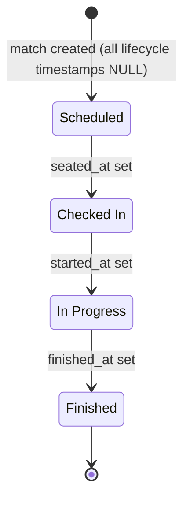

# Data Model & Persistence Reference

*Reference for the [`models/`](../../models/) package (every model and enum), the repository layer in [`application/repositories/`](../../application/repositories/), and the migration setup in [`migrations/`](../../migrations/). Part of the [documentation index](../README.md). The service layer above these repositories is documented in [services.md](services.md).*

> **Package layout.** Models live in per-domain submodules under `models/` (`tenant`, `user`, `tournament`, `match`, `bracket`, `equipment`, `feedback`, `volunteer`, `audit`, `system`, `webhook`, `challonge`, `racetime`, `speedgaming`, `discord_events`, `async_qualifier`, `feature_flag`, `mcp`), with the shared enums in `models/enums.py`. Every model and enum is re-exported from `models/__init__.py`, so `from models import X` and Tortoise's single `"models"` app registration are unchanged. Cross-model foreign keys use string references (`'models.User'`), so the submodules carry no import-order dependencies.

## Overview

Persistence is [Tortoise ORM](https://tortoise.github.io/) 0.24 on PostgreSQL via the `asyncpg` backend. A single `default` connection is built from environment variables in [`migrations/tortoise_config.py`](../../migrations/tortoise_config.py) (see [Migrations](#migrations)). For the database's place in the overall system see [architecture.md](../architecture.md); for the Docker topology and operations see [deployment.md](../deployment.md).

Conventions shared by all models — **the per-model field tables below omit whatever this section covers**:

- **Surrogate primary key** — `id = fields.IntField(pk=True)` (`SERIAL` in PostgreSQL).
- **Timestamps** — `created_at` (`auto_now_add=True`, except `EquipmentLoan`, which uses `checked_out_at`), plus `updated_at` (`auto_now=True`) on everything except the append-only and single-write tables (`AuditLog`, `TelemetryEvent`, `UserRole`, `ApiToken`, `EquipmentLoan`, `WebPushSubscription`, `TenantMembership`, `McpOAuthClient`, `McpAuthorizationCode`, `WebhookDelivery`, `AsyncQualifierReviewNote`). All datetime columns are `TIMESTAMPTZ` and store UTC; display resolves to a per-viewer local zone — see [timezone-handling.md](../timezone-handling.md).
- **Tenant scoping** — unless [Multitenancy](#multitenancy) lists it as global or nullable-tenant, a model carries a `tenant` FK (NOT NULL, `CASCADE`, reverse accessor on `Tenant` named for the model), a `scoped()`-ing repository, and a leak test. Only the unusual cases are called out per model.
- **Table names** — Tortoise defaults to the lowercased class name (`matchplayers`, `generatedseeds`, …); most multi-word models pin that same name explicitly via `Meta.table`. Only a deviation is noted per model. The two many-to-many through tables keep their declared CamelCase names (`"TournamentAdmins"`, `"TournamentCrewCoordinators"`).
- **Delete behavior** — Tortoise's default `ON DELETE CASCADE` applies to genuine parent/child FKs (deleting a match removes its players, acknowledgments, and crew). Detachment and attribution FKs declare `on_delete=fields.SET_NULL` so the record survives the referenced row's deletion: `Match.stream_room` / `Match.generated_seed`, `AuditLog.user`, `TelemetryEvent.user`, `UserRole.granted_by`, `Commentator.approved_by`, `Tracker.approved_by`, `TriforceText.user` / `TriforceText.approved_by`, `Equipment.owner_user`, `EquipmentLoan.checked_in_by`, `VolunteerAssignment.assigned_by` / `checked_in_by`, `ChallongeConnection.connected_by`, `ChallongeParticipant.user`, `ChallongeMatch.participant1` / `participant2` / `winner_participant` / `match`, `BracketEntrant.user`, `BracketMatch.entry1` / `entry2` / `winner` / `winner_to` / `loser_to`, `BracketMatchGame.match` / `winner_entry`. Equipment lending history uses `on_delete=fields.RESTRICT` (`EquipmentLoan.borrower` / `checked_out_by`) so a user with loan history cannot be hard-deleted — retire them via `User.is_active` instead. Natural-key uniqueness is enforced by DB constraints on the junctions (`MatchPlayers`, `TournamentPlayers`, `Commentator`, `Tracker` on their `(match|tournament, user)` pair) and on `User.challonge_user_id` and `User.twitch_user_id`.
- **Column-fit guards** — [`models/column_guards.py`](../../models/column_guards.py) attaches two validators to every field of every model at import of `models/__init__.py`: a string longer than its `CharField(max_length=N)`, or an integer outside its column's declared range (`INT` is 32-bit; `BIGINT`/`SMALLINT` read their bounds off `Field.constraints`), raises `FieldValueError` — **a plain `ValueError`**, so it lands as a `ui.notify` on the web, a `400` over REST, and an `invalid_request` tool error over MCP. Without it these are production-only 500s: Tortoise's own over-length error is a `tortoise.exceptions.ValidationError` (which every `except ValueError` misses), integer range is not checked before `asyncpg` rejects it, and the SQLite test backend enforces neither. It is a backstop, not a substitute for a service-layer bound carrying a meaningful message (e.g. `MAX_RUN_SECONDS` on a qualifier finish time).

Coding conventions for the layers above (async everywhere, no ORM writes from the UI, audit-log action naming) are canonical in [CLAUDE.md](../../CLAUDE.md) and [refactoring-guide.md](../refactoring-guide.md) — not restated here.

## Multitenancy

One shared database, a `tenant_id` discriminator column on scoped rows, and a
tenant resolved per request from the URL. Scoping rules, the request context, and
the `/platform` surface live in [features/multitenancy.md](../features/multitenancy.md)
and [`application/tenant_context.py`](../../application/tenant_context.py); what the
schema encodes is the taxonomy below. The unifying rule: **identity, the tenancy
machinery, and singleton runtime resources are global; everything a tournament
community owns or produces is tenant-scoped.**

| Class | Models | Notes |
|---|---|---|
| **Global** — no `tenant` FK | `User`, `WebPushSubscription`, `UserTablePreference`, `Tenant`, `FeatureFlagGroup`, `RacetimeBot`, `McpOAuthClient`, `McpAuthorizationCode` | `User.discord_id` / `challonge_user_id` / `twitch_user_id` / `racetime_user_id` uniques stay global — identity links are to the person. `RacetimeBot.category` is globally unique. An OAuth grant authenticates a user platform-wide |
| **Nullable `tenant`** — stamped from context, NULL = platform-level row | `AuditLog`, `TelemetryEvent` (`SET NULL` on tenant delete), `UserRole` (`CASCADE`; NULL only for the global `SUPER_ADMIN`), `ApiToken` (`CASCADE`; NULL only for platform-wide OAuth tokens) | |
| **Has a `tenant` FK but is never auto-scoped** | `TenantMembership`, `TenantJoinRequest`, `RacetimeBotTenant` | All answer "which tenants?" and so are queried across tenants with explicit ids |
| **Tenant-scoped** — `tenant` FK, NOT NULL, `CASCADE` | every other model | The default (see conventions above) |

**Per-tenant uniqueness** — formerly-global uniques are composite with `tenant`:
`StreamRoom.name`, `Station.name`, `VolunteerPosition.name`,
`SystemConfiguration.name`,
`RaceRoomProfile.name` → `(tenant, name)`; `Equipment.asset_number` →
`(tenant, asset_number)`; `TenantFeatureFlag.flag` → `(tenant, flag)`;
`ChallongeApiUsage.period` → `(tenant, period)`; `VolunteerProfile` →
`(tenant, user)` (opt-in is per tenant, so `User.volunteer_profiles` is a plural
reverse relation, not a one-to-one); `DiscordRoleMapping` →
`(tenant, discord_role_id, app_role)`; `UserRole` → `(user, role, tenant)`. The
`RacetimeBotTenant` grant is unique on `(bot, tenant)`; `RacetimeRoom.slug` stays
**globally** unique — it is the tenant-routing key for inbound racetime events.

Columns for `Tenant`, `TenantMembership`, `FeatureFlagGroup`, and
`TenantFeatureFlag` are in [Tenancy & flags](#tenancy--flags).

## Entity-relationship diagram

**Core scheduling entities only** — identity, tournaments, matches, crew,
equipment, volunteering, availability, Challonge, and native brackets. The
async-qualifier, racetime, SpeedGaming, Discord-events, MCP-OAuth, webhook, and
feature-flag models are omitted; each has its own field table below. `Tenant`
appears once rather than as an edge to every scoped model.

Legend: `||--o{` required FK (child → exactly one parent), `|o--o{` nullable FK (child → zero or one parent), `}o--o{` many-to-many. Relationship labels are the FK/M2M field names as declared in the `models/` package.


```mermaid
erDiagram
    Tenant ||--o{ Tournament : "tenant"
    Tenant ||--o{ TenantMembership : "tenant"
    User ||--o{ TenantMembership : "user"
    Tenant ||--o{ TenantJoinRequest : "tenant"
    User ||--o{ TenantJoinRequest : "user"

    User ||--o{ UserRole : "user"
    User |o--o{ UserRole : "granted_by"
    User |o--o{ AuditLog : "user"
    User |o--o{ TelemetryEvent : "user"
    User ||--o{ WebPushSubscription : "user"
    User ||--o{ UserTablePreference : "user"

    Tournament }o--o{ User : "admins (TournamentAdmins)"
    Tournament }o--o{ User : "crew_coordinators (TournamentCrewCoordinators)"
    Tournament ||--o{ TournamentPlayers : "tournament"
    User ||--o{ TournamentPlayers : "user"
    Tournament ||--o{ TournamentNotificationPreference : "tournament"
    User ||--o{ TournamentNotificationPreference : "user"
    Tournament ||--o{ TriforceText : "tournament"
    User |o--o{ TriforceText : "user"
    User |o--o{ TriforceText : "approved_by"

    Tournament ||--o{ Match : "tournament"
    StreamRoom |o--o{ Match : "stream_room"
    Tenant ||--o{ Station : "tenant"
    GeneratedSeeds |o--o{ Match : "generated_seed"
    Match ||--o{ MatchPlayers : "match"
    User ||--o{ MatchPlayers : "user"
    Match ||--o{ MatchAcknowledgment : "match"
    User ||--o{ MatchAcknowledgment : "user"
    Match ||--o{ MatchWatcher : "match"
    User ||--o{ MatchWatcher : "user"

    Match ||--o{ Commentator : "match"
    User ||--o{ Commentator : "user"
    User |o--o{ Commentator : "approved_by"
    Match ||--o{ Tracker : "match"
    User ||--o{ Tracker : "user"
    User |o--o{ Tracker : "approved_by"

    User ||--o{ ApiToken : "user"
    User ||--o{ Feedback : "user"
    User |o--o{ Equipment : "owner_user"
    Equipment ||--o{ EquipmentLoan : "equipment"
    User ||--o{ EquipmentLoan : "borrower"
    User ||--o{ EquipmentLoan : "checked_out_by"
    User |o--o{ EquipmentLoan : "checked_in_by"

    User ||--o{ VolunteerProfile : "user (one per tenant)"
    VolunteerPosition ||--o{ VolunteerShift : "position"
    VolunteerShift ||--o{ VolunteerAssignment : "shift"
    User ||--o{ VolunteerAssignment : "user"
    User |o--o{ VolunteerAssignment : "assigned_by"
    User ||--o{ VolunteerQualification : "user"
    VolunteerPosition ||--o{ VolunteerQualification : "position"
    User ||--o{ VolunteerAvailability : "user"
    User ||--o{ PlayerAvailability : "user"

    User |o--o{ ChallongeConnection : "connected_by"
    Tournament ||--o{ ChallongeParticipant : "tournament"
    User |o--o{ ChallongeParticipant : "user"
    Tournament ||--o{ ChallongeMatch : "tournament"
    ChallongeParticipant |o--o{ ChallongeMatch : "participant1 / participant2 / winner"
    Match |o--o{ ChallongeMatch : "match"

    Tournament ||--o{ Bracket : "tournament"
    Tournament ||--o{ BracketEntrant : "tournament"
    User |o--o{ BracketEntrant : "user"
    Bracket ||--o{ BracketEntry : "bracket"
    BracketEntrant ||--o{ BracketEntry : "entrant"
    Bracket ||--o{ BracketMatch : "bracket"
    BracketEntry |o--o{ BracketMatch : "entry1 / entry2 / winner"
    BracketMatch |o--o{ BracketMatch : "winner_to / loser_to"
    BracketMatch ||--o{ BracketMatchGame : "bracket_match"
    Match |o--o| BracketMatchGame : "match"
    BracketEntry |o--o{ BracketMatchGame : "winner_entry"
```

The two M2M lines are realized as the through tables `TournamentAdmins` and `TournamentCrewCoordinators`, declared inline on `Tournament` (`through=`) rather than as model classes.

## Enums

All are `(str, Enum)` — render `.value` in f-strings, never the bare member. Most
are persisted through `CharEnumField`; `FeatureFlag` and `ApiTokenOrigin` go into
plain `CharField` columns, and `StationFormat` is stored as a `SystemConfiguration`
value.

### `Role`

Used by `UserRole.role` and `DiscordRoleMapping.app_role` (`max_length=32`). Authorization checks are made through `AuthService` — see [role-based-auth.md](authentication.md#roles).

| Value | Meaning |
|---|---|
| `STAFF` = `'staff'` | Full staff access |
| `PROCTOR` = `'proctor'` | Match proctoring |
| `STREAM_MANAGER` = `'stream_manager'` | Stream/stage management |
| `TRIFORCE_SUBMITTER` = `'triforce_submitter'` | May submit triforce-screen texts |
| `VOLUNTEER_COORDINATOR` = `'volunteer_coordinator'` | Manages volunteer positions, shifts, and assignments |
| `EQUIPMENT_MANAGER` = `'equipment_manager'` | Manages lending equipment and checkouts |
| `VOLUNTEER` = `'volunteer'` | Opted-in onsite volunteer |
| `PRESET_MANAGER` = `'preset_manager'` | Manages seed-rolling presets (online-tournament surface) |
| `SYNC_ADMIN` = `'sync_admin'` | Manages upstream sync config: SpeedGaming links, Discord events, racetime bot/room config |
| `QUALIFIER_ADMIN` = `'qualifier_admin'` | Administers async qualifiers (also grantable per-qualifier via its `admins` M2M) |
| `SUPER_ADMIN` = `'super_admin'` | Global platform role (manages tenants on `/platform`). Its `UserRole` rows carry `tenant=NULL` and stay visible inside any tenant request; the only role that may be tenant-less. |

### `FeatureFlag`

The stable key persisted on `TenantFeatureFlag.flag` and in the `FeatureFlagGroup.flags`
list — one member per **deliberately gated** subsystem, not one per feature
(renaming a value is a data migration). Members, whose values are the snake_case
names: `ASYNC_QUALIFIERS`, `RACETIME_ROOMS`, `SPEEDGAMING_ETL`, `CHALLONGE`,
`EQUIPMENT`, `VOLUNTEERS`, `TRIFORCE_TEXTS`, `BRACKETS`. Human copy and grouping
live in `application/feature_flags`; see [feature-flags.md](../features/feature-flags.md).

### `ApiTokenOrigin`

Used by `ApiToken.origin` (`max_length=16`, default `PAT`): `PAT` = `'pat'` —
created on the profile page, carries a `tenant`, accepted only by the REST API;
`OAUTH` = `'oauth'` — minted by the MCP authorization server, tenant-less
(platform-wide), accepted only at `/mcp`. Each surface rejects the other kind, so
a credential minted for one can never be replayed against the other.

### `RoleSource`

Used by `UserRole.source` (`max_length=16`, default `MANUAL`). Distinguishes roles a Staff member granted by hand from roles derived automatically from Discord, so the login-time sync only ever revokes the roles it created ([discord.md](../features/discord.md)): `MANUAL` = `'manual'` (granted by a Staff member or pre-existing; never auto-revoked), `DISCORD` = `'discord'` (revoked when the mapped Discord role is lost).

### `MatchNotificationLevel`

Used by `TournamentNotificationPreference.match_notifications` (`max_length=30`, default `NONE`). Consumed by `TournamentNotificationRepository.get_match_notification_subscribers` / `get_stream_candidate_subscribers` — see [match-participation.md](../features/match-participation.md).

| Value | Meaning |
|---|---|
| `NONE` = `'none'` | No match notifications |
| `STREAMED` = `'streamed'` | Notify only for matches with a stream room assigned |
| `STREAMED_AND_CANDIDATES` = `'streamed_and_candidates'` | As `STREAMED`, plus stream-candidate alerts |
| `ALL` = `'all'` | Notify for every match in the tournament |

### `VolunteerAvailabilityStatus`

Used by both `VolunteerAvailability.status` and `PlayerAvailability.status` (`max_length=20`, default `AVAILABLE`). Drives the availability picker and the effective-availability overlap calculations in the volunteer/player availability services: `AVAILABLE` = `'available'`, `UNAVAILABLE` = `'unavailable'` (explicitly blocked out), `PREFERRED` = `'preferred'` (available and would prefer to be scheduled then).

### `FeedbackCategory` / `FeedbackStatus`

`Feedback.category` (`max_length=20`, default `OTHER`): `BUG` = `'bug'`, `SUGGESTION` = `'suggestion'`, `PRAISE` = `'praise'`, `OTHER` = `'other'`. `Feedback.status` (`max_length=20`, default `NEW`): `NEW` = `'new'` (not yet triaged), `REVIEWED` = `'reviewed'`.

### `EquipmentStatus`

Used by `Equipment.status` (`max_length=20`, default `AVAILABLE`), kept in sync with open `EquipmentLoan` rows by `EquipmentService` (the single writer): `AVAILABLE` = `'available'` (on hand), `CHECKED_OUT` = `'checked_out'` (an open `EquipmentLoan` exists), `RETIRED` = `'retired'`.

### `StationFormat`

Stored in `SystemConfiguration` under key `station_format`. Controls the validation pattern applied to station assignment strings in the dialog and in `MatchService.assign_stations`. Default is `FREE` to preserve existing behaviour.

| Value | Meaning |
|---|---|
| `FREE` = `'free'` | No validation; any string up to 50 characters |
| `NUMERIC` = `'numeric'` | Integers only (e.g. `1`, `2`, `3`) |
| `STRUCTURED` = `'structured'` | One letter followed by 1–2 digits (e.g. `A1`, `B12`) |
| `ALPHANUMERIC` = `'alphanumeric'` | Letters, numbers, hyphens, and spaces up to 20 characters |

### `ChallongeMatchState`

Used by `ChallongeMatch.state` (`max_length=20`, default `PENDING`). Mirrors the subset of Challonge match states relevant to scheduling: `PENDING` = `'pending'` (participants not yet fully determined), `OPEN` = `'open'` (both known and ready to play), `COMPLETE` = `'complete'` (result recorded on Challonge).

### `BotStatus`

Health of a racetime bot's websocket connection (`RacetimeBot.status`, `max_length=20`, default `UNKNOWN`), written by the bot runtime ([`racetimebot/connection.py`](../../racetimebot/connection.py) via `RacetimeBotService`) and read by the platform health surface: `UNKNOWN` = `'unknown'` (no live connection has reported yet), `CONNECTED` = `'connected'` (websocket up), `DISCONNECTED` = `'disconnected'`, `ERROR` = `'error'`.

### `RaceRoomStatus`

Cached racetime room lifecycle state (`RacetimeRoom.status`, `max_length=20`, default `OPEN`): `OPEN` = `'open'` (room open, race not started) → `IN_PROGRESS` = `'in_progress'` → `FINISHED` = `'finished'`, plus `CANCELLED` = `'cancelled'` for a cancelled room.

### `SyncStatus`

Used by `SpeedGamingEpisode.sync_status` (`max_length=20`, default `PENDING`).
Reconciliation state of a synced SpeedGaming episode.

| Value | Meaning |
|---|---|
| `PENDING` = `'pending'` | Discovered upstream, not yet materialized |
| `SYNCED` = `'synced'` | Materialized/refreshed into a `Match` |
| `SKIPPED` = `'skipped'` | A lifecycle guard held the refresh back |
| `CANCELLED` = `'cancelled'` | Upstream episode gone; the `Match` soft-detached |
| `ERROR` = `'error'` | Transform/load failed (see `sync_error`) |

### `DiscordEventSource`

What Wizzrobe schedule row a mirrored Discord event came from
(`DiscordScheduledEvent.source_type`). Today only `MATCH` = `'match'`; the
`(source_type, source_id)` link is polymorphic so qualifier windows / live races
join later without a schema change.

### `AsyncQualifierRunStatus` / `AsyncQualifierReviewStatus`

Async-qualifier run + review state. Web-first collapses reveal and start, so a run
is created `IN_PROGRESS` at draw; `PENDING` is reserved for a run pre-created
before a synchronous start (the live-race path).

| `AsyncQualifierRunStatus` | | `AsyncQualifierReviewStatus` | |
|---|---|---|---|
| `PENDING` = `'pending'` | reserved (live races) | `PENDING` = `'pending'` | awaiting review |
| `IN_PROGRESS` = `'in_progress'` | drawn, timing | `APPROVED` = `'approved'` | counts + scored |
| `FINISHED` = `'finished'` | submitted | `REJECTED` = `'rejected'` | excluded |
| `FORFEIT` = `'forfeit'` | irreversible, scores 0 | | |
| `DISQUALIFIED` = `'disqualified'` | staff DQ | | |

### `AsyncQualifierLiveRaceStatus`

Lifecycle of a synchronous racetime qualifier race: `SCHEDULED` = `'scheduled'`
(before a room opens) → `PENDING` = `'pending'` (room open, not started) →
`IN_PROGRESS` = `'in_progress'` → `FINISHED` = `'finished'` (results captured into runs).

### `JoinRequestStatus`

Where a request to join a community stands (`TenantJoinRequest.status`,
`max_length=20`): `PENDING` = `'pending'` → `APPROVED` = `'approved'` or
`DENIED` = `'denied'`. There is one row per `(user, tenant)`, so a denied
request is **re-opened** by moving it back to `PENDING` rather than appended to.

### `BracketFormat`

The pairing/progression format of a single native-bracket stage (`Bracket.format`,
`max_length=32`). Resolved to a pairing engine through the `('bracket_format', …)`
strategy registry. See [features/brackets.md](../features/brackets.md).

| Value | Meaning |
|---|---|
| `SINGLE_ELIM` = `'single_elim'` | Single-elimination bracket |
| `DOUBLE_ELIM` = `'double_elim'` | Double-elimination (winners + losers bracket, grand final + conditional reset) |
| `SWISS` = `'swiss'` | Swiss pairing (per-round, no elimination) |
| `ROUND_ROBIN` = `'round_robin'` | Round robin, optionally split into balanced groups |

### `BracketState`

Lifecycle of a bracket stage (`Bracket.state`, `max_length=16`): `DRAFT` = `'draft'` (entrants enrolled/seeded; the engine has not run), `ACTIVE` = `'active'` (`start` has generated and persisted the match graph), `COMPLETE` = `'complete'` (every match resolved; each entry's `final_rank` written), `CANCELLED` = `'cancelled'` (started and then abandoned — terminal like COMPLETE but **no** `final_rank`, so nothing can advance out of it; hidden from the public views by `is_visible`, and deletable so the stage slot can be reused).

### `BracketMatchState`

State of one persisted bracket match slot (`BracketMatch.state`, `max_length=16`), deliberately parallel to `ChallongeMatchState`: `PENDING` = `'pending'` (one or both entries not yet determined), `OPEN` = `'open'` (both known; playable / schedulable into a `Match`), `COMPLETE` = `'complete'` (winner recorded).

### `BracketMatchGameState`

State of one game within a best-of-N series (`BracketMatchGame.state`,
`max_length=16`). There is deliberately **no `PENDING`**: a game row is created
only when the game is scheduled into a `Match`, so it enters at `SCHEDULED` =
`'scheduled'` (linked to a `Match`, not yet decided) → `COMPLETE` = `'complete'`
(winner recorded); `CANCELLED` = `'cancelled'` means never played — the series
clinched, or staff overrode the result.

### `BracketEntrantStatus` / `BracketEntryStatus`

Roster-level entrant status (`BracketEntrant.status`) and per-stage participation
status (`BracketEntry.status`), both `max_length=16`.

| `BracketEntrantStatus` | | `BracketEntryStatus` | |
|---|---|---|---|
| `ACTIVE` = `'active'` | in the field | `ACTIVE` = `'active'` | still contending |
| `DROPPED` = `'dropped'` | withdrawn from the tournament | `DROPPED` = `'dropped'` | withdrew from this stage |
| | | `ELIMINATED` = `'eliminated'` | knocked out (elimination formats) |

## Model reference

### Tenancy & flags

The tenancy machinery itself. All four are global or cross-tenant (see
[Multitenancy](#multitenancy)); [features/multitenancy.md](../features/multitenancy.md)
and [features/feature-flags.md](../features/feature-flags.md) own the behaviour.

#### `Tenant`

One hosted community — the discriminator row every scoped model points at.

| Field | Type | Null / default | Notes |
|---|---|---|---|
| `name` | `CharField(255)` | not null | Display name of the community |
| `slug` | `CharField(64)` | not null, `unique=True`, `index=True` | URL-safe path routing key (`/t/<slug>`). Mutable — every join is by `tenant.id`, so re-slugging is a one-row UPDATE |
| `domain` | `CharField(255)` | null, `unique=True`, `index=True` | Reserved for host-based addressing; the column exists so attaching a domain later needs no schema change |
| `discord_guild_id` | `BigIntField` | null, `index=True` | Bot routing key. **Non-unique** — several communities may share one Discord server and the bot fans out over every linked tenant |
| `is_active` | `BooleanField` | default `True` | |
| `feature_group` | FK → `FeatureFlagGroup` | null, `SET_NULL` | Assigned live tier; NULL falls back to the default group. `related_name='tenants'` |
| `config` | `JSONField` | default `{}` | Per-tenant knobs without dedicated columns; a `theme` key holds the STAFF-set brand palette (see [`TenantThemeService`](services.md)) |

#### `TenantMembership`

Ties a global `User` to a tenant they belong to — what the auth layer checks to
decide whether an authenticated user may see a tenant at all. Queried across
tenants, so it is never auto-scoped.

| Field | Type | Null / default | Notes |
|---|---|---|---|
| `tenant` | FK → `Tenant` | not null, `CASCADE` | `related_name='memberships'` |
| `user` | FK → `User` | not null, `CASCADE` | `related_name='tenant_memberships'` |

Constraints: `unique_together (('user', 'tenant'),)`; index on `tenant` (the composite is user-first, leaving per-tenant member enumeration uncovered).

#### `TenantJoinRequest`

Someone asking to join a community they can see the door of — the self-serve
enrollment path that makes the membership gate safe to close. Cross-tenant like
`TenantMembership`: the row is written by someone who is not in the target
tenant at all, so its queries pass tenant ids explicitly (and it is in
`check_tenant_scoping`'s `EXEMPT_MODELS`).

| Field | Type | Null / default | Notes |
|---|---|---|---|
| `tenant` | FK → `Tenant` | not null, `CASCADE` | `related_name='join_requests'` |
| `user` | FK → `User` | not null, `CASCADE` | `related_name='join_requests'` |
| `status` | `CharEnumField(JoinRequestStatus)` | default `PENDING` | |
| `message` | `CharField(500)` | null | Free text from the requester; rendered as **text, never markup** |
| `decided_by` | FK → `User` | null, `SET_NULL` | Deleting a staff account must not delete the record of their decision |
| `decided_at` | `DatetimeField` | null | |

Constraints: `unique_together (('user', 'tenant'),)` — **one row per person per
community**: a denied request is re-opened by moving it back to `PENDING`, not
appended to, because an append-only log of attempts is a spam vector with no
reader. Index on `(tenant, status)`, the staff queue's query.

#### `FeatureFlagGroup`

A named super-admin-defined bundle of flags — a live tier/plan. **Global** (no
`tenant` FK). Availability derives from the group *live*, so editing it updates
every tenant on it; an ungrouped tenant falls back to the single `is_default` group.

| Field | Type | Null / default | Notes |
|---|---|---|---|
| `name` | `CharField(100)` | not null, `unique=True` | |
| `description` | `TextField` | null | |
| `flags` | `JSONField` | default `[]` | List of `FeatureFlag` values; unknown/legacy keys are ignored by the service, so retiring a flag never orphans a group |
| `is_default` | `BooleanField` | default `False` | At most one group is default — enforced in the service, not the DB |

Relationship: reverse accessor `tenants` (→ `Tenant.feature_group`).

#### `TenantFeatureFlag`

A per-tenant **override** of one flag, layered on top of the tenant's group. Both
override columns are tri-state; a row with both NULL carries no information and is
deleted. Effective state is computed in `FeatureFlagService` (override → group →
default; available ⇒ enabled-by-default) — never read these columns raw.

| Field | Type | Null / default | Notes |
|---|---|---|---|
| `flag` | `CharField(64)` | not null | A `FeatureFlag` value |
| `available` | `BooleanField` | **null** | NULL = inherit from the group; True/False = super-admin force on/off |
| `enabled` | `BooleanField` | **null** | NULL = default (on whenever available); True/False = the community STAFF's sticky choice |

Constraints: `unique_together (('tenant', 'flag'),)`; index on `tenant`.

### Identity

#### `User`

Discord-authenticated account. Created/updated during OAuth login; access control hangs off `UserRole`, not fields here.

| Field | Type | Null / default | Notes |
|---|---|---|---|
| `discord_id` | `BigIntField` | **null**, `unique=True` | Discord snowflake. NULL only for a SpeedGaming placeholder — a DB `CHECK (discord_id IS NOT NULL OR is_placeholder)` enforces it (Postgres allows many NULLs under the unique) |
| `username` | `CharField(150)` | not null | Discord username |
| `display_name` | `CharField(150)` | null | Preferred display name |
| `pronouns` | `CharField(50)` | null | |
| `is_active` | `BooleanField` | default `True` | |
| `is_system` | `BooleanField` | default `False` | Marks the single reserved automation actor (sentinel `discord_id` = `SYSTEM_USER_DISCORD_ID` = `0`). Workers/bots pass this row as `actor`; resolve it via `UserService.get_system_user()`. `AuthService.is_system()` treats it as authorized for automation actions |
| `dm_notifications` | `BooleanField` | default `True` | Master opt-out for Discord DMs |
| `challonge_user_id` | `CharField(64)` | null, `unique=True` | Verified Challonge identity, captured via one-time OAuth (scope `me`). Unique so bracket sync resolves to exactly one user (Postgres allows multiple NULLs) |
| `challonge_username` | `CharField(255)` | null | Cached Challonge username |
| `challonge_linked_at` | `DatetimeField` | null | When the Challonge identity was linked |
| `twitch_user_id` | `CharField(64)` | null, `unique=True` | Verified Twitch identity, captured via one-time OAuth. Unique so a Twitch id resolves to exactly one user (Postgres allows multiple NULLs) |
| `twitch_username` | `CharField(255)` | null | Cached Twitch login/display name |
| `twitch_linked_at` | `DatetimeField` | null | When the Twitch identity was linked |
| `racetime_user_id` | `CharField(64)` | null, `unique=True` | Verified racetime.gg identity, captured via one-time OAuth (read scope). Unique so a racetime id resolves to exactly one user (Postgres allows multiple NULLs) |
| `racetime_username` | `CharField(255)` | null | Cached racetime.gg name |
| `racetime_linked_at` | `DatetimeField` | null | When the racetime identity was linked |
| `is_placeholder` | `BooleanField` | default `False` | Flags an unresolved SpeedGaming player kept as a first-class `User` so its `MatchPlayers` row stays NOT NULL |
| `speedgaming_id` | `CharField(64)` | null, `unique=True` | SG-side id used to re-find the same placeholder across syncs and to **upgrade it in place** once a `discord_id` appears |

The Challonge identity is **identity only** — the player's Challonge access token is never retained (writes use the shared service-account `ChallongeConnection`). The Twitch and racetime.gg identities are likewise **identity only** — the user's access token is used once during linking and discarded. There is no `access_token` field; the Discord OAuth token is not persisted on `User`.

Relationships: declared reverse/M2M accessors for `admin_tournaments` and `crew_coordinated_tournaments` (M2M from `Tournament`), `match_players`, `match_acknowledgments`, `tournament_players`, `tournament_notifications`, `commentaries`, `approved_commentaries`, `trackers`, `approved_trackers`, `watched_matches`, `roles`, `granted_roles`, `audit_logs`, `triforce_texts`, `triforce_texts_moderated`, `api_tokens`, `feedback_submissions`, `owned_equipment`, `equipment_loans`, `equipment_checkouts_performed`, `equipment_checkins_performed`, `volunteer_profiles` (one per tenant), `volunteer_assignments`, `volunteer_assignments_made`, `volunteer_qualifications`, `volunteer_availability`, `challonge_participations`, `web_push_subscriptions`, `tenant_memberships`. Accessors that exist only implicitly via the children's `related_name` (no class-level annotation): `player_availability`, `challonge_connections`, `telemetry_events`, `volunteer_check_ins`, `bracket_entrants`, `mcp_authorization_codes`, `admin_async_qualifiers`.

Properties: `preferred_name` returns `display_name` if it is truthy, otherwise `username`.

#### `UserRole`

Junction table mapping users to per-tenant `Role` values; records who granted the role and whether it was granted manually or synced from Discord.

| Field | Type | Null / default | Notes |
|---|---|---|---|
| `user` | FK → `User` | not null, `CASCADE` | `related_name='roles'` |
| `tenant` | FK → `Tenant` | **null**, `CASCADE` | `related_name='user_roles'`. NULL only for the global `SUPER_ADMIN` grant, which stays visible inside any tenant request |
| `role` | `CharEnumField(Role)` | not null | `max_length=32` |
| `granted_by` | FK → `User` | null, `SET_NULL` | `related_name='granted_roles'`; null for Discord-synced rows; survives granter deletion |
| `source` | `CharEnumField(RoleSource)` | not null, default `MANUAL` | `max_length=16`; manual grants are never auto-revoked by the Discord sync |

Constraints: `unique_together ('user', 'role', 'tenant')`; index on `role` (the composite is user-first, leaving role-only enumeration uncovered).

#### `DiscordRoleMapping`

Maps a Discord guild role to an application `Role`. Consulted at login by the Discord role sync; managed by Staff on the admin **Discord Roles** tab — see [discord.md](../features/discord.md).

| Field | Type | Null / default | Notes |
|---|---|---|---|
| `guild_id` | `BigIntField` | not null | Discord guild snowflake. A guild may be shared by several tenants, so this alone does not isolate a tenant — reads combine it with the tenant scope |
| `discord_role_id` | `BigIntField` | not null | Discord role snowflake |
| `discord_role_name` | `CharField(100)` | not null | Cached label for the admin table |
| `app_role` | `CharEnumField(Role)` | not null | `max_length=32` |

Constraints: `unique_together ('tenant', 'discord_role_id', 'app_role')`. A Discord role may map to several app roles and vice-versa.

#### `ApiToken`

A bearer credential acting as its owning user. Only the SHA-256 hash is stored; the plaintext is shown once. A token acts with the owner's full permissions unless `read_only` is set. Two kinds share this table, distinguished by `origin`, so revocation, expiry, and the profile listing have one implementation. See [rest-api.md](rest-api.md), [features/mcp-server.md](../features/mcp-server.md), and [`ApiTokenService`](services.md).

| Field | Type | Null / default | Notes |
|---|---|---|---|
| `tenant` | FK → `Tenant` | **null**, `CASCADE` | Set for PATs (the REST API derives the request's community from it); NULL for OAuth tokens, which are platform-wide and name their community per tool call. `related_name='api_tokens'` |
| `user` | FK → `User` | not null | `related_name='api_tokens'` |
| `origin` | `CharField(16)` | default `'pat'`, `index=True` | An `ApiTokenOrigin` value. Each surface refuses the other's kind, so a credential minted for one can never be replayed against the other |
| `oauth_client` | FK → `McpOAuthClient` | null | The MCP client this token was issued to |
| `refresh_token_hash` | `CharField(64)` | null, `unique=True`, `index=True` | SHA-256 of the refresh token; rotated on every refresh |
| `refresh_expires_at` | `DatetimeField` | null | Refresh-token expiry (30 days) |
| `scope` | `CharField(255)` | null | OAuth scope granted |
| `name` | `CharField(100)` | not null | User-supplied label |
| `token_hash` | `CharField(64)` | not null, `unique=True`, `index=True` | SHA-256 of the plaintext token |
| `token_prefix` | `CharField(24)` | not null | Non-secret prefix shown in the UI to identify the token |
| `read_only` | `BooleanField` | default `False` | Restricts the token to read endpoints |
| `last_used_at` | `DatetimeField` | null | Stamped on each authenticated request |
| `expires_at` | `DatetimeField` | null | Optional expiry; null = never |
| `revoked_at` | `DatetimeField` | null | Set when revoked; non-null tokens are rejected |

#### `McpOAuthClient`

An MCP client registered through RFC 7591 dynamic client registration. **Global — no tenant FK.** Clients are *public* (no secret stored); PKCE binds a code to the client that requested it. Rationale for open registration: [features/mcp-server.md](../features/mcp-server.md).

| Field | Type | Null / default | Notes |
|---|---|---|---|
| `client_id` | `CharField(64)` | not null, `unique=True`, `index=True` | |
| `client_name` | `CharField(255)` | not null | Shown on the consent screen and in the profile list |
| `redirect_uris` | `JSONField` | default `[]` | Exact-match allowlist checked on every authorize and token call |
| `grant_types`, `response_types` | `JSONField` | default `[]` | |
| `token_endpoint_auth_method` | `CharField(32)` | default `'none'` | |
| `scope` | `CharField(255)` | null | |

Relationships: reverse accessors `tokens` (→ `ApiToken`), `authorization_codes`.

#### `McpAuthorizationCode`

A single-use authorization code awaiting exchange. **Global — no tenant FK.** Only the hash is stored; `consumed_at` refuses a replayed code even inside its five-minute window.

| Field | Type | Null / default | Notes |
|---|---|---|---|
| `code_hash` | `CharField(64)` | not null, `unique=True`, `index=True` | |
| `client` | FK → `McpOAuthClient` | not null | CASCADE |
| `user` | FK → `User` | not null | Who approved it |
| `redirect_uri` | `CharField(2048)` | not null | Re-checked at exchange (RFC 6749) |
| `redirect_uri_provided_explicitly` | `BooleanField` | default `True` | |
| `code_challenge` | `CharField(128)` | not null | PKCE, verified by the MCP SDK |
| `code_challenge_method` | `CharField(8)` | default `'S256'` | |
| `scope` | `CharField(255)` | null | |
| `resource` | `CharField(2048)` | null | RFC 8707 resource indicator |
| `expires_at` | `DatetimeField` | not null | Five minutes |
| `consumed_at` | `DatetimeField` | null | Set on exchange |

#### `Feedback`

In-app feedback submission from a logged-in attendee. Captures the page the user was on (`page_url`, including any `?tab=`) so staff have context to act on it. Reviewed on the admin **Feedback** tab.

| Field | Type | Null / default | Notes |
|---|---|---|---|
| `user` | FK → `User` | not null, `CASCADE` | `related_name='feedback_submissions'` |
| `category` | `CharEnumField(FeedbackCategory)` | default `OTHER` | `max_length=20` |
| `message` | `TextField` | not null | Free-text feedback |
| `page_url` | `CharField(512)` | not null | Path + query the user was on |
| `status` | `CharEnumField(FeedbackStatus)` | default `NEW` | `max_length=20` |

### Tournament

#### `Tournament`

Tournament metadata and configuration; the root aggregate for matches, enrollment, notification preferences, triforce texts, brackets, and the Challonge/SpeedGaming links.

| Field | Type | Null / default | Notes |
|---|---|---|---|
| `name` | `CharField(255)` | not null | |
| `description` | `TextField` | null | |
| `seed_generator` | `CharField(255)` | null | Legacy randomizer name for seed generation; the `preset` FK wins when set ([seed-generation.md](seed-generation.md)) |
| `is_active` | `BooleanField` | default `True` | |
| `players_per_match` | `IntField` | default `2` | |
| `team_size` | `IntField` | default `1` | |
| `bracket_url` | `CharField(255)` | null | |
| `rules_url` | `CharField(255)` | null | |
| `tournament_format` | `CharField(255)` | null | |
| `triforce_access_message` | `TextField` | null | Custom message shown to players on the triforce-texts tab |
| `average_match_duration` | `IntField` | null | Minutes |
| `max_match_duration` | `IntField` | null | Minutes |
| `challonge_tournament_id` | `CharField(64)` | null | Linked Challonge tournament id (enables bracket sync) |
| `challonge_tournament_url` | `CharField(255)` | null | Challonge bracket URL |
| `challonge_last_synced_at` | `DatetimeField` | null | Last successful Challonge sync (UTC) |
| `config` | `JSONField` | null | Hybrid-config JSON half (messaging templates, scoring params, strategy choices). Written only through `TournamentService`, which validates it with `validate_tournament_config` (unknown keys raise `ValueError`); typed knobs stay their own columns. See [online-tournaments.md](../features/online-tournaments.md) |
| `preset` | FK → `Preset` | null, `SET_NULL` | Seed-rolling preset; resolves the randomizer + settings for seed generation and overrides `seed_generator` when set. `related_name='tournaments'` |
| `racetime_bot` | FK → `RacetimeBot` | null, `SET_NULL` | Selected racetime bot/category; validated against the tenant's authorization grants (`RacetimeBotTenant`). `related_name='tournaments'` |
| `race_room_profile` | FK → `RaceRoomProfile` | null, `SET_NULL` | Reusable room settings applied when a room is opened. `related_name='tournaments'` |
| `racetime_auto_create_rooms` | `BooleanField` | default `False` | Opt-in: auto-open a race room per scheduled match |
| `room_open_minutes_before` | `IntField` | default `30` | Lead time before `scheduled_at` to open the room |
| `require_racetime_link` | `BooleanField` | default `False` | Require players to have a linked racetime identity |
| `racetime_default_goal` | `CharField(255)` | null | Default racetime goal for opened rooms |
| `discord_events_enabled` | `BooleanField` | default `False` | Opt-in: mirror this tournament's scheduled matches into the tenant guild's Discord Scheduled Events |
| `discord_event_duration_minutes` | `IntField` | default `60` | Sets each mirrored event's end time |
| `discord_event_title_template` | `CharField(255)` | null | `{tournament}` / `{match}` / `{players}` placeholders; a built-in default renders when unset |
| `discord_event_description_template` | `TextField` | null | Same placeholders and fallback |
| `event_start_date` | `DateField` | null | Per-tournament override of the tenant event-window start; falls back to `SystemConfigService.get_event_window()` when null |
| `event_end_date` | `DateField` | null | Per-tournament override of the tenant event-window end; falls back to the tenant setting when null |
| `tournament_hours` | `JSONField` | null | Per-tournament override of per-date open/close windows, same shape as the tenant `tournament_hours_by_date` blob (`{"YYYY-MM-DD": {"open": "HH:MM", "close": "HH:MM"}}`); falls back to `SystemConfigService.get_tournament_hours()` when null. Honored by match scheduling validation and match suggestions |
| `admins` | M2M → `User` | — | `through='TournamentAdmins'`, `related_name='admin_tournaments'` |
| `crew_coordinators` | M2M → `User` | — | `through='TournamentCrewCoordinators'`, `related_name='crew_coordinated_tournaments'` |
| `required_commentators` | `IntField` | default `1` | Approved commentators a **stream candidate** needs before the coverage surfaces count it as covered. `0` means the tournament does not use the role. Read by `ReportsService.crew_coverage` and `AnalyticsService.tournament_health` through the shared `reporting_shared.is_crew_covered`, and by the schedule board — a role requiring `0` renders no **Sign up**, and `CrewService.signup_crew` refuses it (hiding a control is not enforcing a rule). Withdrawing stays open at any requirement. |
| `required_trackers` | `IntField` | default `1` | Same, for trackers. The defaults reproduce the pre-migration assumption that every streamed match needs one of each. |
| `staff_administered` | `BooleanField` | default `False` | Staff-run vs. community tournament |
| `allow_player_match_requests` | `BooleanField` | default `True` | Whether players may request matches outside a bracket. Turned off automatically by `BracketService.create_bracket` (stage 0) and `ChallongeService.link_tournament` — a bracket-run tournament schedules only its own matchups. Enforced in `MatchService.submit_match_request`; staff can re-enable it per tournament. |

Relationships: declared reverse accessors `players`, `matches`, `notification_preferences`, `triforce_texts`, `challonge_participants`, `challonge_matches`; `brackets`, `bracket_entrants`, and `sg_event_links` exist implicitly via the children's `related_name`. Both M2M through tables carry a unique index on `(tournament_id, user_id)`.

Computed: `is_racetime_enabled` (property) → `racetime_bot_id is not None`. This is the canonical "configured for racetime.gg" test — a racetime tournament runs online, so the schedule UI hides on-site-only controls (check-in/seating, station assignment) and `MatchScheduleService.seat_match` / `MatchService.assign_stations` reject those actions for it.

#### `TournamentPlayers`

Tournament enrollment row (user ⇆ tournament).

| Field | Type | Null / default | Notes |
|---|---|---|---|
| `tournament` | FK → `Tournament` | not null | `related_name='players'` |
| `user` | FK → `User` | not null | `related_name='tournament_players'` |

Constraint: `unique_together ('tournament', 'user')`; the `TournamentRepository.is_player_enrolled*` service checks remain for friendly error messages.

#### `TournamentNotificationPreference`

Per-user, per-tournament match notification level. See [match-participation.md](../features/match-participation.md).

| Field | Type | Null / default | Notes |
|---|---|---|---|
| `user` | FK → `User` | not null | `related_name='tournament_notifications'` |
| `tournament` | FK → `Tournament` | not null | `related_name='notification_preferences'` |
| `match_notifications` | `CharEnumField(MatchNotificationLevel)` | default `NONE` | `max_length=30` |

Constraint: `unique_together ('user', 'tournament')`.

### Match

#### `Match`

Core scheduling unit. Lifecycle is derived from nullable timestamps rather than a status column — see [Match lifecycle](#match-lifecycle).

| Field | Type | Null / default | Notes |
|---|---|---|---|
| `tournament` | FK → `Tournament` | not null, `CASCADE` | `related_name='matches'` |
| `stream_room` | FK → `StreamRoom` | null, `SET_NULL` | `related_name='matches'`; deleting a room detaches its matches |
| `scheduled_at` | `DatetimeField` | null, indexed | Planned start (UTC) |
| `seated_at` | `DatetimeField` | null | Source comment: *now known as "Checked In"* |
| `started_at` | `DatetimeField` | null | |
| `finished_at` | `DatetimeField` | null, indexed | |
| `confirmed_at` | `DatetimeField` | null | Post-finish results confirmation |
| `comment` | `TextField` | null | |
| `needs_review` | `BooleanField` | default `False` | The proctor's dispute flag: "an admin should look at this before confirming". Not a state — the match stays `Finished`. **Confirming clears it** (`confirm_match`), as does `MatchService.clear_review` |
| `review_note` | `TextField` | null | The proctor's own words for *why*. Deliberately **outlives the flag**: clearing or confirming leaves it, so a confirmed match can carry a note with `needs_review` false |
| `is_stream_candidate` | `BooleanField` | default `False` | |
| `title` | `CharField(255)` | null | |
| `generated_seed` | FK → `GeneratedSeeds` | null, `SET_NULL` | `related_name='matches'` |
| `speedgaming_episode` | O2O → `SpeedGamingEpisode` | null, `SET_NULL` | The canonical **source marker**: non-null = materialized by the SpeedGaming ETL, which makes its ETL-owned fields (`scheduled_at`, players, `tournament`) read-only in Wizzrobe (guard in `MatchService.update_match`). `SET_NULL` soft-detaches the match if its episode is purged. `related_name='match'` |

Relationships: declared reverse accessors `acknowledgments` and `challonge_match` (the linked Challonge bracket match, if scheduled from one); `players`, `commentators`, `trackers`, `watchers`, `racetime_room`, and `bracket_match_game` exist via the children's `related_name`s without class-level declarations.

Properties: `is_seated`, `is_started`, `is_finished`, `is_confirmed` are each `<field> is not None`; `current_state` returns the first of `'Finished'` / `'In Progress'` / `'Checked In'` whose timestamp is set, else `'Scheduled'` (see [Match lifecycle](#match-lifecycle)).

#### `MatchPlayers`

Players assigned to a match, with result and station assignment.

| Field | Type | Null / default | Notes |
|---|---|---|---|
| `match` | FK → `Match` | not null, `CASCADE` | `related_name='players'` |
| `user` | FK → `User` | not null, `CASCADE` | `related_name='match_players'` |
| `finish_rank` | `IntField` | null | Final placement (1 = winner) |
| `finish_time` | `IntField` | null | Elapsed finish time in whole seconds, captured from a racetime room result; null for non-finishers and non-racetime matches |
| `assigned_station` | `CharField(50)` | null | Physical station **label**, not an FK to [`Station`](#station) — see that model for why |

Constraint: `unique_together (('match', 'user'),)`.

#### `MatchAcknowledgment`

Tracks whether each player has acknowledged a match (manually or automatically). See [match-participation.md](../features/match-participation.md).

| Field | Type | Null / default | Notes |
|---|---|---|---|
| `match` | FK → `Match` | not null, `CASCADE` | `related_name='acknowledgments'` |
| `user` | FK → `User` | not null, `CASCADE` | `related_name='match_acknowledgments'` |
| `acknowledged_at` | `DatetimeField` | null | Null = row exists but not acknowledged |
| `auto_acknowledged` | `BooleanField` | default `False` | True when acknowledged by the system |

Constraint: `unique_together (('match', 'user'),)`.

#### `MatchWatcher`

Users watching a match for state-change Discord DMs (observers, not participants). See [match-participation.md](../features/match-participation.md).

| Field | Type | Null / default | Notes |
|---|---|---|---|
| `user` | FK → `User` | not null, `CASCADE` | `related_name='watched_matches'` |
| `match` | FK → `Match` | not null, `CASCADE` | `related_name='watchers'` |

Constraint: `unique_together ('user', 'match')`.

#### `GeneratedSeeds`

Randomizer seed generated for a match; referenced by `Match.generated_seed` and by `AsyncQualifierPermalink.generated_seed`. Created directly by `MatchScheduleService.generate_seed` and `AsyncQualifierService.roll_permalinks` (no repository).

Carries the seed's **provenance**: a `Preset` is an editable row, so without a snapshot taken at roll time, editing a preset silently rewrites the apparent history of every seed rolled from it, and a disputed result has no answer to "what settings did this seed use?". No credential is ever part of the snapshot.

| Field | Type | Null / default | Notes |
|---|---|---|---|
| `seed_url` | `CharField(255)` | not null | Link to the generated seed |
| `seed_info` | `TextField` | null | Generator metadata |
| `randomizer` | `CharField(32)` | null | Backend that rolled it, stamped at roll time |
| `preset` | FK → `Preset` | null, `SET_NULL` | Which preset was selected |
| `settings_snapshot` | `JSONField` | null | The resolved settings **as sent upstream** |
| `rolled_by` | FK → `User` | null, `SET_NULL` | Who spent the match's single roll |
| `provider_meta` | `JSONField` | null | `{provider, operation, attempts, latency_ms, surface}` from the seed-provider envelope |

#### `Preset`

Tenant-authored seed-rolling preset: a named `randomizer` + `settings` blob that seed generation resolves instead of a hard-coded `presets/*` file. CRUD via `PresetService` (gated by `AuthService.can_manage_presets`); the built-in files import as starting rows. Referenced by `Tournament.preset`. See [seed-generation.md](seed-generation.md).

| Field | Type | Null / default | Notes |
|---|---|---|---|
| `name` | `CharField(255)` | not null | Unique per `(tenant, randomizer)` |
| `randomizer` | `CharField(32)` | not null | One of `SeedGenerationService.AVAILABLE_RANDOMIZERS` |
| `settings` | `JSONField` | not null | Raw settings payload handed to the randomizer backend |
| `description` | `TextField` | null | |

Constraint: `unique (tenant, randomizer, name)`. Reverse accessor `tournaments`.

#### `RandomizerCredential`

A community's own credential for one randomizer's key-gated upstream API — the per-tenant successor to the `OOTR_API_KEY` / `SMMAP_SPOILER_TOKEN` / `DK64R_API_KEY` environment variables. `(randomizer, key)` names a `CredentialSpec` in [`application/randomizer_credentials.py`](../../application/randomizer_credentials.py). CRUD via `RandomizerCredentialService` (gated by `AuthService.can_manage_presets`); resolved at roll time by `SeedGenerationService`. See [seed-generation.md](seed-generation.md#per-tenant-credentials).

| Field | Type | Null / default | Notes |
|---|---|---|---|
| `randomizer` | `CharField(32)` | not null | The randomizer the credential belongs to (`ootr`, `smmap`, `dk64r`) |
| `key` | `CharField(64)` | not null | Stable per-randomizer credential key (`api_key`, `spoiler_token`) |
| `value` | `TextField` | not null | **Plaintext at rest**, guarded at the service layer: never serialized into a listing, never written into an audit payload, write-only in the UI. Same contract as `RacetimeBot.client_secret`, `ChallongeConnection.access_token`, and `Webhook.secret` |

Constraint: `unique (tenant, randomizer, key)`, index on `tenant`. Reverse accessor `randomizer_credentials`.

### Crew

#### `Commentator`

Commentary signup for a match, with approval workflow and crew acknowledgment. See [match-participation.md](../features/match-participation.md).

| Field | Type | Null / default | Notes |
|---|---|---|---|
| `user` | FK → `User` | not null, `CASCADE` | `related_name='commentaries'` |
| `match` | FK → `Match` | not null, `CASCADE` | `related_name='commentators'` |
| `approved` | `BooleanField` | default `False` | |
| `approved_by` | FK → `User` | null, `SET_NULL` | `related_name='approved_commentaries'`; survives approver deletion |
| `acknowledged_at` | `DatetimeField` | null | Crew member confirmed the assignment |

Constraint: `unique_together (('match', 'user'),)`.

#### `Tracker`

Item/map tracker operator signup for a match. Structurally identical to `Commentator`.

| Field | Type | Null / default | Notes |
|---|---|---|---|
| `user` | FK → `User` | not null, `CASCADE` | `related_name='trackers'` |
| `match` | FK → `Match` | not null, `CASCADE` | `related_name='trackers'` |
| `approved` | `BooleanField` | default `False` | |
| `approved_by` | FK → `User` | null, `SET_NULL` | `related_name='approved_trackers'`; survives approver deletion |
| `acknowledged_at` | `DatetimeField` | null | |

Constraint: `unique_together (('match', 'user'),)`.

### Infrastructure

#### `Station`

A physical seat/setup in the venue a match player can be assigned to — the pool a
proctor picks from at check-in.

| Field | Type | Null / default | Notes |
|---|---|---|---|
| `name` | `CharField(50)` | not null | The label ("1", "A3") |
| `section` | `CharField(50)` | null | Free-text grouping ("North wall"); a display label only, it carries no pairing semantics |
| `sort_order` | `IntField` | default `0` | Display order in the picker and the admin list |
| `is_active` | `BooleanField` | default `True` | Retired stations stay for history but are not assignable |

Constraint: `unique_together (('tenant', 'name'),)`.

**`MatchPlayers.assigned_station` stores the label, not an FK to this table.**
That keeps every existing row, the REST contract and the MCP contract unchanged,
and — crucially — makes the pool *advisory until it exists*: a community with
zero `Station` rows keeps the historical free-text + `StationFormat` regex
behaviour, so the feature ships without a per-tenant feature flag and without
breaking communities that never define a pool. Once a community has any station,
`MatchService.assign_stations` rejects a label outside the pool.

**Occupancy is derived, never stored**: a station is in use when some match that
is *seated and not finished* has a player assigned to it
(`MatchRepository.occupied_stations`). It frees up when the match finishes, not
when an admin confirms it. That lookup is tenant-scoped — two communities both
naming a station "1" must not block each other.

#### `StreamRoom`

Named stream stage ("Stage 1", "Stage 2", …) that matches can be assigned to.

| Field | Type | Null / default | Notes |
|---|---|---|---|
| `name` | `CharField(255)` | not null | |
| `stream_url` | `CharField(255)` | null | |
| `is_active` | `BooleanField` | default `True` | |

Constraint: `unique_together (('tenant', 'name'),)`. Relationship: reverse accessor `matches`.

#### `SystemConfiguration`

Key-value application settings. Accessed directly by `SystemConfigService` (typed get/set; no repository) — see [services.md](services.md).

| Field | Type | Null / default | Notes |
|---|---|---|---|
| `name` | `CharField(255)` | not null | Setting key |
| `value` | `TextField` | not null | Raw string value |

Constraint: `unique_together (('tenant', 'name'),)`.

#### `Webhook`

Staff-managed outbound webhook. When a published event matches `event_types`, the app POSTs a signed JSON body to `url`. Managed via `WebhookService`; the delivery path subscribes to the [event bus](../features/event-system.md). See [webhooks.md](../features/webhooks.md).

| Field | Type | Null / default | Notes |
|---|---|---|---|
| `name` | `CharField(255)` | not null | Human-readable label |
| `url` | `CharField(1024)` | not null | HTTPS endpoint (SSRF-validated in production) |
| `secret` | `CharField(128)` | not null | HMAC-SHA256 signing key; plaintext (must be reproducible to sign), never returned by list/GET or logged |
| `event_types` | `JSONField` | default `[]` | List of `EventType` values; `['*']` = all events |
| `is_active` | `BooleanField` | default `True` | Disabled webhooks are skipped at delivery |

#### `WebhookDelivery`

Per-attempt delivery log for observability. See [webhooks.md](../features/webhooks.md).

| Field | Type | Null / default | Notes |
|---|---|---|---|
| `webhook` | FK → `Webhook` | not null, `CASCADE` | `related_name='deliveries'`; indexed |
| `event_type` | `CharField(100)` | not null | The delivered event name |
| `payload` | `TextField` | not null | Exact JSON body sent |
| `response_status` | `IntField` | null | HTTP status of the final attempt |
| `attempt_count` | `IntField` | default `0` | Number of attempts made (bounded retries) |
| `success` | `BooleanField` | default `False` | True on a 2xx response |
| `error` | `TextField` | null | Last error (non-2xx / transport) when unsuccessful |
| `created_at` | `DatetimeField` | `auto_now_add`, indexed | |
| `delivered_at` | `DatetimeField` | null | Set on success |

#### `WebPushSubscription`

One browser/device push subscription for a user; every Discord DM is mirrored
to the owner's subscriptions as a native device notification. See
[web-push.md](../features/web-push.md).

| Field | Type | Null / default | Notes |
|---|---|---|---|
| `user` | FK → `User` | not null, `CASCADE` | `related_name='web_push_subscriptions'`; indexed |
| `endpoint` | `CharField(1024)` | not null, `unique=True` | Push-service URL identifying the device subscription |
| `p256dh` | `CharField(128)` | not null | Client public key; messages are encrypted against it (RFC 8291) |
| `auth` | `CharField(64)` | not null | Client auth secret (RFC 8291) |
| `user_agent` | `CharField(255)` | null | Captured at subscribe time to label the device in settings |
| `last_used_at` | `DatetimeField` | null | Set on each successful delivery |

#### `UserTablePreference`

One person's saved layout for one table: visible columns, their order and
widths, plus page size, density and line wrapping. **Deliberately global** — no
`tenant` FK, the same call `User.timezone` makes: which columns you want on a
board is a property of the table, not of the community whose rows fill it, so
someone who is staff in two communities carries one answer between them.
Validated for shape and bounds by `TablePreferenceService`; column *names* are
reconciled against the shipped defaults in presentation
(`theme/tables/preferences.py`), never here.

| Field | Type | Null / default | Notes |
|---|---|---|---|
| `user` | FK → `User` | not null, `CASCADE` | `related_name='table_preferences'` |
| `table_key` | `CharField(64)` | not null | Stable per-table id, namespaced `surface.table`; declared in `TableKeys` |
| `config` | `JSONField` | default `{}` | `columns` (name / visible / width), `page_size`, `density`, `wrap` |
| `updated_at` | `DatetimeField` | `auto_now` | |

Unique together: `(user, table_key)` — one row per person per table, written by upsert.

#### `AuditLog`

Append-only record of admin actions — rows are never modified. Action naming conventions are in [CLAUDE.md](../../CLAUDE.md); the feature in [audit-logging.md](../features/audit-logging.md).

| Field | Type | Null / default | Notes |
|---|---|---|---|
| `user` | FK → `User` | null, `SET_NULL` | Actor; `related_name='audit_logs'`. Nullable + `SET_NULL` so the trail survives user deletion; `AuditService.write_log` also snapshots the actor's `username`/`discord_id` into `details`. |
| `action` | `CharField(255)` | not null | Namespaced `verb.object` string |
| `details` | `TextField` | null | JSON-encoded dict (includes `actor_username` / `actor_discord_id`) |
| `created_at` | `DatetimeField` | `auto_now_add`, indexed | |

Indexes: `created_at` and `user` for the audit-log listing hot path.

#### `TelemetryEvent`

Append-only engagement telemetry — *how* people use the tool, as opposed to the deliberate admin **actions** `AuditLog` records. Written from three capture points (the event-bus mirror, page-view tracking in `protected_page`, and explicit interaction calls); read only by the Staff-gated engagement report. See [telemetry.md](../features/telemetry.md).

| Field | Type | Null / default | Notes |
|---|---|---|---|
| `user` | FK → `User` | null, `SET_NULL` | Actor; `related_name='telemetry_events'`. Nullable + `SET_NULL` so the trail survives user deletion; the service also snapshots the actor's `username` into `details`. Resolved even for deactivated accounts (attribution, not authorization). |
| `category` | `CharField(32)` | not null, indexed | Coarse bucket: `page`, `interaction`, or `domain` |
| `event_type` | `CharField(100)` | not null, indexed | Namespaced `object.verb` name — the `EventType` string for domain rows, else e.g. `page.view` / `report.viewed` |
| `path` | `CharField(512)` | null | Route the event happened on (page views + interactions); null for domain events |
| `session_id` | `CharField(64)` | null, indexed | Per-browser correlation id (NiceGUI `app.storage.browser` id) for session reconstruction; null for bus events |
| `details` | `TextField` | null | JSON-encoded dict (page params / event payload, plus `actor_username`) |
| `created_at` | `DatetimeField` | `auto_now_add`, indexed | |

Indexes: `created_at`, `category`, `event_type`, `session_id`, and `user` — the report's aggregation and filter dimensions. Capture honors the `TELEMETRY_ENABLED` kill-switch.

#### `TriforceText`

Player-submitted ALTTP end-game triforce screen line, moderated per entry. See [triforce-texts.md](../features/triforce-texts.md).

| Field | Type | Null / default | Notes |
|---|---|---|---|
| `tournament` | FK → `Tournament` | not null, `CASCADE` | `related_name='triforce_texts'` |
| `user` | FK → `User` | null, `SET_NULL` | Submitter; survives user deletion as `NULL` |
| `text` | `CharField(200)` | not null | The submitted line |
| `author` | `CharField(200)` | null | Display attribution |
| `approved` | `BooleanField` | **null** | Tri-state: `NULL` pending, `True` approved, `False` rejected |
| `approved_by` | FK → `User` | null, `SET_NULL` | Moderator; `related_name='triforce_texts_moderated'` |
| `approved_at` | `DatetimeField` | null | When moderated |

### Equipment

Lending-equipment subsystem: assets and their checkout history. Managed by `EquipmentService` (the single writer that keeps `Equipment.status` in sync with open loans); gated by the `EQUIPMENT_MANAGER` role (or Staff).

#### `Equipment`

A physical asset available for lending at live events. Its detail page carries a scannable QR code encoding the asset URL (see [`qrcode_util`](services.md)).

| Field | Type | Null / default | Notes |
|---|---|---|---|
| `asset_number` | `IntField` | not null | Auto-assigned, human-facing asset number; each tenant runs its own numbering |
| `name` | `CharField(255)` | not null | |
| `description` | `TextField` | null | |
| `private_notes` | `TextField` | null | Staff-only notes |
| `owner_user` | FK → `User` | null, `SET_NULL` | `related_name='owned_equipment'`; null = owned by the community (its `tenant`) |
| `status` | `CharEnumField(EquipmentStatus)` | default `AVAILABLE` | `max_length=20`; service-maintained |

Relationships: reverse accessor `loans`. Method: `owner_label(community_name)` returns the owner's `preferred_name`, or the passed `community_name` (the owning community's display name, from `TenantService.current_community_name()`) when `owner_user` is null. Constraint: `unique_together (('tenant', 'asset_number'),)`.

#### `EquipmentLoan`

A single checkout of an `Equipment` asset. The open loan (`checked_in_at` is null) identifies the current holder; closed loans are the asset's lending history.

| Field | Type | Null / default | Notes |
|---|---|---|---|
| `equipment` | FK → `Equipment` | not null, `CASCADE` | `related_name='loans'` |
| `borrower` | FK → `User` | not null, `RESTRICT` | `related_name='equipment_loans'`; who holds the asset. `RESTRICT` blocks hard-deleting a user with loan history |
| `checked_out_by` | FK → `User` | not null, `RESTRICT` | `related_name='equipment_checkouts_performed'` |
| `checked_out_at` | `DatetimeField` | `auto_now_add` | Checkout time |
| `checked_in_at` | `DatetimeField` | null | Null while the loan is open |
| `checked_in_by` | FK → `User` | null, `SET_NULL` | `related_name='equipment_checkins_performed'` |

### Volunteering

Onsite-volunteer subsystem: opt-in profiles, coordinator-defined positions and shifts, assignments, qualifications, and availability. Coordinated via the `VolunteerScheduleService` / `VolunteerAutoscheduleService` family; gated by `VOLUNTEER_COORDINATOR` (or Staff) for management, with self-service opt-in/availability for any logged-in user. See [services.md](services.md).

#### `VolunteerProfile`

Per-tenant opt-in record for onsite volunteering — one row per `(tenant, user)`. Any logged-in user can have a profile; only users with `opted_in_at` set are assignable / appear in the coordinator's pool.

| Field | Type | Null / default | Notes |
|---|---|---|---|
| `user` | FK → `User` | not null, `CASCADE` | `related_name='volunteer_profiles'` |
| `opted_in_at` | `DatetimeField` | null | Null = not currently opted in |
| `note` | `TextField` | null | Free-text note (e.g. arrival/departure) |

Constraint: `unique_together (('tenant', 'user'),)`.

#### `VolunteerPosition`

A coordinator-defined volunteer job (e.g. Check-in Desk, Race Proctor).

| Field | Type | Null / default | Notes |
|---|---|---|---|
| `name` | `CharField(255)` | not null | |
| `description` | `TextField` | null | |
| `color` | `CharField(32)` | null | UI color for the schedule grid |
| `display_order` | `IntField` | default `0` | Sort order |
| `is_active` | `BooleanField` | default `True` | |
| `shift_length_minutes` | `IntField` | null | With `stagger_minutes`, enables staggered rolling shifts |
| `stagger_minutes` | `IntField` | null | Offset between overlapping rolling shifts |

Relationships: reverse accessors `shifts`, `qualifications`. Property: `is_staggered` is true when both `shift_length_minutes` and `stagger_minutes` are set (the generator then produces overlapping rolling shifts offset by `stagger_minutes` so handoffs happen one at a time, instead of fixed shared blocks). Constraint: `unique_together (('tenant', 'name'),)`.

#### `VolunteerShift`

A fillable slot-set for a position over a time window (UTC).

| Field | Type | Null / default | Notes |
|---|---|---|---|
| `position` | FK → `VolunteerPosition` | not null, `CASCADE` | `related_name='shifts'` |
| `starts_at` | `DatetimeField` | not null, `index=True` | Window start (UTC) |
| `ends_at` | `DatetimeField` | not null | Window end (UTC) |
| `label` | `CharField(100)` | null | Optional label |
| `slots_needed` | `IntField` | default `1` | Volunteers wanted for this shift |
| `notes` | `TextField` | null | |

Relationship: reverse accessor `assignments`.

#### `VolunteerAssignment`

A volunteer placed into a shift, mirroring the crew signup/acknowledge flow.

| Field | Type | Null / default | Notes |
|---|---|---|---|
| `shift` | FK → `VolunteerShift` | not null, `CASCADE` | `related_name='assignments'` |
| `user` | FK → `User` | not null, `CASCADE` | `related_name='volunteer_assignments'` |
| `assigned_by` | FK → `User` | null, `SET_NULL` | `related_name='volunteer_assignments_made'`; null for auto-generated drafts |
| `auto_generated` | `BooleanField` | default `False` | True when produced by the auto-scheduler |
| `acknowledged_at` | `DatetimeField` | null | Volunteer confirmed the assignment |
| `reminder_sent_at` | `DatetimeField` | null | Last reminder DM time (see [`volunteer_reminder`](services.md)) |
| `checked_in_at` | `DatetimeField` | null | Volunteer checked in on site |
| `checked_in_by` | FK → `User` | null, `SET_NULL` | `related_name='volunteer_check_ins'` |

Constraints: `unique_together (('shift', 'user'),)`; index on `user` (the composite is shift-first, leaving the "my shifts" lookup uncovered).

#### `VolunteerQualification`

Capability matrix: which positions a user can fill. Consulted by the auto-scheduler.

| Field | Type | Null / default | Notes |
|---|---|---|---|
| `user` | FK → `User` | not null, `CASCADE` | `related_name='volunteer_qualifications'` |
| `position` | FK → `VolunteerPosition` | not null, `CASCADE` | `related_name='qualifications'` |

Constraint: `unique_together (('user', 'position'),)`.

### Availability

Self-declared availability windows. Volunteer and player availability share the `VolunteerAvailabilityStatus` enum and an identical shape; they differ only in audience and which service reads them.

#### `VolunteerAvailability`

A window an opted-in volunteer self-declares (UTC). Read by the coordinator picker and the auto-scheduler.

| Field | Type | Null / default | Notes |
|---|---|---|---|
| `user` | FK → `User` | not null, `CASCADE` | `related_name='volunteer_availability'` |
| `starts_at` | `DatetimeField` | not null, `index=True` | Window start (UTC) |
| `ends_at` | `DatetimeField` | not null | Window end (UTC) |
| `status` | `CharEnumField(VolunteerAvailabilityStatus)` | default `AVAILABLE` | `max_length=20` |
| `note` | `TextField` | null | |

#### `PlayerAvailability`

A window a player self-declares they can play (UTC). Unlike volunteer availability there is no opt-in/role gate. Used for match-time suggestions (see [`MatchSuggestionService`](services.md)).

| Field | Type | Null / default | Notes |
|---|---|---|---|
| `user` | FK → `User` | not null, `CASCADE` | `related_name='player_availability'` |
| `starts_at` | `DatetimeField` | not null, `index=True` | Window start (UTC) |
| `ends_at` | `DatetimeField` | not null | Window end (UTC) |
| `status` | `CharEnumField(VolunteerAvailabilityStatus)` | default `AVAILABLE` | `max_length=20` |
| `note` | `TextField` | null | |

### Challonge integration

Mirrors a linked Challonge bracket into wizzrobe so matchups can be scheduled through the normal match flow. Writes to Challonge use a single shared service-account OAuth connection; per-player linking is identity-only. Coordinated by `ChallongeService` and the [`challonge_client`](services.md); managed on the admin **Challonge** tab.

#### `ChallongeConnection`

The shared service-account OAuth connection to Challonge. Only one is meaningful at a time; the most recently saved row is authoritative. Tokens are privileged secrets — surfaced only to Staff and never logged.

| Field | Type | Null / default | Notes |
|---|---|---|---|
| `access_token` | `CharField(512)` | not null | OAuth access token (secret) |
| `refresh_token` | `CharField(512)` | null | OAuth refresh token (secret) |
| `token_expires_at` | `DatetimeField` | null | Access-token expiry |
| `scopes` | `CharField(255)` | null | Granted scopes |
| `challonge_username` | `CharField(255)` | null | Connected account username |
| `connected_by` | FK → `User` | null, `SET_NULL` | `related_name='challonge_connections'` |

#### `ChallongeParticipant`

A Challonge participant in a linked tournament, mirrored into wizzrobe. `user` is resolved by matching `challonge_user_id` to a player who has linked their Challonge identity; it stays null for participants we can't map.

| Field | Type | Null / default | Notes |
|---|---|---|---|
| `tournament` | FK → `Tournament` | not null, `CASCADE` | `related_name='challonge_participants'` |
| `challonge_participant_id` | `CharField(64)` | not null | Challonge's participant id |
| `name` | `CharField(255)` | null | Display name on Challonge |
| `challonge_user_id` | `CharField(64)` | null | Challonge account id, used to map to a `User` |
| `user` | FK → `User` | null, `SET_NULL` | `related_name='challonge_participations'` |

Constraint: `unique_together (('tournament', 'challonge_participant_id'),)`.

#### `ChallongeMatch`

A Challonge bracket match mirrored into wizzrobe. `match` links to the scheduled wizzrobe `Match` once a player schedules it; null while the matchup is unscheduled.

| Field | Type | Null / default | Notes |
|---|---|---|---|
| `tournament` | FK → `Tournament` | not null, `CASCADE` | `related_name='challonge_matches'` |
| `challonge_match_id` | `CharField(64)` | not null | Challonge's match id |
| `round` | `IntField` | null | Bracket round |
| `state` | `CharEnumField(ChallongeMatchState)` | default `PENDING` | `max_length=20` |
| `participant1` | FK → `ChallongeParticipant` | null, `SET_NULL` | `related_name='matches_as_p1'` |
| `participant2` | FK → `ChallongeParticipant` | null, `SET_NULL` | `related_name='matches_as_p2'` |
| `winner_participant` | FK → `ChallongeParticipant` | null, `SET_NULL` | `related_name='matches_as_winner'` |
| `match` | FK → `Match` | null, `SET_NULL` | `related_name='challonge_match'`; the scheduled wizzrobe match |

Constraint: `unique_together (('tournament', 'challonge_match_id'),)`.

#### `ChallongeApiUsage`

Per-calendar-month tally of real outbound Challonge API requests, incremented at the client's single HTTP choke point so consumption can be shown against the monthly quota.

| Field | Type | Null / default | Notes |
|---|---|---|---|
| `period` | `CharField(7)` | not null | `YYYY-MM` (UTC) — per-tenant connections mean per-tenant quotas, so usage is tallied per `(tenant, period)`, not globally |
| `request_count` | `IntField` | default `0` | Requests made this period |

Constraint: `unique_together (('tenant', 'period'),)`.

### Racetime automation

Persistence for the racetime.gg room automation; the websocket runtime lives in
[`racetimebot/`](../../racetimebot/) and its services in [services.md](services.md).

#### `RacetimeBot`

A shared, platform-managed racetime.gg bot for one game category. **Global** (no
`tenant` FK), like the Discord token and VAPID keys: one bot per category holding
that category's OAuth credentials, with SUPER_ADMIN authorizing tenants via
`RacetimeBotTenant`.

| Field | Type | Null / default | Notes |
|---|---|---|---|
| `category` | `CharField(64)` | not null, `unique=True` | Racetime game category (one bot per category) |
| `client_id` | `CharField(255)` | not null | Category OAuth client id |
| `client_secret` | `CharField(255)` | not null | Category OAuth secret; write-only, never surfaced/logged |
| `name` | `CharField(255)` | not null | Display name |
| `description` | `TextField` | null | |
| `is_active` | `BooleanField` | default `True` | Inactive bots are not selectable |
| `handler_class` | `CharField(255)` | null | Dotted path to the bot's room handler |
| `status` | `CharEnumField(BotStatus)` | default `UNKNOWN` | Health, written by the websocket runtime |
| `status_message` | `TextField` | null | Last health detail |
| `last_connected_at` | `DatetimeField` | null | Stamped on a successful connect |
| `last_checked_at` | `DatetimeField` | null | Stamped on each health write |

Relationships: `tenant_grants` (→ `RacetimeBotTenant`), `rooms` (→ `RacetimeRoom`), `tournaments` (→ `Tournament`).

#### `RacetimeBotTenant`

The SUPER_ADMIN authorization grant — a many-to-many join between a global
`RacetimeBot` and a `Tenant`. Created on `/platform` with explicit ids (no
ambient tenant scope). A tenant may hold several categories; a category serves
many tenants.

| Field | Type | Null / default | Notes |
|---|---|---|---|
| `bot` | FK → `RacetimeBot` | not null, `CASCADE` | `related_name='tenant_grants'` |
| `tenant` | FK → `Tenant` | not null, `CASCADE` | `related_name='racetime_bot_grants'` |
| `is_active` | `BooleanField` | default `True` | Suspend a grant without deleting it |

Constraint: `unique_together (('bot', 'tenant'),)`.

#### `RaceRoomProfile`

Reusable racetime room settings a tournament points at (the racetime `startrace`
parameters). Managed by SYNC_ADMIN via `RaceRoomProfileService`.

| Field | Type | Null / default | Notes |
|---|---|---|---|
| `name` | `CharField(255)` | not null | |
| `goal` | `CharField(255)` | null | Racetime goal |
| `invitational` / `unlisted` | `BooleanField` | default `False` | Room visibility |
| `auto_start` | `BooleanField` | default `True` | Auto-start the race |
| `allow_comments` / `allow_midrace_chat` / `allow_non_entrant_chat` | `BooleanField` | default `True` | Chat rules |
| `chat_message_delay` | `IntField` | default `0` | Seconds |
| `start_delay` | `IntField` | default `15` | Seconds before an auto-started race begins |
| `time_limit` | `IntField` | default `24` | Hours before the room auto-closes |
| `streaming_required` | `BooleanField` | default `False` | |

Constraint: `unique_together (('tenant', 'name'),)`. Relationship: `tournaments` (→ `Tournament`).

#### `RacetimeRoom`

A racetime.gg race room record — its own model, not a slug on `Match`. `slug` is
**globally unique + indexed**: inbound racetime events carry only the slug (no
tenant), so `RacetimeRoomRepository.get_by_slug` is deliberately *unscoped* for
tenant routing, mirroring the `ApiToken`→tenant pattern.

| Field | Type | Null / default | Notes |
|---|---|---|---|
| `bot` | FK → `RacetimeBot` | null, `SET_NULL` | Removing a bot keeps room history. `related_name='rooms'` |
| `slug` | `CharField(255)` | not null, `unique=True`, `index=True` | Global room slug — unscoped routing key |
| `category` | `CharField(64)` | not null | |
| `room_name` | `CharField(255)` | null | |
| `status` | `CharEnumField(RaceRoomStatus)` | default `OPEN` | Cached room state, written by the bot runtime |
| `match` | O2O → `Match` | null, `SET_NULL` | `related_name='racetime_room'` |
| `opened_at` | `DatetimeField` | null | |

Index on `match`.

### SpeedGaming ETL

One-way sync of SpeedGaming schedule episodes into `Match` rows: two staging models,
the source marker [`Match.speedgaming_episode`](#match), and the placeholder-user
pattern on the global [`User`](#user) (`is_placeholder` / `speedgaming_id`).

#### `SpeedGamingEventLink`

Which SG event slug feeds which tournament, plus observability.

| Field | Type | Null / default | Notes |
|---|---|---|---|
| `tournament` | FK → `Tournament` | not null, `CASCADE` | `related_name='sg_event_links'` |
| `event_slug` | `CharField(128)` | not null | SG event slug to poll |
| `content_type` | `CharField(64)` | null | Optional SG content-type filter |
| `active` | `BooleanField` | default `True` | Worker only polls active links |
| `sync_interval_minutes` | `IntField` | default `15` | Poll cadence |
| `lookahead_hours` | `IntField` | default `72` | Forward window per poll |
| `last_synced_at` / `last_status` / `last_error` | observability | null | Surfaced in the admin SpeedGaming tab |

Constraints: unique `(tenant, tournament, event_slug)`; indexes on `tenant`, `tournament`. Reverse accessor: `episodes`.

#### `SpeedGamingEpisode`

Staging record holding the raw payload snapshot plus a `content_hash` (cheap
unchanged-since-last check). The materialized `Match` is reached via the reverse of
`Match.speedgaming_episode` (no second column).

| Field | Type | Null / default | Notes |
|---|---|---|---|
| `event_link` | FK → `SpeedGamingEventLink` | null, `SET_NULL` | `related_name='episodes'` |
| `sg_episode_id` | `CharField(64)` | not null | SG-side episode id |
| `title` / `scheduled_at` | | null | Normalized from the payload. SG leaves its episode-level `title` empty, so the label falls back through `match1`/`match2` `title` then `note`, truncated to 255 |
| `payload` | `JSONField` | null | Raw upstream snapshot, refreshed on every poll — including polls that change nothing the ETL reads |
| `content_hash` | `CharField(64)` | null | SHA-256 of the **ETL-relevant projection** of the payload (`when`, title, players), not the whole blob — crew `approved`/`ready` flags churn upstream and must not force a re-import |
| `sync_status` | `CharEnumField(SyncStatus)` | default `PENDING` | `pending`/`synced`/`skipped`/`cancelled`/`error` |
| `synced_at` / `sync_error` | | null | Per-episode outcome |

Constraints: unique `(tenant, sg_episode_id)`; indexes on `tenant`, `event_link`.

### Discord Events mirror

Mirrors the Wizzrobe schedule into each tenant guild's **Discord Scheduled Events**,
per-tournament opt-in via the `discord_event*` columns on [`Tournament`](#tournament).
The reconciler runs against the **verified** `Tenant.discord_guild_id`.

#### `DiscordScheduledEvent`

Reconciliation link between a schedule row and a Discord Scheduled Event.
`content_hash` drives update-vs-noop; the working set is **only this tenant's own
rows**, so a shared guild (several tenants, non-unique `discord_guild_id`) never has
a sibling's event cancelled.

| Field | Type | Null / default | Notes |
|---|---|---|---|
| `guild_id` | `BigIntField` | not null | Snapshot of `Tenant.discord_guild_id` at creation |
| `discord_event_id` | `BigIntField` | not null, **unique** | The Discord Scheduled Event id (one link per event) |
| `source_type` | `CharEnumField(DiscordEventSource)` | not null | Today always `MATCH` |
| `source_id` | `IntField` | not null | The `Match` id (polymorphic key) |
| `title` / `scheduled_at` | | title not null; `scheduled_at` null | Snapshot rendered onto the event |
| `content_hash` | `CharField(64)` | null | SHA-256 of name/description/start/end/location |
| `synced_at` | | null | Last reconcile that touched the event |

Constraints: `discord_event_id` unique; unique `(tenant, source_type, source_id)` (idempotency); indexes on `tenant`, `guild_id`.

### Async Qualifiers

A **peer aggregate of `Tournament`** — created/administered like a tournament
(per-qualifier `admins` M2M, `is_active`) but with a state machine entirely outside
the Match/schedule system. Config is **hybrid**: typed window/count columns plus a
validated-JSON `config` blob (`par_sample_size`, `draw_imbalance_threshold`,
`messaging_templates`). Lifecycle and scoring:
[online-tournaments.md](../features/online-tournaments.md).

#### `AsyncQualifier`

| Field | Type | Null / default | Notes |
|---|---|---|---|
| `name` | `CharField(255)` | not null | |
| `description` / `event_name` | `TextField` / `CharField(255)` | null | `event_name` is informational only (no FK to the event it feeds) |
| `opens_at` / `closes_at` | `DatetimeField` | null | Typed window columns (UTC) |
| `runs_per_pool` | `IntField` | default 1 | Leaderboard slots per pool |
| `allowed_reattempts` | `IntField` | default 0 | Reattempt budget per player |
| `config` | `JSONField` | null | Validated by `validate_async_qualifier_config` |
| `is_active` | `BooleanField` | default `True` | Closing it (or passing `closes_at`) lifts the info lockdown |
| `admins` | M2M → `User` | through `AsyncQualifierAdmins` | The reviewer set (self-review blocked) |

#### `AsyncQualifierPool`

Named permalink pool; optional `preset` FK (`SET_NULL`). Unique `(qualifier, name)`;
indexes on `tenant`, `qualifier`.

#### `AsyncQualifierPermalink`

One seed `url` in a pool (`CASCADE`), `notes`, `live_race` flag, and a maintained
`par_time` (whole seconds, mean of the N fastest approved runs) + `par_updated_at`.
Indexes on `tenant`, `pool`. A permalink Wizzrobe rolled itself (rather than one an
admin pasted in) also carries `generated_seed` (FK → `GeneratedSeeds`, `SET_NULL`),
so a qualifier seed answers the same provenance questions a match seed does.

#### `AsyncQualifierRun`

A player's attempt. FKs → `qualifier` (`CASCADE`), `user`, `permalink` (`SET_NULL`
so purging a permalink keeps run history), and nullable `reviewed_by` /
`review_claimed_by` (`SET_NULL`). Carries `status` / `review_status` enums, timing
(`started_at`, `finished_at`, `elapsed_seconds`, `measured_seconds`), `runner_vod_url`, the one-attempt
backstop (`reattempted` + `reattempt_reason`), `score` (0–105, null until scored),
and review attribution/claim-lock timestamps. Indexes: `tenant`, `(qualifier,
review_status)` (reviewer queue), `user` ("my runs"), `permalink` (par recompute),
`(status, started_at)` (the expiry worker's cross-tenant scan).
The nullable `live_race` FK (`SET_NULL`) marks a run captured from a synchronous
racetime race.

`expired_at` / `expiry_warned_at` are the abandoned-run backstop. A run left open
holds its permalink assignment and the player's pool slot indefinitely and keeps
widening the window in which any finish time is claimable, so the expiry worker
warns once (`expiry_warned_at`, stamped before the DM so a failure cannot re-fire
it) and then forfeits it. An expired run is `FORFEIT` like any other — it did not
finish — but `expired_at` records that *nobody chose it*, which is the distinction
an appeal needs; a reviewer can still grant a reattempt.

`reattempted` + `reattempt_reason` are set by **either** reattempt path;
`reattempt_granted_by` distinguishes them — null when the runner spent their own
allowance, the reviewer when it was granted on their behalf (which is what keeps a
granted void out of the runner's spent count).

`elapsed_seconds` is the runner's **claim**; `measured_seconds` is the server's own
wall clock from the `started_at` it stamped at the draw to the moment of submit. The
two are kept side by side rather than one replacing the other: the timer runs through
reading the seed, pausing, and the gap before submitting, so measured is an **upper
bound** on the real run — evidence for the reviewer, not the result. A claim above it
is refused (impossible), a claim far below it is confirmed by the runner, and both
numbers reach the review queue. Null for live-race captures and for rows that predate
the column; no backfill, because a measurement that was never taken cannot be
reconstructed and a guess would be indistinguishable from a real one.

#### `AsyncQualifierReviewNote`

A reviewer's note (`author` FK) on a run (`CASCADE`). Indexes on `tenant`, `run`.

#### `AsyncQualifierLiveRace`

A synchronous racetime race whose entrants' results are captured into
`AsyncQualifierRun`s. FKs → `pool` (`CASCADE`) and nullable `permalink` /
`episode` (→ `SpeedGamingEpisode`, `SET_NULL`); `match_title`; a globally-unique
nullable `racetime_slug` that mirrors the `RacetimeRoom.slug` (so the shared
inbound-event handler routes the room's events to the qualifier capture path when
`RacetimeRoom.match_id` is null); and an `AsyncQualifierLiveRaceStatus` enum.
Indexes on `tenant`, `pool`.

### Native brackets

Generating, progressing, and standing tournaments in-house instead of mirroring them
from Challonge. The models below live in [`models/bracket.py`](../../models/bracket.py)
and form one aggregate the lifecycle drives together; the engines, exclusivity guard
against Challonge, and standings rules are in
[features/brackets.md](../features/brackets.md).

#### `Bracket`

One **stage** of a tournament's bracket (a single-stage tournament has one row;
a group→playoff tournament has several, ordered by `stage_order`).

| Field | Type | Null / default | Notes |
|---|---|---|---|
| `tournament` | FK → `Tournament` | not null, `CASCADE` | `related_name='brackets'` |
| `name` | `CharField(255)` | not null | |
| `format` | `CharEnumField(BracketFormat)` | not null | Selects the pairing engine |
| `state` | `CharEnumField(BracketState)` | default `DRAFT` | Stage lifecycle |
| `stage_order` | `IntField` | default 0 | 0-based chain position; `(tournament, stage_order)` unique |
| `config` | `JSONField` | null | Schema-validated by `validate_bracket_config` (reset toggle, Swiss rounds, group count/points, tiebreakers, advancement rule, and a per-round metadata map `rounds["<n>"] = {best_of, scheduled_at, scheduled_end}`, the latter two bounding match-time suggestions for the round) |

Unique `(tournament, stage_order)`; index on `tournament`.

#### `BracketEntrant`

Tournament-level roster row carrying an entrant's identity across every stage.
Placeholder-friendly: a `display_name` now, a linked `user` later (one link fixes
the entrant in every stage; the indirection future-proofs team support).

| Field | Type | Null / default | Notes |
|---|---|---|---|
| `tournament` | FK → `Tournament` | not null, `CASCADE` | `related_name='bracket_entrants'` |
| `display_name` | `CharField(255)` | not null | |
| `user` | FK → `User` | null, `SET_NULL` | Deleting a user re-placeholders (keeps bracket history) |
| `status` | `CharEnumField(BracketEntrantStatus)` | default `ACTIVE` | |

Indexes on `tournament`, `user`.

#### `BracketEntry`

An entrant's participation within **one stage** (its seed, group, and — once the
stage completes — `final_rank`).

| Field | Type | Null / default | Notes |
|---|---|---|---|
| `bracket` | FK → `Bracket` | not null, `CASCADE` | `related_name='entries'` |
| `entrant` | FK → `BracketEntrant` | not null, `CASCADE` | `related_name='entries'` |
| `seed` | `IntField` | null | Per-stage seed (stage 2's derives from stage 1's ranks) |
| `group_number` | `IntField` | null | Group-stage formats only |
| `final_rank` | `IntField` | null | Written on stage completion; consumed by advancement |
| `status` | `CharEnumField(BracketEntryStatus)` | default `ACTIVE` | |

Unique `(bracket, entrant)` (an entrant participates in a stage at most once);
index on `bracket`.

#### `BracketMatch`

One slot in a stage's persisted match graph. Carries the `winner_to` / `loser_to`
progression pointers, so elimination advancement is plain pointer-following once
the graph is generated. The scheduling seam lives one level down, on
[`BracketMatchGame`](#bracketmatchgame) — a slot spans `best_of` games and each
game is its own scheduled `Match`.

| Field | Type | Null / default | Notes |
|---|---|---|---|
| `bracket` | FK → `Bracket` | not null, `CASCADE` | `related_name='bracket_matches'` |
| `round` | `IntField` | not null | Positive = winners bracket; **negative = losers bracket** (start.gg convention) |
| `position` | `IntField` | not null | `(bracket, round, position)` unique |
| `group_number` | `IntField` | null | Group-stage formats only |
| `entry1` / `entry2` | FK → `BracketEntry` | null, `SET_NULL` | The two slots (`related_name='matches_as_entry1/2'`) |
| `winner` | FK → `BracketEntry` | null, `SET_NULL` | `related_name='matches_won'` |
| `entry1_score` / `entry2_score` | `IntField` | null | Optional reported set scores (positional to the slots); winner must have the strictly-higher score unless `forfeit` |
| `forfeit` | `BooleanField` | default `False` | DQ / walkover / no-show — waives the score-vs-winner rule; card renders "FF" |
| `state` | `CharEnumField(BracketMatchState)` | default `PENDING` | |
| `winner_to` / `loser_to` | Self-FK → `BracketMatch` | null, `SET_NULL` | Where this match's winner/loser flow (`feeder_winners` / `feeder_losers`) |
| `winner_to_slot` / `loser_to_slot` | `IntField` | null | Which slot (1 or 2) the propagated entry fills |
| `best_of` | `IntField` | null | Per-matchup override of the round's `Bracket.config['rounds'][N]['best_of']`; null → round value → 1 |

Unique `(bracket, round, position)`; index on `bracket`.

#### `BracketMatchGame`

One game of a bracket match's best-of-N series, and **the scheduling seam**: every
game is its own scheduled `Match`, and a `Match` never backs more than one game.
Rows are created lazily at schedule time and `game_number` is assigned by the
service, never by a caller — see [features/brackets.md](../features/brackets.md).

| Field | Type | Null / default | Notes |
|---|---|---|---|
| `bracket_match` | FK → `BracketMatch` | not null, `CASCADE` | `related_name='games'` |
| `game_number` | `IntField` | not null | 1-based; `(bracket_match, game_number)` unique |
| `match` | **OneToOne** → `Match` | null, `SET_NULL` | The scheduled real `Match` (`related_name='bracket_match_game'`); SET_NULL so deleting it preserves the recorded result |
| `winner_entry` | FK → `BracketEntry` | null, `SET_NULL` | `related_name='games_won'` |
| `forfeit` | `BooleanField` | default `False` | A DQ / walkover / no-show in **this game** |
| `state` | `CharEnumField(BracketMatchGameState)` | default `SCHEDULED` | |
| `cancelled_reason` | `CharField(255)` | null | Why a game was never played, e.g. `'series clinched 2-0'` |

Unique `(bracket_match, game_number)`; indexes on `bracket_match`, `match`.

## Match lifecycle

`Match.current_state` is derived from three nullable timestamps; there is no status column. State is recomputed from whichever timestamps are set, so the precedence order (`finished_at` > `started_at` > `seated_at`) is what matters: a match with `started_at` set but `seated_at` still null reads "In Progress", and clearing a timestamp moves the match back a state.


```mermaid
stateDiagram-v2
    state "Checked In" as CheckedIn
    state "In Progress" as InProgress

    [*] --> Scheduled : match created (all lifecycle timestamps NULL)
    Scheduled --> CheckedIn : seated_at set
    CheckedIn --> InProgress : started_at set
    InProgress --> Finished : finished_at set
    Finished --> [*]
```

Two further timestamps sit outside this state machine:

- **`scheduled_at`** — the planned start time (UTC), set at creation via `MatchRepository.create` and used for ordering and schedule display. It does not affect `current_state`; a match is "Scheduled" until `seated_at` is set regardless of whether `scheduled_at` has passed.
- **`confirmed_at`** — results confirmation *after* the match finishes. `MatchScheduleService.confirm_match` rejects confirmation unless `finished_at` is set **and** some player carries a `finish_rank`, then stamps `confirmed_at`. It is surfaced via the `is_confirmed` property and shown as a distinct "Confirmed" state in some service-layer displays, but `current_state` itself never returns it. The second half of that precondition is mirrored to the UI as the `has_result` row field (`MatchDisplayService`): a Finished match with no `finish_rank` shows a "No result" chip and a *Record winner* button instead of Confirm, rather than a Confirm whose only outcome is the refusal.

`needs_review` sits outside the state machine too, and deliberately so: a
contested result is a *flag on* a Finished match, not a state between Finished
and Confirmed. A proctor raises it (`MatchService.flag_for_review`, gated on
`can_run_match`); confirming the match clears it, because an admin confirming
**is** the review. `MatchService.clear_review` (gated on `can_confirm_match`)
drops the flag without confirming, for "looked at it, nothing to fix, not
confirming yet". Both write audit rows and publish
`match.flagged_for_review` / `match.review_cleared`. `review_note` is never
cleared by either.

## Repository layer

Repositories live in [`application/repositories/`](../../application/repositories/) and are exported from its [`__init__.py`](../../application/repositories/__init__.py); the layering rules and worked examples are in [refactoring-guide.md](../refactoring-guide.md). Both calling conventions are in use and interchangeable — a class of lookups (`TournamentRepository.update(...)`) and an instance (`PresetRepository().update(...)`).

Some read-only paths query models directly instead: the `GET /api/matches` endpoint builds a hand-scoped `Match.filter(tenant_id=require_tenant_id())` query with filters and `prefetch_related` inline ([`api/routers/matches.py`](../../api/routers/matches.py)), and models with no repository (`SystemConfiguration`, `GeneratedSeeds`) are accessed straight from their services.

### Shared bases and the scoping seam

| Symbol | Source | What it gives |
|---|---|---|
| `TenantScopedRepository[T]` | [`_base.py`](../../application/repositories/_base.py) | Generic `create` (tenant-stamped), `get_by_id` (scoped), `update` (setattr loop + save), `delete`. A subclass binds `model` and overrides only what differs — an extra `prefetch_related`, a different lookup shape, or an unscoped `create`/`get_by_id` for a deliberately global model (`User`, `Tenant`, `RacetimeBot`, `FeatureFlagGroup`) |
| `CrewRepository[T]` | [`_crew_repository.py`](../../application/repositories/_crew_repository.py) | The whole CRUD surface for a crew-signup model: `get_by_id`, `get_by_match`, `get_by_match_and_user`, `create`, `update`, `delete`, `approve`, `acknowledge` (stamps `acknowledged_at` with the current UTC time), `clear_acknowledgment` |
| `current_tenant_id()` | [`_tenant.py`](../../application/repositories/_tenant.py) | Alias of `require_tenant_id()` ([`tenant_context.py`](../../application/tenant_context.py)); raises when no tenant is in scope. Repositories call it to **stamp** `tenant_id` on writes |
| `scoped(qs, tenant_id=None)` | [`_tenant.py`](../../application/repositories/_tenant.py) | `qs.filter(tenant_id=current_tenant_id())` — the standard read filter. Pass `tenant_id` explicitly only for a deliberate cross-tenant query (the `/platform` super-admin surface) |

Nullable-tenant models (`AuditLog`, `TelemetryEvent`, `UserRole`) filter to the current tenant on read (excluding NULL platform rows) and stamp the ambient tenant on write. The cross-tenant exceptions — token lookup by hash, guild→tenant routing, racetime slug routing, the volunteer-reminder scan, identity by `discord_id` — never call these helpers and say so in a source comment.

### Repositories

Consult the source for full signatures.

| Repository | Source | Serves | Key methods |
|---|---|---|---|
| `AuditRepository` | [`audit_repository.py`](../../application/repositories/audit_repository.py) | `AuditLog` | `list` (newest first, `user` prefetched) and `count`, over the same filters: date range, actor, case-insensitive action substring, limit/offset |
| `TelemetryRepository` | [`telemetry_repository.py`](../../application/repositories/telemetry_repository.py) | `TelemetryEvent` | `create`, `list`, `count`, `count_distinct_users`, `count_distinct_sessions`, `top_paths`, `top_event_types`, `top_users` — DB-side aggregations for the engagement report, never full-table scans into memory |
| `CommentatorRepository`, `TrackerRepository` | [`commentator_repository.py`](../../application/repositories/commentator_repository.py), [`tracker_repository.py`](../../application/repositories/tracker_repository.py) | `Commentator`, `Tracker` | Model bindings over `CrewRepository`; no methods of their own |
| `MatchAcknowledgmentRepository` | [`match_acknowledgment_repository.py`](../../application/repositories/match_acknowledgment_repository.py) | `MatchAcknowledgment` | `list_for_match`, `list_for_matches` (one query for many matches, grouped by id; every requested id gets a possibly-empty list), `get`, `upsert`, `delete_for_match`, `delete_for_user` |
| `MatchRepository` | [`match_repository.py`](../../application/repositories/match_repository.py) | `Match`, `MatchPlayers` | `get_by_id`, `get_all` (filters by tournaments, stream rooms, upcoming-only = `finished_at IS NULL`, or the matches one user plays in; ordered by `scheduled_at`), `create`, `update`, `delete`, `add_player`, `remove_player`, `get_players`. Both getters prefetch `tournament`, `players(+user)`, `stream_room`, `generated_seed`, `commentators(+user)`, `trackers(+user)` unless asked not to |
| `MatchWatcherRepository` | [`match_watcher_repository.py`](../../application/repositories/match_watcher_repository.py) | `MatchWatcher` | `get_by_id`, `get_by_match`, `get_by_match_and_user`, `get_by_user`, `get_match_ids_for_user`, `is_watching`, `get_or_create` (idempotent watch), `delete`, `delete_by_match_and_user` |
| `StationRepository` | [`station_repository.py`](../../application/repositories/station_repository.py) | `Station` | `get_all`, `get_active`, `active_names` (the assignable labels; empty = no pool defined), plus the `TenantScopedRepository` CRUD quartet |
| `StreamRoomRepository` | [`stream_room_repository.py`](../../application/repositories/stream_room_repository.py) | `StreamRoom` | `get_by_id`, `get_all`, `get_all_as_dict` (id → name for select options), `create`, `update`, `delete` |
| `TournamentRepository` | [`tournament_repository.py`](../../application/repositories/tournament_repository.py) | `Tournament`, `TournamentPlayers` | `get_by_id`, `get_by_ids`, `get_all`, `get_all_as_dict`, `create`, `update`, `delete`; enrollment `enroll_player`, `enroll_player_by_id`, `unenroll_player`, `get_enrolled_players`, `get_enrolled_players_by_user`, `get_enrolled_players_by_tournament_id`, `is_player_enrolled`, `is_player_enrolled_by_id` |
| `TournamentNotificationRepository` | [`tournament_notification_repository.py`](../../application/repositories/tournament_notification_repository.py) | `TournamentNotificationPreference` | `get_by_user_and_tournament`, `get_all_for_user`, `upsert`, `get_match_notification_subscribers` (`ALL` always; `STREAMED`/`STREAMED_AND_CANDIDATES` only when a stream room is assigned; drops users without `discord_id` or with `dm_notifications` off), `get_stream_candidate_subscribers` (same DM-ability filter) |
| `TriforceTextRepository` | [`triforce_text_repository.py`](../../application/repositories/triforce_text_repository.py) | `TriforceText` | `get_by_id`, `list_by_tournament`, `list_by_tournament_and_user`, `list_approved`, `list_approved_user_buckets` (distinct submitter ids with ≥1 approved text, plus a `None` bucket for deleted submitters so their texts stay in the balanced rotation), `list_approved_by_user`, `create`, `update`, `set_moderation`, `delete`. Module-level `APPROVAL_STATUSES = ('pending', 'approved', 'rejected')` is the vocabulary callers pass; a private helper maps it onto the tri-state `approved` column (`pending` → `NULL`) and raises `ValueError` for anything else |
| `UserRepository` | [`user_repository.py`](../../application/repositories/user_repository.py) | `User` | **Unscoped** — `User` is global, so `create`/`get_by_id` override the base. `get_by_id`, `get_by_ids`, `get_by_discord_id`, `get_by_username`, `get_all` (optional role filter through the `userrole` join; optional has-discord filter), `search_by_name`, `create`, `get_or_create_by_discord_id`, `get_or_create_system_user`, `update_discord_info`; SpeedGaming placeholders `get_placeholder_by_speedgaming_id`, `create_placeholder`, `upgrade_placeholder` (+ the base `update`/`delete`) |
| `UserRoleRepository` | [`user_role_repository.py`](../../application/repositories/user_role_repository.py) | `UserRole` | `add` (idempotent `get_or_create`; a `MANUAL` grant on an existing Discord-sourced row upgrades its `source` to `MANUAL`, pinning it against future Discord revocation), `remove`, `list_for_user`, `list_for_user_by_source`, `list_users_with_role` |
| `DiscordRoleMappingRepository` | [`discord_role_mapping_repository.py`](../../application/repositories/discord_role_mapping_repository.py) | `DiscordRoleMapping` | `get_by_id`, `get_all`, `list_for_guild`, `get_match` (exact-tuple lookup used to reject duplicates), `create`, `delete` |
| `TenantRepository` | [`tenant_repository.py`](../../application/repositories/tenant_repository.py) | `Tenant` | **Never scoped** — it resolves which tenant a request belongs to. `get_by_id`, `get_by_slug`, `get_by_domain`, `list_by_guild_id`, `list_all`, `slug_exists`, `domain_exists`, `create`, `update`, `delete` |
| `TenantMembershipRepository` | [`tenant_membership_repository.py`](../../application/repositories/tenant_membership_repository.py) | `TenantMembership` | **Never scoped** — queried across tenants. `is_member`, `add`, `remove`, `list_for_user`, `list_for_tenant`, `tenant_ids_for_user` |
| `TenantJoinRequestRepository` | [`tenant_join_request_repository.py`](../../application/repositories/tenant_join_request_repository.py) | `TenantJoinRequest` | **Never scoped** — the requester is not in the target tenant. `get`, `get_by_id`, `upsert_pending` (re-opens a decided row in place), `list_pending`, `decide` |
| `ApiTokenRepository` | [`api_token_repository.py`](../../application/repositories/api_token_repository.py) | `ApiToken` | `create`, `create_oauth_token`, `get_by_id`, `get_by_hash`, `get_by_refresh_hash`, `rotate_refresh`, `list_for_user`, `touch_last_used`, `revoke`. Reads match this tenant's PATs **or** the user's tenant-less OAuth tokens, so MCP connections stay revocable from any community. `create_oauth_token` defaults `read_only=True`, matching the consent screen's own default. |
| `McpAuthRepository` | [`mcp_auth_repository.py`](../../application/repositories/mcp_auth_repository.py) | `McpOAuthClient`, `McpAuthorizationCode` | `create_client`, `get_client`, `create_code`, `get_code`, `consume_code`, `purge_expired_codes`. Global by design — neither model carries a tenant. |
| `FeedbackRepository` | [`feedback_repository.py`](../../application/repositories/feedback_repository.py) | `Feedback` | `create`, `get_by_id`, `list_recent`, `set_status` |
| `TenantFeatureFlagRepository` | [`feature_flag_repository.py`](../../application/repositories/feature_flag_repository.py) | `TenantFeatureFlag` | `list_for_tenant`, `map_for_tenant`, `get_for_tenant`, `set_override` (tri-state; deletes an all-NULL row) |
| `FeatureFlagGroupRepository` | [`feature_flag_group_repository.py`](../../application/repositories/feature_flag_group_repository.py) | `FeatureFlagGroup` | `list_all`, `get_by_id`, `get_by_name`, `get_default`, `create`, `update`, `delete`, `clear_default`, `count_tenants` |
| `EquipmentRepository` | [`equipment_repository.py`](../../application/repositories/equipment_repository.py) | `Equipment`, `EquipmentLoan` | `create`, `get_by_id`, `list_all`, `next_asset_number`, `bulk_create`, `update`, `delete`, `create_loan`, `get_open_loan`, `close_loan`, `list_open_loans_for_user`, `list_loans_for_equipment`, `open_loans_by_equipment_id` |
| `VolunteerProfileRepository` | [`volunteer_profile_repository.py`](../../application/repositories/volunteer_profile_repository.py) | `VolunteerProfile` | `get_for_user`, `get_or_create_for_user`, `save`, `list_opted_in`, `opted_in_user_ids` |
| `VolunteerPositionRepository` | [`volunteer_position_repository.py`](../../application/repositories/volunteer_position_repository.py) | `VolunteerPosition` | `get_by_id`, `list_all`, `list_active`, `create`, `update`, `delete` |
| `VolunteerShiftRepository` | [`volunteer_shift_repository.py`](../../application/repositories/volunteer_shift_repository.py) | `VolunteerShift` | `get_by_id`, `list_for_window`, `list_for_position_window`, `create`, `update`, `delete`, `delete_all` |
| `VolunteerAssignmentRepository` | [`volunteer_assignment_repository.py`](../../application/repositories/volunteer_assignment_repository.py) | `VolunteerAssignment` | `get_by_id`, `get_for_shift_and_user`, `exists`, `create`, `delete`, `save`, `overlapping_for_user`, `list_for_user` (excludes drafts unless `include_drafts`; `with_shiftmates` adds the sibling-assignment joins), `list_for_window`, `list_for_shift`, draft lifecycle `count_auto_for_window` / `list_auto_for_window` / `mark_published` / `delete_auto_for_window`, `due_for_reminder` (**deliberately unscoped** — the reminder worker scans every tenant; skips drafts) |
| `VolunteerAvailabilityRepository` | [`volunteer_availability_repository.py`](../../application/repositories/volunteer_availability_repository.py) | `VolunteerAvailability` | `get_by_id`, `list_for_user`, `for_users_overlapping`, `create`, `delete`, `delete_for_user` |
| `VolunteerQualificationRepository` | [`volunteer_qualification_repository.py`](../../application/repositories/volunteer_qualification_repository.py) | `VolunteerQualification` | `qualified_position_ids`, `qualified_user_ids_for_position`, `set_for_user`, `list_all` |
| `PlayerAvailabilityRepository` | [`player_availability_repository.py`](../../application/repositories/player_availability_repository.py) | `PlayerAvailability` | `get_by_id`, `list_for_user`, `for_users_overlapping`, `create`, `delete`, `delete_for_user`, `has_any` |
| `ChallongeRepository` | [`challonge_repository.py`](../../application/repositories/challonge_repository.py) | `ChallongeConnection`, `ChallongeParticipant`, `ChallongeMatch`, `ChallongeApiUsage` | connection: `get_connection`, `save_connection`, `update_connection_tokens`, `clear_connection`; mirror teardown: `delete_mirror` (drops a tournament's participants + matches, leaving the scheduled `Match` rows); participants: `upsert_participant`, `get_participant`, `list_participants`, `participant_tournament_ids_for_user`; matches: `upsert_match`, `get_match`, `get_challonge_match_for_match`, `link_match`, `unscheduled_open_matches_for_user`; counts/sync: `count_participants`, `count_matches`, `set_last_synced_at`; usage metering: `increment_api_usage`, `get_monthly_usage` |
| `WebPushRepository` | [`web_push_repository.py`](../../application/repositories/web_push_repository.py) | `WebPushSubscription` | `get_by_endpoint`, `get_by_id`, `list_for_user`, `list_for_discord_id`, `upsert` (re-binds an existing endpoint), `delete`, `delete_by_endpoint`, `touch_last_used` |
| `TablePreferenceRepository` | [`table_preference_repository.py`](../../application/repositories/table_preference_repository.py) | `UserTablePreference` | **Global — never tenant-scoped** (the model has no tenant column). `all_for_user` (one query; the only read a page build makes), `get`, `upsert`, `delete`, `delete_all_for_user` |
| `WebhookRepository` | [`webhook_repository.py`](../../application/repositories/webhook_repository.py) | `Webhook` | `get_by_id`, `list_all`, `list_active`, `create`, `update`, `delete` |
| `WebhookDeliveryRepository` | [`webhook_delivery_repository.py`](../../application/repositories/webhook_delivery_repository.py) | `WebhookDelivery` | `create`, `list_for_webhook`, `prune_older_than` |
| `PresetRepository` | [`preset_repository.py`](../../application/repositories/preset_repository.py) | `Preset` | `get_by_id`, `get_by_natural_key`, `list_all`, `list_by_randomizer`, `create`, `update`, `delete` |
| `RandomizerCredentialRepository` | [`randomizer_credential_repository.py`](../../application/repositories/randomizer_credential_repository.py) | `RandomizerCredential` | `list_all`, `get_by_natural_key`, `upsert`, `delete_by_natural_key`, `configured_pairs` |
| `AsyncQualifierRepository`, `AsyncQualifierPoolRepository`, `AsyncQualifierPermalinkRepository`, `AsyncQualifierRunRepository`, `AsyncQualifierLiveRaceRepository`, `AsyncQualifierReviewNoteRepository` (one module) | [`async_qualifier_repository.py`](../../application/repositories/async_qualifier_repository.py) | `AsyncQualifier`, `AsyncQualifierPool`, `AsyncQualifierPermalink`, `AsyncQualifierRun`, `AsyncQualifierLiveRace`, `AsyncQualifierReviewNote` | Qualifier/pool/permalink/run CRUD + `list_active`, `get_with_relations`/`get_with_permalinks`; draw support `lock_user_for_draw` (SELECT … FOR UPDATE), `get_active_for_user`, `played_permalink_ids_for_user_in_pool`, `valid_run_counts_by_permalink_for_pool`; scoring/review `list_valid_for_qualifier`, `list_approved_finished_for_permalink`, `list_pending_review`; live races `get_by_racetime_slug`, `list_for_live_race` |
| `RacetimeBotRepository` | [`racetime_bot_repository.py`](../../application/repositories/racetime_bot_repository.py) | `RacetimeBot`, `RacetimeBotTenant` | **Global — never tenant-scoped** (bots managed on `/platform` with explicit ids). bots `list_all`, `list_active`, `get_by_id`, `get_by_category`, `create`, `update`, `delete`; SUPER_ADMIN authorization grants `get_grant`, `list_grants_for_bot`, `create_grant`, `set_grant_active`, `delete_grant`, `list_active_for_tenant(tenant_id)` (explicit id, no ambient scope) |
| `RacetimeRoomRepository` | [`racetime_room_repository.py`](../../application/repositories/racetime_room_repository.py) | `RacetimeRoom` | Scoped `get_by_id`, `get_by_match`, `list_all`, `create`, `update`; **unscoped routing** `get_by_slug` (inbound racetime events carry only the slug → resolve slug→room→tenant with no ambient scope, like the API-token-hash lookup); worker scans `list_open_all`, `matches_due_for_auto_open(window_start, window_end)` |
| `RaceRoomProfileRepository` | [`race_room_profile_repository.py`](../../application/repositories/race_room_profile_repository.py) | `RaceRoomProfile` | `list_all`, `get_by_id`, `get_by_name`, `create`, `update`, `delete` |
| `SpeedGamingEventLinkRepository` | [`speedgaming_event_link_repository.py`](../../application/repositories/speedgaming_event_link_repository.py) | `SpeedGamingEventLink` | Scoped CRUD `list_all`, `get_by_id`, `get_by_natural_key`, `create`, `update`, `delete`; **unscoped** `list_active_all` (cross-tenant due-for-sync worker scan) |
| `SpeedGamingEpisodeRepository` | [`speedgaming_episode_repository.py`](../../application/repositories/speedgaming_episode_repository.py) | `SpeedGamingEpisode` | ETL staging. `get_by_sg_id`, `get_by_id`, `list_for_link`, `list_all`, `create`, `update` (upsert keyed on unique `(tenant, sg_episode_id)`) |
| `DiscordScheduledEventRepository` | [`discord_scheduled_event_repository.py`](../../application/repositories/discord_scheduled_event_repository.py) | `DiscordScheduledEvent` | Reconciliation links — shared-guild safety is enforced here (a query never sees a sibling tenant's mirrored event). `list_all`, `get_by_id`, `get_by_source`, `list_for_source_type`, `create`, `update`, `delete` (upsert key `(tenant, source_type, source_id)`) |
| `BracketRepository` | [`bracket_repository.py`](../../application/repositories/bracket_repository.py) | `Bracket`, `BracketEntrant`, `BracketEntry`, `BracketMatch`, `BracketMatchGame` | One repo spanning the whole aggregate the lifecycle drives together. brackets `get_bracket`, `list_for_tournament`, `get_stage`; entrants `create_entrant`, `get_entrant`, `list_entrants`; entries `create_entry`, `get_entry`, `update_entry`, `delete_entry`, `list_entries`, `list_active_entries`, `get_entry_for_entrant`, `set_entry_seeds`; matches `create_match`, `get_match`, `list_matches`, `get_match_at`, `list_matches_in_round`, `list_open_matches`, `max_round`, `winner_feeders`/`loser_feeders` (still-fillable feeder scan); scheduling seam `get_match_with_entrants`, `get_game_for_match`, `get_bracket_match_for_match`, `open_matches_for_user`; series games `create_game`, `get_game`, `list_games`, `games_for_matches`, `games_for_series`, `settle_game` (compare-and-swap) |

## Migrations

Migrations are managed by [Aerich](https://github.com/tortoise/aerich) 0.8.

**Configuration.** [`pyproject.toml`](../../pyproject.toml) points Aerich at the ORM config and migration directory:

```toml
[tool.aerich]
tortoise_orm = "migrations.tortoise_config.TORTOISE_ORM"
location = "./migrations"
src_folder = "./."
```

**Connection config.** [`migrations/tortoise_config.py`](../../migrations/tortoise_config.py) loads `.env` (via `python-dotenv`) and builds a `postgres://` DSN from `DB_USERNAME`, `DB_PASSWORD`, `DB_HOST`, `DB_PORT`, and `DB_NAME`, URL-quoting the password with `urllib.parse.quote_plus`. It raises `ValueError` at import time if `DB_HOST`, `DB_PORT`, or `DB_NAME` is missing, and — the production credential guard — also raises when `ENVIRONMENT` is `production` but `DB_USERNAME`/`DB_PASSWORD` are blank. The `models` app registers both `models` and `aerich.models` (Aerich's own version-tracking model). The full environment-variable table is in [deployment.md](../deployment.md).

**Automatic upgrade on startup.** `init_db()` in [`main.py`](../../main.py), called from the FastAPI lifespan, runs `aerich.Command(tortoise_config=TORTOISE_ORM, app='models', location='./migrations')`, then `command.init()` and `command.upgrade()` before `Tortoise.init(config=TORTOISE_ORM)` — so pending migrations are applied on every application start, with no manual step in deployment.

**Migration history.** The history was squashed into a single init migration, [`migrations/models/0_20260608213149_init.py`](../../migrations/models/0_20260608213149_init.py), with migrations 1–19 adding the equipment, volunteering, availability, Challonge, API-token, feedback, web-push, and Twitch-linking tables/columns plus the FK-hotpath indexes (below). Together they create all model tables, the two M2M through tables (`"TournamentAdmins"`, `"TournamentCrewCoordinators"` with unique `(tournament_id, user_id)` indexes), and the `aerich` bookkeeping table. Its `downgrade()` returns empty SQL, so the init migration is not reversible.

**Multitenancy onward (migrations 20 to head).** The head is **migration 46**. In order: **20** — the additive multitenancy migration (adds `Tenant`/`TenantMembership` and a `tenant` FK across the scoped models: nullable FK → `default`-tenant backfill → `SET NOT NULL`; see [features/multitenancy.md](../features/multitenancy.md)); **21** — online-tournament foundations (system user, the `PRESET_MANAGER`/`SYNC_ADMIN`/`QUALIFIER_ADMIN` roles, the hybrid-config substrate); **22** — user-managed `Preset`; **23** — racetime identity fields on `User`; **24** — `RacetimeBot`/`RacetimeBotTenant`/`RaceRoomProfile`/`RacetimeRoom`; **25** — `matchplayers.finish_time`; **26** — SpeedGaming ETL (placeholder `User`, `SpeedGamingEventLink`/`Episode`, the `Match` source marker); **27** — `DiscordScheduledEvent`; **28** — the `AsyncQualifier*` tables; **29** — `AsyncQualifierLiveRace`; **30–31** — per-tenant feature flags (`TenantFeatureFlag`, then `FeatureFlagGroup` + `Tenant.feature_group`; see [features/feature-flags.md](../features/feature-flags.md)); **32** — per-tournament event days/hours; **33–35** — native brackets (tables, then match scores/forfeit, then the `BracketMatchGame` series seam); **36** — `Tournament.allow_player_match_requests` (backfilled off for Challonge-linked and bracket-run tournaments); **37** — `RandomizerCredential`; **38** — retires the `dk64_randomizer` flag rows that per-tenant credentials replaced; **39** — MCP OAuth (`McpOAuthClient`, `McpAuthorizationCode`, the `ApiToken` OAuth columns); **40** — the `BracketState.CANCELLED` state; **41** — the venue `Station` pool; **42** — `Match.needs_review`; **43–44** — async-qualifier run measurement (`measured_seconds`, then `reattempt_granted_by`); **45** — `TenantJoinRequest`, the self-serve enrollment path behind the membership gate; **46** — `Tournament.required_commentators`/`required_trackers`, the per-tournament crew requirement the coverage surfaces read (defaults `1`/`1` reproduce the previous behaviour on existing rows).

**Foreign-key / reverse-lookup indexes (migration 19).** Tortoise does not index FK columns on Postgres, and a `unique_together` composite only serves lookups on its *leftmost* column — so single-column reverse-relation reads (e.g. `matchwatcher` by `match_id`, `tournamentplayers` by `user_id`) previously sequential-scanned. [`migrations/models/19_20260711000000_add_fk_hotpath_indexes.py`](../../migrations/models/19_20260711000000_add_fk_hotpath_indexes.py) adds single-column indexes on the hot FK/reverse-lookup columns of the growing tables (`match.tournament_id`/`stream_room_id`, `matchplayers.user_id`, `matchwatcher.match_id`, `tournamentplayers.user_id`, `tournamentnotificationpreference.tournament_id`, `equipmentloan.equipment_id`/`borrower_id`, `challongematch.match_id`/`participant1_id`/`participant2_id`, `challongeparticipant.user_id`, `volunteerassignment.user_id`, `volunteerqualification.position_id`, `volunteershift.position_id`, `volunteeravailability.user_id`, `playeravailability.user_id`, `userrole.role`, `feedback.created_at`) plus a composite `triforcetext(tournament_id, user_id)`. Each is mirrored by a `Meta.indexes` (or field-level `index=True`) declaration in the `models/` package so `generate_schemas()` builds the same schema in tests.

**Developer workflow.** After changing a model in the `models/` package:

```bash
poetry run aerich migrate   # generate a new migration from model changes
poetry run aerich upgrade   # apply it (or just restart the app)
```
