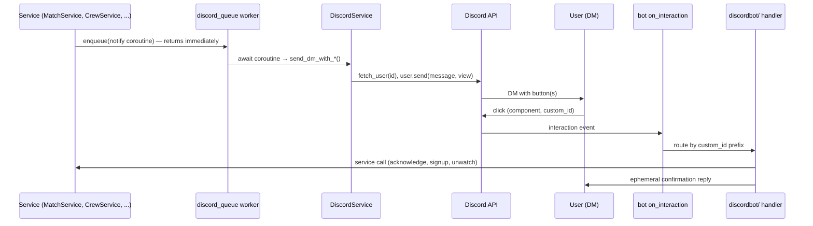

# Discord Integration Reference

*Implementation reference for the in-process Discord bot, the outbound DM queue, and the button interaction handlers. Part of the [documentation index](../README.md).*

This page documents mechanics only — singletons, method signatures, custom_id wire formats, error paths. Behavior-level documentation lives in the feature docs: [discord-notifications](../features/discord-notifications.md), [match-acknowledgment](../features/match-acknowledgment.md), [match-watcher](../features/match-watcher.md), [crew-management](../features/crew-management.md), [tournament-notifications](../features/tournament-notifications.md), [mock-discord](../features/mock-discord.md).

## Key files

| File | Contents |
|---|---|
| [`application/services/discord_service.py`](../../application/services/discord_service.py) | `get_discord_bot()` singleton factory, `DiscordService`, `MockDiscordService`, mock selection |
| [`application/services/discord_queue.py`](../../application/services/discord_queue.py) | Outbound send queue: `start()`, `stop()`, `enqueue()`, worker loop |
| [`discordbot/crew_signup.py`](../../discordbot/crew_signup.py) | Crew signup buttons + handler (`crew_signup:` interactions) |
| [`discordbot/match_acknowledgment.py`](../../discordbot/match_acknowledgment.py) | Player Acknowledge button + handler (`match_ack:` interactions) |
| [`discordbot/crew_acknowledgment.py`](../../discordbot/crew_acknowledgment.py) | Crew Acknowledge button + handler (`crew_ack:` interactions) |
| [`discordbot/watch_buttons.py`](../../discordbot/watch_buttons.py) | Unwatch button + handler (`match_watch:` interactions) |
| [`discordbot/volunteer_acknowledgment.py`](../../discordbot/volunteer_acknowledgment.py) | Volunteer shift Acknowledge button + handler (`volunteer_ack:` interactions) |
| [`main.py`](../../main.py) | `init_discord_bot()` / `close_discord_bot()`, queue start/stop in the FastAPI lifespan |
| [`application/utils/mock_discord.py`](../../application/utils/mock_discord.py) | `is_mock_discord()` flag with production guard |
| [`application/services/match_schedule_service.py`](../../application/services/match_schedule_service.py) | Notification fan-out coroutines and DM message builders |
| [`application/services/crew_service.py`](../../application/services/crew_service.py) | Crew approval → crew acknowledgment DM |

## Architecture overview

The bot is a **py-cord `commands.Bot`** that lives inside the single Uvicorn worker (see [architecture.md](../architecture.md) for why one worker is a hard requirement). It is created lazily by `get_discord_bot()` in [`application/services/discord_service.py`](../../application/services/discord_service.py) and started during FastAPI lifespan startup in [`main.py`](../../main.py):

1. `init_discord_bot()` — under `MOCK_DISCORD` it prints `MOCK_DISCORD enabled — skipping Discord bot start.` and returns. Otherwise it reads `DISCORD_TOKEN` and schedules `bot.start(token)` as an asyncio task (`loop.create_task`). If the token is unset it prints a warning and continues — the app runs, but the bot never connects.
2. `discord_queue.start()` — starts the outbound send worker (next sections).
3. On shutdown, the reverse: `discord_queue.stop()` → `close_discord_bot()` (calls `bot.close()`; no-op under mock) → DB close.

Degradation is graceful at every layer: when the bot is missing or not connected, every `DiscordService` send method returns a `(False, reason)` tuple instead of raising, and the fan-out methods that call them log the failure and move on.

Under `MOCK_DISCORD=true` ([`application/utils/mock_discord.py`](../../application/utils/mock_discord.py)), the entire service is stubbed: the bottom of `discord_service.py` rebinds the module-level name at import time —

```python
if is_mock_discord():
    DiscordService = MockDiscordService
```

— so every importer transparently gets the mock. `is_mock_discord()` returns true when `MOCK_DISCORD` is `1`/`true`/`yes`, and **raises `RuntimeError` if combined with `ENVIRONMENT=production`** (the mock also bypasses OAuth — see [mock-discord.md](../features/mock-discord.md) and [authentication.md](authentication.md)).

The bot and the web UI are **peer presentation layers**: button handlers in `discordbot/` call the same service-layer methods ([services.md](services.md)) as the NiceGUI pages, so both paths share validation, audit logging, and DB effects.



## The bot singleton

`get_discord_bot()` ([`discord_service.py`](../../application/services/discord_service.py)) creates the bot once and stores it in module-level `_bot_instance`:

- **Intents**: `discord.Intents.default()` plus `guilds=True`, `members=True`, `dm_messages=True` (needed for DMs and guild/role visibility).
- **Constructor**: `commands.Bot(command_prefix='!', intents=intents)`. The prefix is set but no text commands are registered — the bot only sends DMs and receives component interactions.
- **`on_ready`**: prints `Discord bot ready. Logged in as <user>`.
- **`on_interaction`**: the single dispatch point for all buttons. It handles only `discord.InteractionType.component` events, reads `interaction.data['custom_id']`, and routes on string prefix:

| `custom_id` prefix | Handler |
|---|---|
| `crew_signup:` | [`discordbot/crew_signup.py`](../../discordbot/crew_signup.py) → `handle_crew_signup_interaction` |
| `match_ack:` | [`discordbot/match_acknowledgment.py`](../../discordbot/match_acknowledgment.py) → `handle_match_acknowledgment_interaction` |
| `crew_ack:` | [`discordbot/crew_acknowledgment.py`](../../discordbot/crew_acknowledgment.py) → `handle_crew_acknowledgment_interaction` |
| `volunteer_ack:` | [`discordbot/volunteer_acknowledgment.py`](../../discordbot/volunteer_acknowledgment.py) → `handle_volunteer_acknowledgment_interaction` |
| `match_watch:` | [`discordbot/watch_buttons.py`](../../discordbot/watch_buttons.py) → `handle_unwatch_interaction` |

Handlers are imported lazily inside `on_interaction`, and `DiscordService` imports the view factories lazily inside its send methods (the `discordbot/` modules in turn import services inside their handler bodies) — this avoids circular imports between the service layer and the bot layer. `discordbot/__init__.py` is empty.

Because dispatch is raw-prefix routing rather than registered `discord.ui.View` callbacks, **buttons keep working across bot restarts**: all state is encoded in the `custom_id`, nothing is held in memory, and no `bot.add_view()` persistent-view registration is needed. All views are built with `timeout=None`.

## DiscordService API

`DiscordService` is instantiated per use (`DiscordService()`); construction just grabs the bot singleton. Every send/mutation method returns a **`Tuple[bool, str]`** — `(True, "Message sent successfully.")` on success, `(False, reason)` on failure — and never raises. The two list methods return `Tuple[bool, Union[list, str]]` (data on success, error string on failure).

| Method | Signature | Behavior |
|---|---|---|
| `send_dm` | `(user_id: int, message: str)` | Plain DM via `fetch_user(user_id)` + `user.send(message)`. |
| `send_dm_with_crew_buttons` | `(user_id, message, match_id: int)` | DM with the two crew signup buttons from `make_crew_signup_view(match_id)`. |
| `send_dm_with_acknowledgment_button` | `(user_id, message, match_id: int)` | DM with the Acknowledge button from `make_match_acknowledgment_view(match_id)`. |
| `send_dm_with_crew_acknowledgment_button` | `(user_id, message, crew_type: str, crew_id: int)` | DM with the crew Acknowledge button from `make_crew_acknowledgment_view(crew_type, crew_id)`. `crew_type` is `'commentator'` or `'tracker'`; `crew_id` is the `Commentator`/`Tracker` row id. |
| `send_dm_with_unwatch_button` | `(user_id, message, match_id: int)` | DM with the Unwatch button from `make_unwatch_view(match_id)`. |
| `send_dm_with_volunteer_acknowledgment_button` | `(user_id, message, assignment_id: int)` | DM with the volunteer shift Acknowledge button from `make_volunteer_acknowledgment_view(assignment_id)`. |
| `get_bot` | `()` (sync) | Returns the bot instance (or `None` in the mock). |
| `list_guilds` | `()` | `(True, [{"id": int, "name": str}, ...])` from the bot's cached guild list. |
| `list_guild_roles` | `(guild_id: int)` | Roles for a guild as `[{"id", "name"}]`. Resolves the guild via cache then `fetch_guild` fallback; prefers `guild.fetch_roles()`, falls back to cached `guild.roles`. |
| `add_role_to_user` | `(guild_id, user_id, role_id, reason: Optional[str] = None)` | Adds a guild role to a member. Resolves member via cache then `fetch_member`; resolves role via cache then `fetch_roles`. `reason` goes to the Discord audit log. |
| `remove_role_from_user` | `(guild_id, user_id, role_id, reason: Optional[str] = None)` | Mirror of `add_role_to_user` using `member.remove_roles`. |
| `get_member_role_ids` | `(guild_id, user_id)` | `(True, {role_id, ...})` for the member's current roles (`@everyone` excluded). When the member is not in the guild, returns `(True, set())`. On a hard failure (bot not ready, API error) returns `(False, reason)` so callers can fail open. Powers the login-time role sync — see [discord-role-sync.md](../features/discord-role-sync.md). |

`add_role_to_user` / `remove_role_from_user` currently have no callers; they exist as API surface only. `get_member_role_ids` is called by `DiscordRoleMappingService.sync_user_roles` during OAuth login.

> **Privileged intent.** Reading guild members requires the **Server Members Intent**, enabled both in code (`intents.members = True`, already set) **and** toggled on for the bot application in the Discord Developer Portal. The bot must also be invited to the guild (`bot` scope). Without these, `get_member_role_ids` returns errors / empty sets and the sync is a safe no-op.

Every send method runs the same guard ladder before touching the API, mapped to error strings:

| Condition | Returned `(False, ...)` message |
|---|---|
| Bot is `None` | `Discord bot not initialized` |
| `not bot.is_ready()` | `Discord bot is not connected. Please try again in a moment.` |
| `discord.NotFound` | `User not found` |
| `discord.Forbidden` | `Cannot send DM to this user (DMs may be disabled)` |
| `discord.HTTPException` | `Failed to send message: <detail>` |
| Any other exception | `Discord bot error: <detail>` |

(Role methods use the same ladder with role-specific messages: `Guild not found`, `Member not found in guild`, `Role not found in guild`, `Bot lacks permissions or role hierarchy prevents this action`.)

Caller pattern — check the tuple, never wrap in try/except:

```python
from application.services.discord_service import DiscordService

success, err = await DiscordService().send_dm(user.discord_id, message)
if not success:
    print(f"DM failed for {user.discord_id}: {err}")   # log and continue
```

`User.discord_id` is a `BigIntField`; the send methods take the raw integer snowflake. (The interaction handlers look users up the other way via `UserRepository.get_by_discord_id`, which is typed `str` but compares against the same column.)

### MockDiscordService

`MockDiscordService` (same file) mirrors the public surface exactly. Selection happens once at import time via the `DiscordService = MockDiscordService` rebinding shown above — callers never branch on mock mode themselves.

- All five `send_dm*` methods **print the message to stdout** (prefix `[MOCK Discord DM] -> <user_id> ...`, including the match/crew id and button type) and return `(True, "Message sent (mock)")`, so notification code paths run end-to-end without Discord.
- `get_bot()` returns `None`.
- `list_guilds()` returns `(True, [{"id": 1, "name": "Mock Guild"}])`; `list_guild_roles()` returns two fixed mock roles.
- `add_role_to_user` / `remove_role_from_user` print a `[MOCK Discord] add_role/remove_role ...` line and return success.
- `get_member_role_ids()` prints a line and returns `(True, set())`, so the login-time role sync runs as a safe no-op in mock mode.

Button interactions are **not** testable in mock mode (no bot connection); see [mock-discord.md](../features/mock-discord.md).

## The async send queue

[`application/services/discord_queue.py`](../../application/services/discord_queue.py) is a tiny module-level FIFO that decouples request handling from Discord I/O. A single fan-out can DM dozens of users (each a `fetch_user` + `send` round-trip), so services must never await it inline — UI handlers and the shared NiceGUI event loop would stall. Instead they hand the *coroutine object* to the queue and return immediately.

| Function | Signature | Behavior |
|---|---|---|
| `start` | `() -> None` (sync) | Creates the `_worker()` task on the running event loop. Called once from `main.py` lifespan startup. |
| `stop` | `() -> None` (async) | If items are still queued, prints `[discord_queue] stopping with N item(s) still queued — they will not be sent`, then cancels the worker task and awaits it (swallowing `CancelledError`). Called from lifespan shutdown. |
| `enqueue` | `(coro: Coroutine) -> None` (sync) | `put_nowait` onto the unbounded `asyncio.Queue`. Safe to call from sync or async code; never blocks. |

The worker loop (`_worker`) pulls one coroutine at a time, awaits it, catches **any** exception and prints `[discord_queue] worker error: <e>` (the queue never dies from a bad send), and marks `task_done()`. Sends are therefore strictly serialized in enqueue order.

```python
from application.services import discord_queue

# Build the coroutine object; the worker awaits it later.
discord_queue.enqueue(self.match_schedule_service.notify_match_participants(match, msg))
return match   # caller does not wait for any DM
```

What gets enqueued is usually a `MatchScheduleService.notify_*` fan-out coroutine, not an individual DM — the per-recipient loop and its own error logging run inside the worker. Two variations exist in the codebase:

- `MatchScheduleService.generate_seed` enqueues a locally defined `_send_seed_dms()` closure.
- `CrewService._request_crew_acknowledgment` enqueues a single `DiscordService.send_dm_with_crew_acknowledgment_button(...)` call directly.

Deliberate exception to the queue rule: the admin Send Message dialog ([`theme/dialog/send_message_dialog.py`](../../theme/dialog/send_message_dialog.py), opened from the user edit dialog) awaits `DiscordService.send_dm()` directly so the admin sees the success/failure result immediately in a `ui.notify`.

Because `stop()` cancels the worker without draining, anything still queued at shutdown is dropped (the printed count is the only trace).

## Interaction handlers (`discordbot/`)

Complete `custom_id` grammar (each module exposes its prefix as a `CUSTOM_ID_PREFIX` constant):

| Format | Produced by | Click effect |
|---|---|---|
| `crew_signup:commentator:<match_id>` / `crew_signup:tracker:<match_id>` | `make_crew_signup_view(match_id)` | Crew signup |
| `match_ack:ack:<match_id>` | `make_match_acknowledgment_view(match_id)` | Player acknowledgment |
| `match_ack:acknowledged` | `make_acknowledged_view()` (match ack) | None — disabled placeholder after acknowledgment |
| `crew_ack:commentator:<crew_id>` / `crew_ack:tracker:<crew_id>` | `make_crew_acknowledgment_view(crew_type, crew_id)` | Crew acknowledgment (`crew_id` is the `Commentator`/`Tracker` row id, not a match id) |
| `crew_ack:acknowledged` | `make_acknowledged_view()` (crew ack) | None — disabled placeholder after acknowledgment |
| `volunteer_ack:<assignment_id>` | `make_volunteer_acknowledgment_view(assignment_id)` | Volunteer shift acknowledgment |
| `volunteer_ack:acknowledged` | `make_acknowledged_view(CUSTOM_ID_PREFIX)` (volunteer ack) | None — disabled placeholder after acknowledgment |
| `match_watch:unwatch:<match_id>` | `make_unwatch_view(match_id)` | Remove watcher |

Common to all four modules: views are `discord.ui.View(timeout=None)` holding plain `discord.ui.Button`s with static `custom_id`s and no callbacks (routing happens in `on_interaction`, above). Handlers parse the `custom_id`, resolve the SGLMan user with `UserRepository().get_by_discord_id(str(interaction.user.id))`, call a service method, and reply **ephemerally**. A malformed `custom_id` yields `Invalid interaction.`; a non-integer id yields `Invalid match ID.` / `Invalid crew ID.`; a Discord user with no SGLMan account gets `You do not have an SGLMan account. Please log in at the website first.`; service `ValueError`s are relayed verbatim as the reply.

### crew_signup.py

| Item | Value |
|---|---|
| View factory | `make_crew_signup_view(match_id)` |
| Buttons | `Sign up as Commentator` (`ButtonStyle.primary`), `Sign up as Tracker` (`ButtonStyle.secondary`) |
| `custom_id` | `crew_signup:<role>:<match_id>` where `<role>` ∈ `commentator` \| `tracker` |
| Handler | `handle_crew_signup_interaction(interaction)` |

The handler validates the role token, loads the match via `MatchService().repository.get_by_id(match_id, prefetch_relations=False)`, and rejects with `Match not found.` or — when `finished_at` is set — `This match has already finished. Crew signup is closed.`. On success it calls `MatchService.signup_crew(match_id, user, role)` (creates an unapproved `Commentator`/`Tracker` row, audits `crew.signup_created`) and replies `You have been signed up as a **<role>** for Match ID <id>. Awaiting admin approval.` A duplicate signup surfaces the service's `ValueError` (`User already signed up as <role>`). No defer, no message edit — the buttons stay live for other recipients of the same fan-out. See [crew-management.md](../features/crew-management.md).

### match_acknowledgment.py

| Item | Value |
|---|---|
| View factories | `make_match_acknowledgment_view(match_id)`, `make_acknowledged_view()` |
| Buttons | `Acknowledge` (`ButtonStyle.success`); replaced after use by disabled `Acknowledged` (`ButtonStyle.secondary`) |
| `custom_id` | `match_ack:ack:<match_id>`; the disabled replacement uses `match_ack:acknowledged` |
| Handler | `handle_match_acknowledgment_interaction(interaction)` |

The handler **defers ephemerally first** (the DB work can exceed Discord's 3-second interaction deadline) and replies through a `_send()` helper that uses `interaction.followup` when the defer succeeded, falling back to `interaction.response`. It calls `MatchService().acknowledge_match(match_id, user)` (validates the clicker is a current player, upserts `MatchAcknowledgment.acknowledged_at`, audits `match.acknowledged`), then edits the original DM's view to the disabled `Acknowledged` button (failure to edit only logs a warning), and replies `You have acknowledged Match ID <id>. Players: <names>. Thanks!`. Service `ValueError`s (not a participant, already acknowledged) are relayed; any other exception is logged and answered with `An unexpected error occurred. Please try again or use the website to acknowledge.` See [match-acknowledgment.md](../features/match-acknowledgment.md).

### crew_acknowledgment.py

| Item | Value |
|---|---|
| View factories | `make_crew_acknowledgment_view(crew_type, crew_id)`, `make_acknowledged_view()` |
| Buttons | `Acknowledge` (`ButtonStyle.success`); replaced after use by disabled `Acknowledged` (`ButtonStyle.secondary`) |
| `custom_id` | `crew_ack:<crew_type>:<crew_id>` where `<crew_type>` ∈ `commentator` \| `tracker`; disabled replacement uses `crew_ack:acknowledged` |
| Handler | `handle_crew_acknowledgment_interaction(interaction)` |

Structurally identical to the match-ack handler (defer + `_send` fallback, view swap, same generic error message). It calls `CrewService().acknowledge_crew_assignment(crew_id, crew_type, user)`, which enforces that the clicker owns the assignment (`You can only acknowledge your own crew assignments.`), that it has been approved (`This <crew_type> assignment has not been approved yet.`), treats repeat clicks as a no-op, sets `acknowledged_at` in a transaction, and audits `crew.acknowledged`. The reply is `You have acknowledged your <crew_type> assignment for Match ID <id>. Players: <names>. Thanks!`. See [crew-management.md](../features/crew-management.md) and [match-acknowledgment.md](../features/match-acknowledgment.md).

### volunteer_acknowledgment.py

| Item | Value |
|---|---|
| View factories | `make_volunteer_acknowledgment_view(assignment_id)`, `make_acknowledged_view(CUSTOM_ID_PREFIX)` |
| Buttons | `Acknowledge` (`ButtonStyle.success`); replaced after use by disabled `Acknowledged` (`ButtonStyle.secondary`) |
| `custom_id` | `volunteer_ack:<assignment_id>`; the disabled replacement uses `volunteer_ack:acknowledged` |
| Handler | `handle_volunteer_acknowledgment_interaction(interaction)` |

Structurally identical to the match-ack and crew-ack handlers (defer + `_send` fallback, view swap on the DM, same generic error message). It calls `VolunteerScheduleService().acknowledge(assignment_id, user)`, which enforces that the clicker owns the assignment, treats repeat clicks as a no-op (idempotent), stamps `acknowledged_at` in a transaction, and audits `volunteer.acknowledged`. The reply is produced by `volunteer_ack_confirmation(position_name)` from `discord_messages.py`. Service `ValueError`s are relayed verbatim; any other exception is logged and answered with a generic retry message. See [discord-notifications.md](../features/discord-notifications.md).

### watch_buttons.py

| Item | Value |
|---|---|
| View factory | `make_unwatch_view(match_id)` |
| Button | `Unwatch` (`ButtonStyle.danger`) |
| `custom_id` | `match_watch:unwatch:<match_id>` |
| Handler | `handle_unwatch_interaction(interaction)` |

The Unwatch button rides along on lifecycle DMs sent to watchers (there is no "watch" button in Discord — watching starts from the web schedule). The handler calls `MatchWatcherService().unwatch(match_id, user)`, which deletes the `MatchWatcher` row and audits `match.watcher_removed`, returning whether a row was removed. Reply: `You are no longer watching match ID <id>.` or `You were not watching match ID <id>.`. No defer, no view edit. See [match-watcher.md](../features/match-watcher.md).

## Message flows

All outbound notifications are coroutines enqueued via `discord_queue.enqueue(...)` from [`match_service.py`](../../application/services/match_service.py), [`match_schedule_service.py`](../../application/services/match_schedule_service.py), and [`crew_service.py`](../../application/services/crew_service.py). The fan-out coroutines in `MatchScheduleService` never raise: each skips recipients without a `discord_id` or with `User.dm_notifications` off, logs per-DM failures, and swallows unexpected errors.

Recipient selection helpers:

- `notify_match_participants` — players + approved crew + watchers, deduplicated by `discord_id`; watchers get the Unwatch-button variant, everyone else a plain DM.
- `notify_match_crew` — approved crew + watchers, **excluding players** (players get the ack-request DM instead); watchers again get the Unwatch variant.
- `notify_acknowledgment_request` — players with a pending `MatchAcknowledgment` row only.
- `notify_tournament_subscribers_scheduled` / `notify_stream_candidate_subscribers` — tournament subscribers by notification level ([tournament-notifications.md](../features/tournament-notifications.md)), minus `MatchService._collect_notified_discord_ids` (players + approved crew already DMed). The stream-candidate fan-out returns early if the match already has a stream room.

### DM message builders

Message text is produced by private `_create_*_dm_message` helpers on `MatchScheduleService` (all times formatted with `format_eastern_display` — see [timezone-handling.md](../timezone-handling.md)):

| Builder | Used for | Content |
|---|---|---|
| `_create_scheduled_dm_message` | New-match info DM (crew/subscribers) | Tournament name, match id, scheduled time |
| `_create_rescheduled_dm_message` | Reschedule info DM (crew/subscribers) | Tournament name, match id, new time |
| `_create_acknowledgment_request_dm_message` | Player ack request (scheduled and rescheduled variants) | Match details plus optional stream room and player names; ends with `Click **Acknowledge** below to confirm you've seen this.` |
| `_create_checked_in_dm_message` | Seated transition | "checked in … about to begin" |
| `_create_state_changed_dm_message` | Started / Finished / Confirmed transitions | `Match ID <id> in **<tournament>** is now: **<state>**.` |
| `_create_stream_candidate_dm_message` | Stream-candidate alert | Flag announcement + scheduled time + "Use the buttons below to sign up as crew." |
| `_create_seed_dm_message` | Seed generation | Greeting, match/tournament, seed URL |

The crew approval DM has no builder — `CrewService._request_crew_acknowledgment` assembles it inline from the match title, scheduled time, stream room, and player list.

### Flow table

| Flow | Triggering call site | DiscordService method | Buttons | Handler → DB effect | Feature doc |
|---|---|---|---|---|---|
| Match scheduled — player ack request | `MatchService.create_match` / `submit_match_request` → `notify_acknowledgment_request(match, rescheduled=False)` | `send_dm_with_acknowledgment_button` | Acknowledge | `handle_match_acknowledgment_interaction` → `MatchService.acknowledge_match` sets `MatchAcknowledgment.acknowledged_at` | [match-acknowledgment](../features/match-acknowledgment.md) |
| Match rescheduled / players changed — ack request | `MatchService.update_match` → `notify_acknowledgment_request(match, rescheduled=<time changed>)` (acks re-seeded first) | `send_dm_with_acknowledgment_button` | Acknowledge | same as above | [match-acknowledgment](../features/match-acknowledgment.md) |
| Scheduled/rescheduled — crew & watcher info | `MatchService.create_match` / `submit_match_request` / `update_match` (time changed) → `notify_match_crew(match, msg)` | `send_dm` (crew) / `send_dm_with_unwatch_button` (watchers) | Unwatch (watchers only) | `handle_unwatch_interaction` → `MatchWatcherService.unwatch` deletes `MatchWatcher` row | [discord-notifications](../features/discord-notifications.md), [match-watcher](../features/match-watcher.md) |
| Crew signup invitation (subscribers) | same call sites → `notify_tournament_subscribers_scheduled(match, msg, notified_ids)` | `send_dm_with_crew_buttons` | Sign up as Commentator / Tracker | `handle_crew_signup_interaction` → `MatchService.signup_crew` creates unapproved `Commentator`/`Tracker` row | [tournament-notifications](../features/tournament-notifications.md), [crew-management](../features/crew-management.md) |
| Stream candidate alert | `MatchService.create_match` (flagged) / `set_stream_candidate(flag=True)` → `notify_stream_candidate_subscribers(match, notified_ids)` | `send_dm_with_crew_buttons` | Sign up as Commentator / Tracker | same as above | [discord-notifications](../features/discord-notifications.md), [crew-management](../features/crew-management.md) |
| Crew approved — ack request | `CrewService.update_crew_approval(approved=True)` → `_request_crew_acknowledgment` (enqueues the send directly) | `send_dm_with_crew_acknowledgment_button` | Acknowledge | `handle_crew_acknowledgment_interaction` → `CrewService.acknowledge_crew_assignment` sets `acknowledged_at` | [crew-management](../features/crew-management.md) |
| Match seated (checked in) | `MatchScheduleService.seat_match` / `MatchService.seat_players` → `notify_match_participants` | `send_dm` / `send_dm_with_unwatch_button` | Unwatch (watchers only) | `handle_unwatch_interaction` → watcher row deleted | [discord-notifications](../features/discord-notifications.md) |
| Match started / finished / confirmed | `MatchScheduleService.start_match` / `finish_match` / `confirm_match` → `notify_match_participants` (`is now: **Started/Finished/Confirmed**`) | `send_dm` / `send_dm_with_unwatch_button` | Unwatch (watchers only) | same as above | [discord-notifications](../features/discord-notifications.md) |
| Seed generated | `MatchScheduleService.generate_seed` → enqueues inline `_send_seed_dms()` per opted-in player | `send_dm` | none | n/a — informational (seed URL) | [discord-notifications](../features/discord-notifications.md) |
| Volunteer shift assigned — ack request | `VolunteerScheduleService.assign(notify=True)` → enqueues `DiscordService.send_dm_with_volunteer_acknowledgment_button(...)` directly | `send_dm_with_volunteer_acknowledgment_button` | Acknowledge | `handle_volunteer_acknowledgment_interaction` → `VolunteerScheduleService.acknowledge` sets `acknowledged_at` | [discord-notifications](../features/discord-notifications.md) |
| Volunteer shift reminder | `volunteer_reminder` loop → enqueues reminder DM per un-reminded upcoming assignment | `send_dm_with_volunteer_acknowledgment_button` | Acknowledge | same as above | — |
| Admin direct message | `SendMessageDialog.send` (user edit dialog) — awaited inline, **not** queued | `send_dm` | none | n/a — failure shown via `ui.notify` | — |

Note the asymmetry in lifecycle notifications: scheduling/rescheduling DMs are split (players get the Acknowledge DM via `notify_acknowledgment_request`; crew, watchers, and subscribers get informational variants), while seated/started/finished/confirmed DMs go to everyone at once via `notify_match_participants`.
