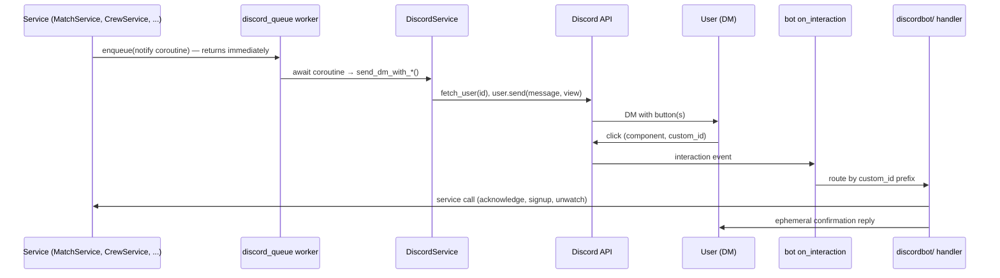

# Discord Integration Reference

*Implementation reference for the in-process Discord bot, the outbound DM queue, and the button interaction handlers. Part of the [documentation index](../README.md).*

This page documents mechanics only — singletons, method signatures, custom_id wire formats, error paths. Behavior-level documentation lives in [discord.md](../features/discord.md) (notifications, guild-role sync, mock mode) and [match-participation.md](../features/match-participation.md) (crew, acknowledgment, watching).

> **Sibling: the racetime bot.** The [`racetimebot/`](../../racetimebot/) package (connection, handler, manager, mock, transport) is the racetime.gg analogue of this Discord bot — a lifespan-managed connection running as a peer in the same single worker. Its runtime and health model are documented in [services.md § racetimebot](services.md); the one-bot-many-guilds tenant routing both bots follow is in [multitenancy.md](../features/multitenancy.md#discord-one-bot-many-guilds).

## Key files

| File | Contents |
|---|---|
| [`application/services/discord/discord_service.py`](../../application/services/discord/discord_service.py) | `get_discord_bot()` singleton factory, the handler/view-factory registries, `DiscordService`, `MockDiscordService`, mock selection |
| [`application/services/discord/discord_queue.py`](../../application/services/discord/discord_queue.py) | Outbound send queue: `start()`, `stop()`, `enqueue()` over the shared `CoroutineQueue` |
| [`application/utils/coroutine_queue.py`](../../application/utils/coroutine_queue.py) | `CoroutineQueue` + `bind_module_state` — the serial-worker primitive `discord_queue` is one instance of |
| [`application/services/discord/discord_link_service.py`](../../application/services/discord/discord_link_service.py) | Verified tenant ↔ guild linking (bot-auth flow + server-side Manage Server re-check) |
| [`application/services/discord/discord_role_mapping_service.py`](../../application/services/discord/discord_role_mapping_service.py) | Discord role → app role mappings and the login-time/live `sync_user_roles` |
| [`application/services/discord/discord_event_sync_service.py`](../../application/services/discord/discord_event_sync_service.py) | Tenant-facing Scheduled Events config: per-tournament opt-in + "reconcile now" (gated by `can_manage_sync`) |
| [`application/services/discord/discord_event_reconciler_service.py`](../../application/services/discord/discord_event_reconciler_service.py) | Idempotent create/update/cancel of guild Scheduled Events; shared-guild safe (works only from this tenant's own link rows) |
| [`application/services/discord/discord_event_worker.py`](../../application/services/discord/discord_event_worker.py) | Background reconcile loop, gated by `DISCORD_EVENTS_SYNC_ENABLED` |
| [`discordbot/__init__.py`](../../discordbot/__init__.py) | Registers every interaction handler and view factory with `discord_service` at import |
| [`discordbot/_ack_common.py`](../../discordbot/_ack_common.py) | `run_dm_interaction` (the shared handler ladder), `make_acknowledged_view`, `send_ephemeral` |
| [`discordbot/_tenant.py`](../../discordbot/_tenant.py) | `match_tenant_id` / `crew_tenant_id` / `assignment_tenant_id` — deliberately unscoped tenant discovery |
| [`discordbot/crew_signup.py`](../../discordbot/crew_signup.py) | Crew signup buttons + handler (`crew_signup:`) |
| [`discordbot/match_acknowledgment.py`](../../discordbot/match_acknowledgment.py) | Player Acknowledge button + handler (`match_ack:`) |
| [`discordbot/crew_acknowledgment.py`](../../discordbot/crew_acknowledgment.py) | Crew Acknowledge button + handler (`crew_ack:`) |
| [`discordbot/volunteer_acknowledgment.py`](../../discordbot/volunteer_acknowledgment.py) | Volunteer shift Acknowledge button + handler (`volunteer_ack:`) |
| [`discordbot/watch_buttons.py`](../../discordbot/watch_buttons.py) | Unwatch button + handler (`match_watch:`) |
| [`main.py`](../../main.py) | `init_discord_bot()` / `close_discord_bot()`, the `import discordbot` registration hook, queue and worker start/stop in the FastAPI lifespan |
| [`application/utils/mocks/mock_discord.py`](../../application/utils/mocks/mock_discord.py) | `is_mock_discord()` flag with production guard |
| [`application/services/match/match_schedule_service.py`](../../application/services/match/match_schedule_service.py) | Notification fan-out coroutines |
| [`application/utils/discord_messages.py`](../../application/utils/discord_messages.py) | Plain-text DM builders (public functions) + ephemeral confirmation strings |
| [`application/utils/discord_embeds.py`](../../application/utils/discord_embeds.py) | Embed-card builders (`match_embed`, `state_changed_embed`, `matchup_ready_embed`, `volunteer_embed`, `notification_embed`, `time_field`, `COLOR_*`) |
| [`application/services/crew_service.py`](../../application/services/crew_service.py) | Crew approval → crew acknowledgment DM |

## Architecture overview

The bot is a **discord.py `commands.Bot`** that lives inside the single Uvicorn worker (see [architecture.md](../architecture.md) for why one worker is a hard requirement). It is created lazily by `get_discord_bot()` in [`application/services/discord/discord_service.py`](../../application/services/discord/discord_service.py) and started during FastAPI lifespan startup in [`main.py`](../../main.py):

1. `import discordbot` — registers the interaction handlers and view factories (below) before any interaction can dispatch or DM can be sent.
2. `init_discord_bot()` — under `MOCK_DISCORD` it logs `MOCK_DISCORD enabled — skipping Discord bot start.` and returns. Otherwise it reads `DISCORD_TOKEN` and schedules `bot.start(token)` as an asyncio task with a done-callback that logs a crashed task. An unset token logs a warning and continues — the app runs, but the bot never connects.
3. `discord_queue.start()` — starts the outbound send worker; `discord_event_worker.start()` runs too when `DISCORD_EVENTS_SYNC_ENABLED` is on.
4. On shutdown, the reverse: `discord_queue.stop()` → `close_discord_bot()` (`bot.close()` + task cancel; no-op under mock) → DB close.

Degradation is graceful at every layer: when the bot is missing or not connected, every `DiscordService` method returns a `(False, reason)` tuple instead of raising, and the fan-out methods log the failure and move on.

**The import cycle is inverted into a registry.** `discord_service.py` owns `_interaction_handlers` / `_view_factories` plus `register_interaction_handler(prefix, fn)` and `register_view_factory(kind, factory)` (keyed by the `VIEW_*` constants), and never imports `discordbot` at all. [`discordbot/__init__.py`](../../discordbot/__init__.py) registers all five handlers and all five view factories at import; `main.py`'s lifespan imports the package once. The dependency runs one way: `discordbot` → `application.services`. This mirrors `application/events/match_live.py`.

> **One Discord library, and it is discord.py.** Never add **py-cord** alongside it. The two are hard forks that both install into the same top-level `discord/` package — neither uninstalls the other, so whichever unpacks last silently owns the ~107 modules they share. This repo shipped both for a while, py-cord won, and `discord.EntityType` / `discord.PrivacyLevel` quietly stopped existing: every scheduled-event create/edit raised `AttributeError`, which `_scheduled_event_op`'s `except Exception` swallowed into a `(False, …)` tuple. The suite stayed green because that path is only ever reached through `MockDiscordService`. `TestDiscordLibraryIdentity` in [`tests/services/test_discord_service.py`](../../tests/services/test_discord_service.py) now asserts the `discord` package has exactly one provider, and `.claude/scripts/enforce_safe_commands.py` blocks `poetry add py-cord`.

**Embeds vs. text.** Each notification is *sent* as a colour-coded `discord.Embed` card built in [`discord_embeds.py`](../../application/utils/discord_embeds.py) (state colour, Tournament/Players/Time/Stage field grid, native `<t:unix:F>·<t:unix:R>` timestamps, community-name footer via `TenantService.current_community_name()`). `send_dm(..., embed=embed)` sends the embed as the Discord representation but **always mirrors the plain-text `message`** (from [`discord_messages.py`](../../application/utils/discord_messages.py)) to the recipient's web-push devices — so the embed layer is purely additive and the text builders remain the mirror/fallback copy. The embed is built in the request's tenant context (at enqueue time), not in the serial `discord_queue` worker.

Under `MOCK_DISCORD=true` the entire service is stubbed: the bottom of `discord_service.py` rebinds the module-level name at import time —

```python
if is_mock_discord():
    DiscordService = MockDiscordService
```

— so every importer transparently gets the mock. `is_mock_discord()` returns true when `MOCK_DISCORD` is truthy (`env_flag`: `1`/`true`/`yes`/`on`), and **raises `RuntimeError` if combined with `ENVIRONMENT=production`** (the mock also bypasses OAuth — see [discord.md § Mock mode](../features/discord.md#mock-mode) and [authentication.md](authentication.md)).

The bot and the web UI are **peer presentation layers**: handlers in `discordbot/` call the same service-layer methods ([services.md](services.md)) as the NiceGUI pages, so both paths share validation, audit logging, and DB effects.


```mermaid
sequenceDiagram
    participant SVC as Service (MatchService, CrewService, ...)
    participant Q as discord_queue worker
    participant DS as DiscordService
    participant API as Discord API
    participant U as User (DM)
    participant BOT as bot on_interaction
    participant H as discordbot/ handler

    SVC->>Q: enqueue(notify coroutine) — returns immediately
    Q->>DS: await coroutine → send_dm_with_*()
    DS->>API: fetch_user(id), user.send(message, view)
    API->>U: DM with button(s)
    U->>API: click (component, custom_id)
    API->>BOT: interaction event
    BOT->>H: route by custom_id prefix
    H->>SVC: service call (acknowledge, signup, unwatch)
    H->>U: ephemeral confirmation reply
```

## The bot singleton

`get_discord_bot()` creates the bot once and stores it in module-level `_bot_instance`:

- **Intents**: `discord.Intents.default()` plus `guilds=True`, `members=True`, `dm_messages=True` (needed for DMs and guild/role visibility).
- **Constructor**: `commands.Bot(command_prefix='!', intents=intents)`. The prefix is set but no text commands are registered — the bot only sends DMs and receives component interactions.

Four gateway events are registered:

| Event | Behavior |
|---|---|
| `on_ready` | Logs `Discord bot ready. Logged in as <user>` |
| `on_interaction` | The single dispatch point for buttons: handles `InteractionType.component` only, reads `interaction.data['custom_id']`, and looks the prefix (text before the first `:`) up in `_interaction_handlers` |
| `on_member_update` | Fires `_sync_member_roles` **only when role membership actually changed** (the event also fires for nick/avatar/timeout edits) |
| `on_member_remove` | Left/kicked/banned — the same re-sync, which strips their Discord-sourced roles |

`_sync_member_roles(guild_id, discord_user_id)` fans out across **every tenant sharing that guild** (`TenantService.list_tenants_for_guild`), each inside its own `tenant_scope`; an unknown guild or unknown user is a no-op. It logs and swallows everything, so a bad event can never crash the gateway connection. Behavior: [discord.md § Guild-role → app-role sync](../features/discord.md#guild-role--app-role-sync).

Registered handler prefixes:

| `custom_id` prefix | Handler |
|---|---|
| `crew_signup:` | [`crew_signup.py`](../../discordbot/crew_signup.py) → `handle_crew_signup_interaction` |
| `match_ack:` | [`match_acknowledgment.py`](../../discordbot/match_acknowledgment.py) → `handle_match_acknowledgment_interaction` |
| `crew_ack:` | [`crew_acknowledgment.py`](../../discordbot/crew_acknowledgment.py) → `handle_crew_acknowledgment_interaction` |
| `volunteer_ack:` | [`volunteer_acknowledgment.py`](../../discordbot/volunteer_acknowledgment.py) → `handle_volunteer_acknowledgment_interaction` |
| `match_watch:` | [`watch_buttons.py`](../../discordbot/watch_buttons.py) → `handle_unwatch_interaction` |

Because dispatch is raw-prefix routing rather than registered `discord.ui.View` callbacks, **buttons keep working across bot restarts**: all state is encoded in the `custom_id`, nothing is held in memory, and no `bot.add_view()` persistent-view registration is needed. All views are built with `timeout=None`.

## DiscordService API

`DiscordService` is instantiated per use (`DiscordService()`); construction just grabs the bot singleton. **No method raises** — each returns `Tuple[bool, Union[str, list, dict, set, bool, int]]`: `(True, payload)` on success (`"Message sent successfully."` for the send methods), `(False, reason)` on failure.

| Method | Signature | Behavior |
|---|---|---|
| `send_dm` | `(user_id: int, message: str, view_factory=None, embed=None)` | Plain DM via `fetch_user(user_id)` + `user.send(...)`. `view_factory` is a zero-arg callable invoked just before the send; `embed`, when present, is sent **instead of** the plain content (Discord would otherwise show both) while `message` stays the web-push/fallback text. |
| `send_dm_with_crew_buttons` | `(user_id, message, match_id: int, embed=None)` | DM with the two crew signup buttons (`VIEW_CREW_SIGNUP`). |
| `send_dm_with_acknowledgment_button` | `(user_id, message, match_id: int, embed=None)` | DM with the player Acknowledge button (`VIEW_MATCH_ACK`). |
| `send_dm_with_crew_acknowledgment_button` | `(user_id, message, crew_type: str, crew_id: int, embed=None)` | DM with the crew Acknowledge button (`VIEW_CREW_ACK`). `crew_type` is `'commentator'` or `'tracker'`; `crew_id` is the `Commentator`/`Tracker` row id. |
| `send_dm_with_volunteer_acknowledgment_button` | `(user_id, message, assignment_id: int, embed=None)` | DM with the volunteer shift Acknowledge button (`VIEW_VOLUNTEER_ACK`). |
| `send_dm_with_unwatch_button` | `(user_id, message, match_id: int, embed=None)` | DM with the Unwatch button (`VIEW_UNWATCH`). |
| `get_bot` | `()` (sync) | Returns the bot instance (or `None` in the mock). |
| `list_guilds` | `()` | `(True, [{"id": int, "name": str}, ...])` from the bot's cached guild list. |
| `list_guild_roles` | `(guild_id: int)` | Roles as `[{"id", "name"}]`. Resolves the guild via cache then `fetch_guild`; prefers `guild.fetch_roles()`, falls back to cached `guild.roles`. |
| `get_guild_summary` | `(guild_id: int)` | `(True, {"id", "name"})` for a guild the bot can see — renders the connected server's name and confirms the bot actually joined after a link. |
| `member_can_manage_guild` | `(guild_id: int, user_id: int)` | `(True, bool)` — owner / Administrator / Manage Server. The authorization proof for `DiscordLinkService`; an indeterminate answer returns `(False, error)` so callers fail **closed**. |
| `add_role_to_user` | `(guild_id, user_id, role_id, reason=None)` | Adds a guild role to a member. Resolves member via cache then `fetch_member`, role via cache then `fetch_roles`. `reason` goes to the Discord audit log. |
| `remove_role_from_user` | `(guild_id, user_id, role_id, reason=None)` | Mirror of `add_role_to_user` using `member.remove_roles`. |
| `get_member_role_ids` | `(guild_id, user_id)` | `(True, {role_id, ...})` for the member's current roles (`@everyone` excluded); `(True, set())` when the member is not in the guild. A hard failure (bot not ready, API error) returns `(False, reason)` so callers can fail open. Powers the role sync. |
| `create_scheduled_event` | `(guild_id, *, name, start_time, end_time, description=None, location='Stream')` | Creates an external Scheduled Event; `(True, event_id)`. |
| `edit_scheduled_event` | `(guild_id, event_id, *, name, start_time, end_time, description=None, location='Stream')` | Edits an existing Scheduled Event to match the current schedule. |
| `delete_scheduled_event` | `(guild_id, event_id)` | Cancels a Scheduled Event; treats an already-gone event as success. |

`add_role_to_user` / `remove_role_from_user` currently have no callers; they exist as API surface only. `get_member_role_ids` is called by `DiscordRoleMappingService.sync_user_roles`. The three scheduled-event methods share one `_scheduled_event_op` guard/error wrapper and are driven by `DiscordEventReconcilerService`.

> **Privileged intent.** Reading guild members requires the **Server Members Intent**, enabled both in code (`intents.members = True`, already set) **and** toggled on for the bot application in the Discord Developer Portal. The bot must also be invited to the guild (`bot` scope). Without these, `get_member_role_ids` returns errors / empty sets and the sync is a safe no-op.

`send_dm` is the chokepoint every notification fan-out flows through; **before** the guard ladder it enqueues a fire-and-forget mirror of the message to the recipient's web-push devices (no-op unless [device notifications](../features/web-push.md) are configured), so pushes go out even when the bot is down or the user blocks DMs. Corollary: a `(False, ...)` return means only the *Discord* leg failed — devices may already have been notified, so do not blind-retry. `MockDiscordService.send_dm` deliberately skips the mirror so mock mode has no external side effects.

Every method runs the same guard ladder before touching the API, mapped to error strings:

| Condition | Returned `(False, ...)` message |
|---|---|
| Bot is `None` | `Discord bot not initialized` |
| `not bot.is_ready()` | `Discord bot is not connected. Please try again in a moment.` |
| `discord.NotFound` | `User not found` |
| `discord.Forbidden` | `Cannot send DM to this user (DMs may be disabled)` |
| `discord.HTTPException` | `Failed to send message: <detail>` |
| Any other exception | `Discord bot error: <detail>` |

Role and guild methods use the same ladder with their own messages: `Guild not found`, `The bot is not in this server.`, `Member not found in guild`, `Role not found in guild`, `Bot lacks permissions or role hierarchy prevents this action`.

Caller pattern: `from application.services.discord.discord_service import DiscordService` (or `from application.services import DiscordService`), then check the returned tuple and log — never wrap in `try`/`except`.

### MockDiscordService

`MockDiscordService` (same file) mirrors the public surface exactly. Selection happens once at import time via the `DiscordService = MockDiscordService` rebinding shown above — callers never branch on mock mode themselves.

- The five button variants delegate to the single `send_dm` stub, which **prints to stdout** (`[MOCK Discord DM] -> <user_id>: <message> [embed: <title>]`) and returns `(True, "Message sent (mock)")`, so notification code paths run end-to-end without Discord.
- `get_bot()` returns `None`.
- `list_guilds` / `list_guild_roles` / `get_member_role_ids` / `get_guild_summary` / `member_can_manage_guild` answer from `application/utils/mocks/mock_discord_data.py`; the role/event methods print a `[MOCK Discord] …` line and return success.

Button interactions are **not** testable in mock mode (no bot connection); see [discord.md § Mock mode](../features/discord.md#mock-mode).

## The async send queue

[`discord_queue.py`](../../application/services/discord/discord_queue.py) is one instance of the shared `CoroutineQueue` ([`application/utils/coroutine_queue.py`](../../application/utils/coroutine_queue.py)), bound with `bind_module_state(__name__, _q)`. A single fan-out can DM dozens of users (each a `fetch_user` + `send` round-trip), so services must never await it inline — UI handlers and the shared NiceGUI event loop would stall. Instead they hand the *coroutine object* to the queue and return immediately.

| Function | Signature | Behavior |
|---|---|---|
| `start` | `() -> None` (sync) | Delegates to `CoroutineQueue.start()` — creates the single worker task on the running loop. Called once from lifespan startup. |
| `stop` | `() -> None` (async) | Delegates to `CoroutineQueue.stop()`: logs `discord_queue stopping with %d item(s) still queued — they will not be sent`, cancels the worker, awaits it. Called from lifespan shutdown. |
| `enqueue` | `(coro: Coroutine) -> None` (sync) | Wraps the coroutine in the caller's `tenant_scope` (below), then `put_nowait` onto the unbounded queue. Safe from sync or async code; never blocks. |

The worker awaits one coroutine at a time, so sends are strictly serialized in enqueue order. Failures are **logged** (reaching logs + Sentry), never swallowed silently, and the queue survives a bad send.

**Tenant scope across the queue boundary.** The worker task is created once at startup with **no tenant in scope**, and a coroutine handed to `asyncio.Queue` does not carry the enqueuer's context — so a `notify_*` coroutine reaching `require_tenant_id()` would raise in the worker and silently drop the DM. `enqueue` therefore snapshots `get_current_tenant_id()` at call time (request context) and re-establishes it via `tenant_scope` when the worker awaits the coroutine. Enqueue **from a tenant-scoped context**; a genuinely tenant-agnostic send may enqueue unscoped and is queued as-is.

```python
from application.services import discord_queue

# Build the coroutine object; the worker awaits it later.
discord_queue.enqueue(self.match_schedule_service.notify_match_participants(match, msg))
return match   # caller does not wait for any DM
```

What gets enqueued is usually a `MatchScheduleService.notify_*` fan-out coroutine, not an individual DM — the per-recipient loop and its own error logging run inside the worker. Variations: `MatchScheduleService.generate_seed` enqueues a locally defined `_send_seed_dms()` closure, and `CrewService._request_crew_acknowledgment` / `VolunteerScheduleService.assign` / `_bracket/notifications.py` enqueue single `DiscordService` calls directly.

Deliberate exception to the queue rule: the admin Send Message dialog ([`theme/dialog/send_message_dialog.py`](../../theme/dialog/send_message_dialog.py)) awaits `DiscordService.send_dm()` directly so the admin sees the result immediately in a `ui.notify`.

Because `stop()` cancels the worker without draining, anything still queued at shutdown is dropped (the logged count is the only trace).

## Interaction handlers (`discordbot/`)

All views are `discord.ui.View(timeout=None)` holding plain `discord.ui.Button`s with static `custom_id`s and no callbacks — routing happens in `on_interaction`. Each module exposes its prefix as `CUSTOM_ID_PREFIX`.

| `custom_id` | Produced by | Service called | View swap on click? |
|---|---|---|---|
| `crew_signup:commentator:<match_id>` / `crew_signup:tracker:<match_id>` | `make_crew_signup_view(match_id)` | `CrewService.signup_crew(match_id, user, role)` | No — buttons stay live for the other recipients of the same fan-out |
| `match_ack:ack:<match_id>` | `make_match_acknowledgment_view(match_id)` | `MatchService.acknowledge_match(match_id, user)` | Yes → `match_ack:acknowledged` |
| `crew_ack:commentator:<crew_id>` / `crew_ack:tracker:<crew_id>` | `make_crew_acknowledgment_view(crew_type, crew_id)` (`crew_id` is the `Commentator`/`Tracker` row id, not a match id) | `CrewService.acknowledge_crew_assignment(crew_id, crew_type, user)` | Yes → `crew_ack:acknowledged` |
| `volunteer_ack:<assignment_id>` | `make_volunteer_acknowledgment_view(assignment_id)` | `VolunteerScheduleService.acknowledge(assignment_id, user)` | Yes → `volunteer_ack:acknowledged` |
| `match_watch:unwatch:<match_id>` | `make_unwatch_view(match_id)` | `MatchWatcherService.unwatch(match_id, user)` | No — the button stays live |
| `<prefix>:acknowledged` | `make_acknowledged_view(CUSTOM_ID_PREFIX)` — one shared factory in `_ack_common.py`, not redefined per module | — | Disabled placeholder; no handler action |

### The shared ladder (`_ack_common.py`)

Every handler supplies a `parse`, a `resolve_tenant`, a `not_found_message`, and a body to `run_dm_interaction`, which runs these steps in order:

1. **Defer ephemerally** — extends Discord's 3-second interaction deadline. Every handler defers; a failed defer is logged and the reply falls back from `interaction.followup` to `interaction.response` (`send_ephemeral`).
2. **Parse the `custom_id`** — raising `DMInteractionError` short-circuits with its text as the reply. Malformed → `Invalid interaction.`; non-integer id → `Invalid match ID.` / `Invalid crew ID.`; crew signup also validates the role token → `Invalid role.`.
3. **Resolve the tenant** from the referenced entity; `None` replies with the module's `not_found_message` (e.g. `Match not found.`).
4. **Inside `tenant_scope`, resolve the account** with `UserService().get_user_by_discord_id(str(interaction.user.id))`; a Discord user with no Wizzrobe account gets `MSG_NO_ACCOUNT`.
5. **Run the body**, then reply ephemerally. A service `ValueError` is relayed **verbatim**; anything else is logged and answered with the module's generic retry message.

Business rules live in the services, not the handlers — the "match already finished ⇒ crew signup closed" rule, for example, is raised as a `ValueError` from `CrewService.signup_crew` so the web UI and REST API enforce it identically.

[`_tenant.py`](../../discordbot/_tenant.py) holds `match_tenant_id`, `crew_tenant_id`, and `assignment_tenant_id`. These are **deliberately unscoped global reads** — the sanctioned load-or-404 shape — because a DM button arrives with `interaction.guild_id is None` and the tenant has to be *discovered* from the referenced row before anything can be scoped to it. This is the one documented exception to the tenant-scoping rule in [multitenancy.md](../features/multitenancy.md).

Per-module notes beyond the table: the crew-signup reply is `crew_signup_confirmation(role, player_names)` and a duplicate signup surfaces the service's `User already signed up as <role>`; the three ack handlers edit the original DM's view to the disabled `Acknowledged` button (a failed edit only logs a warning); the Unwatch button rides along on lifecycle DMs to watchers — there is no "watch" button in Discord, watching starts from the web schedule.

## Message flows

Outbound notifications are coroutines enqueued via `discord_queue.enqueue(...)` from [`match_service.py`](../../application/services/match/match_service.py), [`match_schedule_service.py`](../../application/services/match/match_schedule_service.py), [`match_cancellation.py`](../../application/services/match/match_cancellation.py), [`crew_service.py`](../../application/services/crew_service.py), and [`_bracket/notifications.py`](../../application/services/_bracket/notifications.py). The fan-out coroutines never raise: each skips recipients without a `discord_id` or with `User.dm_notifications` off, logs per-DM failures, and swallows unexpected errors.

Recipient selection helpers:

- `notify_match_participants` — players + approved crew + watchers, deduplicated by `discord_id`; watchers get the Unwatch-button variant, everyone else a plain DM.
- `notify_match_crew` — approved crew + watchers, **excluding players** (players get the ack-request DM instead); watchers again get the Unwatch variant.
- `notify_acknowledgment_request` — players with a pending `MatchAcknowledgment` row only.
- `notify_match_cancelled` — the recipient set collected *before* the delete, since the match row is gone by send time.
- `notify_tournament_subscribers_scheduled` / `notify_stream_candidate_subscribers` — tournament subscribers by notification level ([discord.md § Tournament notification preferences](../features/discord.md#tournament-notification-preferences)), minus `MatchService._collect_notified_discord_ids` (players + approved crew already DMed). The stream-candidate fan-out returns early if the match already has a stream room.

### DM message builders

Message text comes from **public functions** in [`discord_messages.py`](../../application/utils/discord_messages.py) — not from methods on any service. Services import the builders they need and the interaction handlers import the ephemeral confirmation strings. Times are formatted with `format_eastern_display` at the call site before being passed in ([timezone-handling.md](../timezone-handling.md)); each builder takes optional fields and suppresses any that are empty/`None`.

| Builder | Used for | Content |
|---|---|---|
| `scheduled_dm` | New-match info DM (crew/subscribers) | Tournament name, players, scheduled time, stage |
| `rescheduled_dm` | Reschedule info DM (crew/subscribers) | Tournament name, players, new time, stage |
| `acknowledgment_request_dm` | Player ack request (scheduled/rescheduled variants via `rescheduled=`) | Match details plus optional stream room and player names; ends with `Click **Acknowledge** below to confirm you've seen this.` |
| `checked_in_dm` | Seated transition | "checked in … about to begin" |
| `cancelled_dm` | Match cancellation | Tournament, match descriptor, optional reason, and whether the bracket matchup is released to reschedule |
| `state_changed_dm` | Started / Finished / Confirmed transitions | `Your match in **<tournament>** is now: **<state>**.` plus an optional info block |
| `matchup_ready_dm` | Bracket matchup ready / re-book | Tournament, round, opponent (with seed), best-of, schedule URL |
| `stream_candidate_dm` | Stream-candidate alert | Flag announcement + scheduled time + "Use the buttons below to sign up as crew." |
| `seed_dm` | Seed generation | Greeting, match/tournament, seed URL |
| `crew_assignment_dm` | Crew approval DM | Crew type, match title, players, scheduled time, stage; ends with "Please click below to acknowledge your assignment." |
| `volunteer_assignment_dm` / `volunteer_reminder_dm` | Volunteer shift assigned / reminder | Position, label, shift start/end |
| `volunteer_unassigned_dm` | Coordinator took a volunteer off a shift | Position, label, start/end; no acknowledgment button — there is nothing to confirm |
| `volunteer_shift_changed_dm` | A shift a volunteer is on moved in time | Both windows (was → now), then "Tap **Acknowledge** to confirm you can still cover it." |
| `volunteer_released_dm` | A volunteer gave a shift back — **sent to the coordinators**, not the volunteer | Who dropped it, the shift block, hours of notice, their reason, "This slot is open again." |

Ephemeral confirmation strings live in the same module: `crew_signup_confirmation(role, player_names)`, `match_ack_confirmation`, `crew_ack_confirmation`, `volunteer_ack_confirmation`, `unwatch_confirmation(player_names, was_watching)`.

### Flow table

| Flow | Triggering call site | `DiscordService` method | Buttons |
|---|---|---|---|
| Match scheduled — player ack request | `MatchService.create_match` / `submit_match_request` → `notify_acknowledgment_request(match, rescheduled=False)` | `send_dm_with_acknowledgment_button` | Acknowledge |
| Match rescheduled / players changed — ack request | `MatchService.update_match` → `notify_acknowledgment_request(match, rescheduled=<time changed>)` (acks re-seeded first) | `send_dm_with_acknowledgment_button` | Acknowledge |
| Scheduled/rescheduled — crew & watcher info | same call sites → `notify_match_crew(match, msg)` | `send_dm` (crew) / `send_dm_with_unwatch_button` (watchers) | Unwatch (watchers only) |
| Crew signup invitation (subscribers) | same call sites → `notify_tournament_subscribers_scheduled(match, msg, notified_ids)` | `send_dm_with_crew_buttons` | Sign up as Commentator / Tracker |
| Stream candidate alert | `MatchService.create_match` (flagged) / `set_stream_candidate(flag=True)` → `notify_stream_candidate_subscribers` | `send_dm_with_crew_buttons` | Sign up as Commentator / Tracker |
| Crew approved — ack request | `CrewService.update_crew_approval(approved=True)` → `_request_crew_acknowledgment` | `send_dm_with_crew_acknowledgment_button` | Acknowledge |
| Match seated (checked in) | `MatchScheduleService.seat_match` / `MatchService.seat_players` → `notify_match_participants` | `send_dm` / `send_dm_with_unwatch_button` | Unwatch (watchers only) |
| Match started / finished / confirmed | `MatchScheduleService.start_match` / `finish_match` / `confirm_match` → `notify_match_participants` | `send_dm` / `send_dm_with_unwatch_button` | Unwatch (watchers only) |
| Match cancelled | `MatchCancellationService` → `notify_match_cancelled(recipients, message, embed)` (recipients collected before the delete) | `send_dm` | none |
| Bracket matchup ready | `_bracket/notifications.py` → `_send_matchup_ready(...)` per entrant (opt-in only) | `send_dm` | none |
| Seed generated | `MatchScheduleService.generate_seed` → inline `_send_seed_dms()` per opted-in player | `send_dm` | none |
| Volunteer shift assigned — ack request | `VolunteerScheduleService.assign(notify=True)` | `send_dm_with_volunteer_acknowledgment_button` | Acknowledge |
| Volunteer shift reminder | `volunteer_reminder` loop, per un-reminded upcoming assignment | `send_dm_with_volunteer_acknowledgment_button` | Acknowledge |
| Admin direct message | `SendMessageDialog.send` — awaited inline, **not** queued | `send_dm` | none |

Note the asymmetry in lifecycle notifications: scheduling/rescheduling DMs are split (players get the Acknowledge DM via `notify_acknowledgment_request`; crew, watchers, and subscribers get informational variants), while seated/started/finished/confirmed DMs go to everyone at once via `notify_match_participants`.
